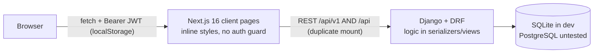
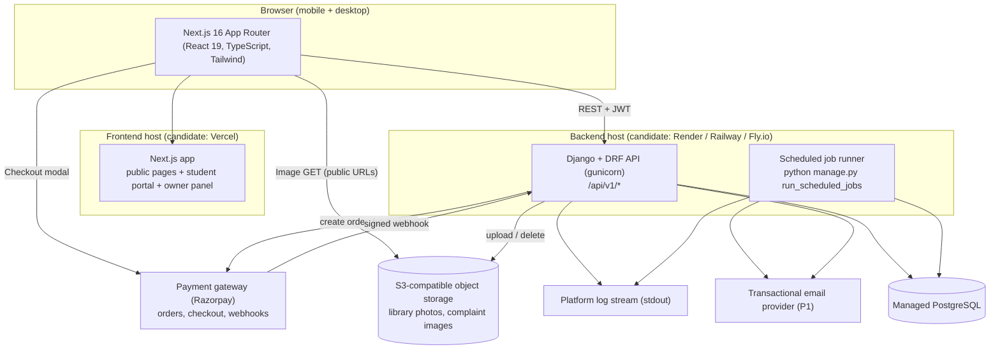
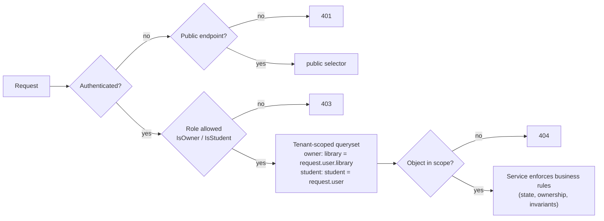
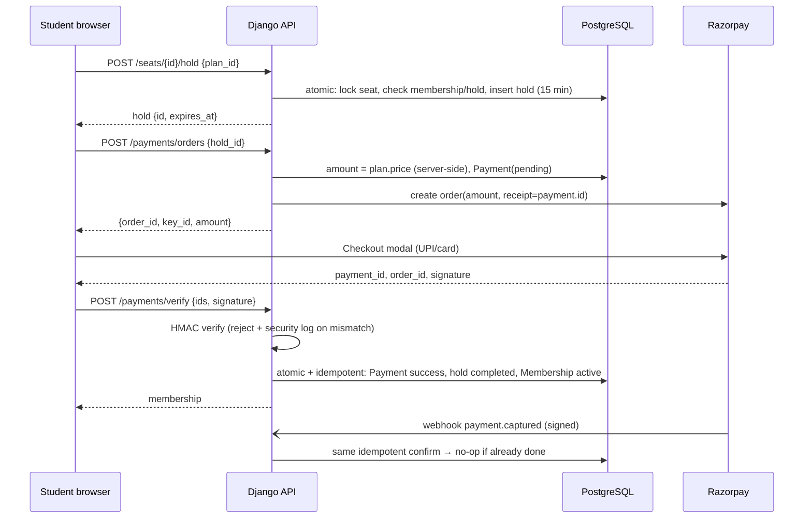
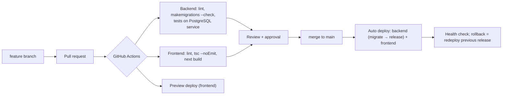

# LibraryHive — Architecture Decision (Phase 2)

**Version:** 1.0
**Date:** 2026-10-09
**Status:** Draft, awaiting approval
**Inputs:** `PROJECT_AUDIT.md` (current state), `FEATURES.md` v2.1 (approved scope and decisions D1 to D17), SRS, `AGENTS.md`

Decision priority (from the brief): **correctness → maintainability → security → reliability → MVP speed → scalability.**

Specific hosting vendors and prices are **not** fixed in this document. They are only *candidates* here, and the final choice and its cost are confirmed in Phase 10 (`DEPLOYMENT.md`). Everything else in this document is a proposed architectural decision for your approval.

---

## 1. Current architecture (as found in Phase 0)



- Two-tier modular monolith: a Next.js client and a Django REST API (`PROJECT_AUDIT.md` §3).
- Working modules are auth (backend), library profile, seats and discovery. Everything else is missing.

## 2. Problems with the current architecture

| # | Problem | Consequence |
|---|---|---|
| P1 | `Seat.status` is a stored, client-writable field with no link to bookings | It cannot express hold expiry, drifts from reality (seed data, wizard overwrites), and blocks double-booking guarantees |
| P2 | No service layer; logic sits in serializers and views and is duplicated 3 times | Booking, payment and archival rules would be scattered and untestable |
| P3 | No global API conventions (exception handler, default permission, pagination, throttling) | Inconsistent envelope; any new view is public by default |
| P4 | SQLite is the only DB exercised | Row locks are no-ops, so concurrency cannot be verified |
| P5 | No file storage, background jobs, email or logging | Photos, expiry notifications and audit are impossible today |
| P6 | Frontend has no auth context, guards, data-fetching layer or design system | Each of ~30 new screens would re-implement loading, error and auth handling inline |
| P7 | Broken environment (`requirements.txt`, empty `.env.example`, hardcoded secrets) | Cannot deploy or onboard teammates |
| P8 | Duplicate routes (`/api/` + `/api/v1/`, `seats/library/{id}/`) | Ambiguous contract for four parallel developers |

None of these force a framework change. They are problems of **structure inside** the current stack. §4 checks whether a different stack would still be better.

---

## 3. Alternatives considered

| | Option | Summary |
|---|---|---|
| **A** | **Next.js + Django REST Framework + PostgreSQL** (current stack, restructured) | Keep and restructure. Business logic in a Django service layer. |
| **B** | **Next.js full-stack + PostgreSQL** (Route Handlers / Server Actions + Prisma or Drizzle) | One TypeScript codebase. Rewrite the backend. |
| **C** | **Next.js + Supabase** (Supabase Auth, Postgres with RLS, Storage, Edge Functions) | Backend-as-a-service. Logic in RLS policies, SQL functions and Deno edge functions. |
| **D** | **Django full-stack** (server templates + HTMX) | Drop Next.js. Considered only because Django is already the strongest part of the repo. |

## 4. Comparison

Scores: 1 = poor, 5 = excellent, judged **for this project and this team**, not in general.

| Criterion | A: Next + DRF + PG | B: Next full-stack + PG | C: Next + Supabase | D: Django + HTMX |
|---|---|---|---|---|
| MVP speed | **4**: half the modules exist; Django admin is free back-office tooling | 2: backend rewrite | 3: fast CRUD, slow for complex flows | 3: rewrite UI |
| Reuse of existing code | **5**: models, permissions, 16 tests, 3 pages, SeatGrid kept | 2: frontend only | 2: frontend only | 2: backend only |
| Maintainability | **4**: clear app boundaries, one language per tier | 4 | 2: logic split across SQL, RLS, edge functions and the client | 4 |
| Relational complexity (14+ related entities, history) | **5**: Django ORM, migrations, constraints | 4: Prisma/Drizzle are fine, weaker on partial/conditional constraints | 4: raw Postgres is strong, but it is hand-written SQL | 5 |
| Auth and RBAC | **4**: SimpleJWT + DRF permissions already in place | 3: needs Auth.js plus a custom RBAC layer | 4: built-in auth; RBAC via RLS | 5: sessions |
| Multi-tenant isolation | **4**: scoped querysets + object permissions; must be disciplined | 3: hand-written in every handler | **5**: RLS enforced in the DB | 4 |
| Seat concurrency and transactions | **5**: `transaction.atomic`, `select_for_update`, partial unique constraints, all native | 3: interactive transactions; row locks need raw SQL | 3: only inside SQL functions | 5 |
| Payment integration (server order, HMAC verify, webhooks) | **5**: plain Python views; official gateway SDKs are Python-friendly | 4 | 3: edge functions in Deno; secrets and idempotency hand-built | 5 |
| Photo / file storage | 4: `django-storages` to S3-compatible storage | 3 | **5**: built-in storage | 4 |
| Background jobs and notifications | **4**: management commands + platform cron; no extra service | 2: serverless time limits; needs a cron service | 3: `pg_cron` / scheduled edge functions | 4 |
| Testing | **5**: Django test runner, real Postgres in CI, existing tests | 3 | 2: RLS and SQL functions are harder to unit test | 5 |
| Deployment | 3: two services (frontend + API) | **5**: one deploy | 4 | 4 |
| GitHub CI/CD | 4 | 5 | 3 | 4 |
| Cost | 4: free or low tiers available for both tiers | 4 | 4 (pauses inactive free projects) | 5 |
| Team of 4 in parallel | **5**: one Django app per module maps to the SRS split | 3 | 2: shared SQL/RLS surface causes conflicts | 4 |
| Future scalability | 4: stateless API, scale horizontally | 4 | 4 | 3 |
| Future AI integration | **5**: Python ecosystem | 3 | 3 | 5 |
| Modern SaaS UX (visual seat map, dashboards, mobile) | **5**: React | 5 | 5 | 3 |
| **Total (of 90)** | **79** | 62 | 61 | 74 |

## 5. Recommended architecture: **A, Next.js + Django REST Framework + PostgreSQL, restructured**

### 5.1 Why

1. **Correctness of the hardest requirements.** Double-booking prevention, idempotent payments and notification dedup all rely on DB transactions, row locks and conditional unique constraints. Django supports these natively and they are easy to test against real PostgreSQL.
2. **Reuse.** The User model, library and seat models, permissions, 16 passing tests, the seat grid and the discovery and explore pages are kept. No module that works is rewritten.
3. **Team fit.** The SRS split into four people maps onto separate Django apps and separate route groups. That limits merge conflicts.
4. **Back office for free.** Django admin gives the team support and debugging tools without building them.
5. **Future AI** (excluded from the MVP) is simplest in Python.

### 5.2 Why the alternatives were rejected

- **B (Next.js full-stack):** throws away the working backend and tests. Row locking needs raw SQL. Serverless time limits make the daily jobs awkward. Its main benefit (one deployment) does not outweigh a rewrite.
- **C (Supabase):** RLS is excellent for isolation. But booking, payment verification, webhooks, offline-student identity linking and notifications would be spread across SQL functions, RLS policies and Deno edge functions. That is hard for a student team to test and review, and it replaces working code. Supabase stays a **candidate host for PostgreSQL and storage** in Phase 10; that is a hosting choice, not an architecture change.
- **D (Django + HTMX):** a capable backend, but it discards the React UI. An interactive seat map and a polished mobile SaaS experience are easier in React.

---

## 6. Final system architecture



**Principles**
- **One backend (modular monolith) and one frontend.** No microservices, queues, Redis, WebSockets or Celery (`AGENTS.md` §1.9).
- **The backend is the single source of truth.** Prices, dates, seat state, payment state and permissions are computed and enforced in Django. The frontend only displays results and collects input.
- **Correctness never depends on a background job running on time.** Expired holds and due/overdue states are also evaluated lazily at read time. The job only cleans up and sends notifications.

---

## 7. Frontend architecture

| Aspect | Decision | Why |
|---|---|---|
| Framework | Next.js 16 App Router (the version already in the repo), React 19, TypeScript **strict mode on** | Already installed and working. Strict typing satisfies AGENTS §2.3. |
| Route groups | `app/(public)/` (landing, discover, `libraries/[id]`), `app/(auth)/` (login, register, claim), `app/student/…`, `app/owner/…` | Clear separation for guards and layouts. Owner and student areas get their own layouts with navigation. |
| Rendering | Client components for authenticated and interactive pages. Public pages stay client-rendered in the MVP. | Same data path everywhere. SEO server rendering of library pages is a P2 improvement. |
| Data fetching | **TanStack Query** on top of the existing `lib/api-client.ts` | One standard for loading, error, retry, caching and refetch on ~30 screens. Seat-map polling becomes a single option. |
| Forms and validation | **react-hook-form + zod** | Consistent client validation and error messages. The backend still validates everything. |
| Styling | **Tailwind CSS** plus a small in-house kit in `components/ui/` (Button, Input, Select, Modal, Badge, Card, Table, EmptyState, ErrorState, Skeleton, Toast) | Replaces about 3,300 lines of inline styles with consistent, responsive styling. No heavy UI framework. |
| Auth on the client | `AuthProvider` context; `lib/auth.ts` keeps tokens; `api-client` refreshes once on a 401; role guards in the `student/` and `owner/` layouts | Fixes the silent 5-minute logout and the unguarded owner pages. |
| Live seat map | **Polling** every 15 s while the page is visible, plus an immediate refetch after any booking action | Simple and reliable. The backend's 409 is the real guard, so the map only needs to be near-real-time. |
| Map view | **Leaflet + OpenStreetMap tiles** (`react-leaflet`) | Free and keyless. The tile provider is re-checked for production usage limits in Phase 10. |
| Charts | Keep simple CSS/SVG bars (existing `DomainChart`) | A few small charts do not justify a chart library. |
| API types | `lib/types.ts`, kept in sync with the OpenAPI schema (§10) | One contract across four developers. |

---

## 8. Backend architecture

### 8.1 Apps (one owner per app; matches `FEATURES.md` owners)

| App | Responsibility |
|---|---|
| `core` | BaseModel, permissions, tenant-scoping mixins, exception handler, response helpers, pagination, request-ID middleware, logging config, **audit log** model and service |
| `accounts` | User, registration, login/refresh/logout, profile, phone normalisation, offline-student identity and **claim** (OTP or claim code) |
| `libraries` | Library profile, facilities, domains vocabulary, pricing plans, **photos**, publish rules |
| `seats` | Seat configuration, **seat holds (reservations)**, availability computation, owner overrides |
| `memberships` | Membership lifecycle, offline admission, renewal, archival, due/overdue rules |
| `payments` | Gateway adapter, orders, verification, webhooks, offline payments, receipts, dues |
| `notifications` | **New app.** In-app notifications, delivery records, email channel, scheduled job |
| `attendance` | Check-in/out, auto-close, owner views |
| `complaints` | Complaint lifecycle |
| `visits` | Demo/visit requests |
| `analytics` | Dashboards, reports, CSV export, domain breakdown |

`notifications` and the audit model in `core` are additions to the app list in `AGENTS.md` §2.1. `AGENTS.md` will be updated to match after approval.

### 8.2 Layering inside each app

```
views.py        thin: parse, check permission, call a service, return the envelope
serializers.py  input validation and output shape only (no side effects)
services.py     business rules and transactions (the only place that changes state)
selectors.py    read-side queries (library-scoped querysets, availability, KPIs)
models.py       fields, constraints, indexes
tests/          service tests, API tests, permission tests
```

**Rule:** cross-app calls go through the other app's `services.py` or `selectors.py`, never straight into its models' internals. For example, `payments.services.confirm_payment()` calls `memberships.services.activate_from_hold()`.

### 8.3 Global API conventions (configured once in `core`)

- `DEFAULT_PERMISSION_CLASSES = IsAuthenticated`. Public views explicitly opt in with `AllowAny`.
- A custom exception handler. **Every** response, including validation, auth and throttling errors, uses `{success, data, error}`. Field errors go into `error` as a message plus `details`, and unknown exceptions are logged and returned as a generic 500 envelope with `request_id`.
- Page-number pagination envelope: `data: {items, page, page_size, total}`.
- Throttling: login, register, claim/OTP and webhook endpoints (scoped rates, kept in the database cache, so no Redis is needed).
- Settings come from environment variables only, with a production guard (refuse to start if `DEBUG` is on or the secret key is a default).

---

## 9. Database architecture

- **PostgreSQL in every environment**, including local development (via a local install or a single `docker run`) and CI. SQLite is removed as the default, because locking and constraint behaviour must match production.
- **Shared database, shared schema, row-level tenancy.** Every tenant-owned table has a `library_id` FK. Owner→library is one-to-one.
- **Constraints carry the invariants**, not only code. Exact definitions are in Phase 3.
  - at most one non-archived membership per seat (partial unique index), which together with D1 means one occupant per seat
  - at most one *pending* hold per seat (partial unique index; expired holds are marked `expired` under the row lock before a new hold is inserted)
  - one non-archived membership per student per library
  - one cover photo per library
  - unique normalised phone, unique email
  - unique gateway order and payment IDs
  - notification dedup key
  - one open attendance record per student
- **Seat state is derived, not stored.** This is the key change from the current code.
  - The `Seat` table holds only configuration: label, row, position, `is_active` and `is_disabled`.
  - The status shown is computed from data: `disabled` → *Disabled*; non-archived membership → *Occupied*; unexpired pending hold → *Reserved*; otherwise *Empty*.
  - This removes drift and makes hold expiry automatic.
  - Owner "manual reconciliation" (SEAT-07) becomes explicit actions on the underlying records: release a hold, archive a membership, disable a seat, or place an **owner manual hold** (a hold with a reason and no expiry).
- **History is never deleted.** Memberships, payments, attendance, complaints and audit rows use `PROTECT` or `SET_NULL`, never cascade from user or library deletion. Libraries and users are deactivated, not deleted.
- **Migrations:** Django migrations only. Every PR is checked with `makemigrations --check` in CI.

---

## 10. API architecture

- REST under **`/api/v1/` only**. The duplicate `/api/` mount and the `seats/library/{id}/` route are removed.
- Resource-oriented URLs, with action endpoints for state transitions (e.g. `POST /seats/{id}/hold/`, `POST /memberships/{id}/archive/`, `POST /payments/verify/`).
- Status codes: 400 validation, 401 unauthenticated, 403 wrong role, **404 for objects outside the caller's tenant scope** (the scoped queryset simply does not find them, so another library's IDs are not revealed), 409 conflicts (seat taken, duplicate library), 429 throttled.
- **OpenAPI schema** generated with `drf-spectacular` at `/api/v1/schema/`, published to the team as the frozen contract (SRS §10.4 requires the contract to be agreed before parallel work).
- Full per-endpoint contracts are defined in Phase 4.

The 404 rule above differs from `AGENTS.md` §4.2, which says 403 for cross-library IDs. The recommended 404 hides whether another library's record exists. `AGENTS.md` will be updated to match after approval.

---

## 11. Authentication architecture

- **JWT via SimpleJWT** (kept). Access token 60 minutes and refresh token 7 days, matching `AGENTS.md` §4.1. Refresh tokens rotate and are blacklisted on logout and rotation (`token_blacklist` app).
- Claims: `user_id`, `role`, `name`.
- **Token storage (amended by SEC-1, approved 2026-10-09; see `SECURITY.md` §4.2):** the access token is kept **in memory only** and sent as `Authorization: Bearer`. The refresh token lives in an `HttpOnly; Secure; SameSite=Strict` cookie scoped to `/api/v1/auth/`. Only `/api/v1/auth/*` is proxied through a Next.js rewrite so that the cookie is first-party; every other API call goes directly to the backend. On page load the frontend calls `POST /auth/refresh/` to obtain a fresh access token.
- *Superseded text (kept for history):* tokens were previously to be stored in `localStorage` by `lib/auth.ts`.
  - This carries an XSS risk. It is mitigated by React's output escaping, no `dangerouslySetInnerHTML`, a strict Content-Security-Policy, and short access lifetimes.
  - The alternative (httpOnly cookies through a same-origin proxy) is re-evaluated in Phase 6. Switching later would change only `lib/auth.ts`, `api-client.ts` and the backend authentication class.
- **Offline-to-online claim (D4):** a registration that matches an offline record by phone or email triggers a claim. The student verifies with an email OTP or an owner-issued claim code (single-use, expiring, attempt-limited, stored hashed). Only after verification is the existing user given a password and an online login.
- Passwords use Django's default hashing and validators.

## 12. Authorization and multi-tenancy



- Three layers: **role permission** (view level), **scoped queryset** (data level, the default deny for other tenants), and **service checks** (business rules).
- Shared mixins in `core`: `OwnerLibraryScopedMixin` and `StudentOwnedScopedMixin`, so no view writes its own filter.
- **Mandatory tests per app:** Owner A cannot access Library B's data, and Student A cannot access Student B's data (FEATURES AUTH-08).

## 13. File storage architecture

- `django-storages` with an **S3-compatible bucket** in production (candidates: Cloudflare R2, AWS S3, Supabase Storage; chosen in Phase 10). Local `FileSystemStorage` in development. The same code path is used in both.
- **Only the storage key and metadata are stored in PostgreSQL. Image binaries are never stored in the database** (brief NEW-A).
- Upload pipeline, all synchronous and on the server:
  1. `multipart/form-data`.
  2. Size ≤ 5 MB.
  3. Extension and **actual content** verified with Pillow (JPG/PNG/WEBP).
  4. Image re-encoded, which strips EXIF/GPS metadata.
  5. One display size plus one thumbnail generated.
  6. Saved under a random UUID key (`libraries/{library_id}/{uuid}.webp`).
- Library photos are public and served directly from the bucket or CDN URL. Complaint images (P1) are private and served through short-lived signed URLs, only to the student and the owner.

## 14. Payment architecture

### 14.1 Gateway evaluation (Razorpay vs Cashfree)

| Criterion | Razorpay | Cashfree |
|---|---|---|
| UPI, cards, netbanking (India) | Yes | Yes |
| Server-created order, client checkout | Orders API + Checkout.js modal | Orders API + JS SDK checkout using a payment session ID |
| Server verification of client callback | HMAC-SHA256 of `order_id\|payment_id` with the key secret | Fetch order/payment status from the API (plus webhook) |
| Signed webhooks | Yes (HMAC-SHA256 of the body, `X-Razorpay-Signature`) | Yes (HMAC-SHA256 of timestamp + body) |
| Test mode | Yes | Yes (sandbox) |
| Python SDK | Official | Official |
| Fit with existing project docs | AGENTS §5, SPEC and FEATURES already specify its flow | Would need doc changes |
| Live activation | Business KYC required | Business KYC required |

**Recommendation: Razorpay.** Both are technically suitable. Razorpay's synchronous signature check gives the simplest *verified* confirmation path, and the project's documents and team expectations are already written around it. Fees and settlement terms are similar in kind but **must be confirmed by the team before going live**; they are not assumed here.

To keep a switch cheap, all gateway calls go through **`payments/gateway.py`**, an interface with `create_order`, `verify_checkout`, `verify_webhook` and `fetch_payment`. Only this file knows Razorpay.

### 14.2 Payment flow



- **Idempotency:** confirmation is a single service, `confirm_payment(order_id, payment_id)`. It locks the Payment row, returns early if it is already successful, and relies on unique constraints on gateway IDs. The browser callback and the webhook can arrive in any order, any number of times.
- **Late payment after hold expiry:** if the seat is still free, the hold is re-acquired under the lock and the payment is confirmed. If the seat is taken, the payment is marked `needs_refund`, the owner and student are notified, and the refund is made manually outside the system (no refund workflow in the MVP, PAY-14).
- **Failed, cancelled and pending payments** are recorded. The hold simply expires. A retry creates a new order while the hold is valid.
- **Offline payments** use the same Payment table (`method = cash | upi_direct | bank_transfer`, `recorded_by`, receipt number), written by the memberships or payments services inside the admission or renewal transaction.

## 15. Notification and background-job architecture

- **Events produce notifications inside the business transaction** (`transaction.on_commit`), e.g. payment confirmed, complaint updated, demo decided. Writing in-app notifications is a simple DB insert.
- **One scheduled entry point:** `python manage.py run_scheduled_jobs`, run **hourly** by the platform's cron feature. Every step is idempotent, so the frequency only affects timeliness, never correctness. Steps:
  1. Mark expired holds (cleanup only; reads already treat them as expired).
  2. Recompute membership statuses (Active → Due → Overdue) using D5.
  3. Create renewal and expiry notifications for the day's milestones (dedup by unique key).
  4. Send pending email deliveries and retry failed ones (attempt count and backoff; P1).
  5. Auto-close forgotten attendance after closing time.
  6. Write a job summary to the logs.
- **Fallback scheduler:** if the chosen host has no cron, a GitHub Actions scheduled workflow calls a token-protected internal endpoint that runs the same command. Either way, there is no always-on worker process.
- **Email** (P1) goes through Django's email backend to one transactional provider (Phase 10). Account-claim OTP emails are sent synchronously in the request, so the user sees a failure immediately.

## 16. Logging and audit architecture (FEATURES §3.15)

- Python `logging` with a JSON formatter writing to stdout. Middleware adds `request_id` (also returned in `X-Request-ID`), `user_id` and `library_id` to every log line, plus a redaction filter (passwords, tokens, signatures, OTPs; phone and email masked).
- Access log middleware records method, path, status and duration.
- `core.audit.record(actor, action, entity, changes, reason)` writes the append-only `AuditLog` row **inside the same transaction** as the change, so the audit row and the change succeed or fail together.
- The hosting platform keeps and rotates logs. Nothing is self-hosted.

## 17. Deployment architecture (candidate; finalised in Phase 10)

| Component | Candidate | Reason |
|---|---|---|
| Frontend | Vercel (Next.js native, PR preview deployments) | Zero-config Next.js and previews per PR |
| Backend API | Render, Railway or Fly.io (container or native Python with gunicorn) | Long-running Django, cron support, git-push deploys |
| Scheduled job | The same platform's cron job, or the GitHub Actions fallback | §15 |
| Database | Managed PostgreSQL (the backend host's, or Neon or Supabase) with automated backups | Phase 10 compares backups and region |
| Object storage | S3-compatible bucket (R2, S3 or Supabase Storage) | §13 |
| Region | India or nearest available (Mumbai or Singapore) | Latency for Indian users and payments |

- Static files are served by WhiteNoise.
- Migrations run as a release step before the new version receives traffic.
- A health endpoint, `/api/v1/health/`, checks the app and DB.
- Separate environments: local, preview/staging (gateway test mode) and production.

## 18. CI/CD architecture (detailed in Phase 11)



Secrets live only in GitHub and the hosting platforms' secret stores.

## 19. Security architecture (detailed in Phase 6)

- Defence in depth: HTTPS everywhere, strict CORS allow-list, security headers and CSP on the frontend, DRF default-deny, three-layer authorization (§12), and server-side validation of every input.
- Server-side pricing and payment verification; signed and idempotent webhooks; throttling on auth, claim and webhook endpoints.
- Upload validation and re-encoding; private complaint images via signed URLs.
- Secrets only in environment variables, with a production startup guard; secret key and gateway keys rotated if leaked (the current committed key is treated as leaked).
- Audit trail and redacted logs.

## 20. Scaling approach

The MVP target is tens of libraries and a few thousand students.

- The API is **stateless** (JWT), so it scales horizontally by adding instances. Locks live in PostgreSQL, so correctness holds across instances.
- Indexes on every tenant FK and filter column. Discovery uses a bounding-box prefilter in SQL before computing distance, and is paginated. Availability counts come from aggregate queries, not N+1 queries.
- Scale steps in order: bigger DB instance → read replica for analytics → a CDN for photos (already in place) → caching of public library listings. Each is added only when measured load requires it. No microservices.

## 21. Cost considerations

- Every component has a free or low-cost tier among the candidates. The likely monthly cost for the MVP is dominated by the managed PostgreSQL and the always-on backend instance. **Exact figures are confirmed in Phase 10** from current vendor pricing; none are assumed here.
- Free tiers that sleep or pause (some backend and database hosts) can add cold-start latency and may pause inactive DBs. Phase 10 must check this for production.
- Payment gateway fees are per transaction (KYC'd merchant account required for live mode).

## 22. Risks

| Risk | Likelihood | Impact | Mitigation |
|---|---|---|---|
| Live gateway activation (KYC) not ready by launch | Medium | High | Build and test entirely in test mode. Start KYC early. Gateway adapter allows a switch. |
| Concurrency bugs that only appear on PostgreSQL | Medium | High | PostgreSQL in dev and CI. Parallel-request tests (BOOK-02). |
| Scope size vs team capacity (~130 features) | High | High | Strict P0-first ordering in Phase 7. P1 only after the module's P0 items are done. |
| Frontend migration (inline styles → Tailwind) stalls, leaving a hybrid | Medium | Medium | Each existing page is migrated by its owner in the same task that touches it. The final audit fails if inline-style pages remain. |
| Free-tier sleeping or pausing hosts | Medium | Medium | Evaluated in Phase 10. Paid minimal tier for API and DB at launch if needed. |
| XSS in the frontend | Low | High | CSP, no raw HTML, short access lifetime; refresh token unreadable by JavaScript (SEC-1). |
| Email deliverability (OTP) | Medium | Medium | Owner claim-code fallback (D4). Reputable provider with a verified domain. |
| Four developers changing shared contracts | Medium | Medium | Frozen OpenAPI contract, `core` owned by P1, PR reviews. |

## 23. Migration strategy: old → final

> **Updated by D19 (2026-10-09):** instead of restructuring the old code in place, the legacy application code is removed in T00 (preserved in `legacy/*` tags) and the final architecture is implemented fresh. §23.1 remains the checklist of legacy patterns that must not reappear; §23.2 is replaced by `IMPLEMENTATION_PLAN.md` §3–§5.

### 23.1 Old architecture (to be removed or replaced)

| Item | Location | Action |
|---|---|---|
| Stored, client-writable `Seat.status` | `apps/seats/models.py`, `serializers.py` | Replace with derived status + hold/override actions (§9). Data migration maps current statuses to empty (no backing records exist). |
| Seat creation logic in 3 places | `apps/libraries/serializers.py`, `apps/seats/views.py` | Move into one `seats.services` function. Library create/update no longer creates seats. |
| Plans deleted and recreated on save | `apps/libraries/serializers.py:194-202` | Individual plan CRUD with deactivation. |
| `/api/` duplicate mount; `seats/library/{id}/` | `config/urls.py:14`, `apps/seats/urls.py:6` | Delete. Update `frontend/.env.example` to `/api/v1`. |
| Domain breakdown in `libraries` (duplicated) | `apps/libraries/views.py:195`, `serializers.py:58` | Move to `analytics`. Explore page reads it there. |
| Silent `except Exception` around missing models | same | Removed with the move. |
| Global-freeze `requirements.txt`; empty `.env.example`; hardcoded settings | `backend/` | Clean pinned dependency list; env-driven settings; complete examples. |
| SQLite default | `config/settings.py:104-110` | PostgreSQL default; SQLite not supported. |
| Inline styles, monolithic pages | `frontend/app/**` | Tailwind + `components/ui`. Pages split into components. |
| Fake UI data (amenities, shift selector, `alert()` booking, demo credentials) | explore, discover, SeatGrid, setup | Replaced by real data and flows (FEATURES NFR-04, SEAT-09). |
| Owner login inside the setup wizard | `app/owner/setup/page.tsx` | Moved to `(auth)/login`; wizard requires an owner session. |
| `ERDIAGRAM.md` (separate owner/student tables, JSON pricing) | root | Rewritten in Phase 3. |
| Tracked build artifacts | `frontend/tsconfig.tsbuildinfo` | Untracked and git-ignored. |

### 23.2 Migration order (high level; detailed in Phase 7)

1. **Foundation:** env-driven settings, clean dependencies, PostgreSQL, `core` conventions (envelope, permissions, pagination, logging, audit), CI skeleton.
2. **Contract freeze:** Phase 3 schema and Phase 4 OpenAPI contract, so the four developers can then work in parallel.
3. **Restructure existing modules in place:** seats (derived status), libraries (plans CRUD, facilities, photos), auth (envelope, phone, refresh, logout). Existing tests are kept and adapted, and new ones added.
4. **Build new modules** on the final structure: holds/booking → memberships → payments → offline/claim → notifications → attendance → complaints → visits → analytics.
5. **Frontend:** UI kit, auth layer and Tailwind first, then the existing pages migrated as they are touched, then new screens.
6. **Removal check:** every row in §23.1 is verified as gone in the final audit. **No hybrid remains.**

### 23.3 Final architecture

The diagrams in §6, §12 and §14.2, with the components in §7–§18.

---

## 24. Documents to update after approval

- `AGENTS.md`:
  - app list (`notifications`, audit in `core`)
  - 404-for-out-of-scope rule
  - Next.js 16 + Tailwind
  - PostgreSQL in dev
  - service layer convention
- `SPEC.md` and `ERDIAGRAM.md`: rewritten in Phase 3.
- `BACKEND_ARCHITECTURE.md`, `UI_ARCHITECTURE.md`, `SECURITY.md`: Phases 4–6.
