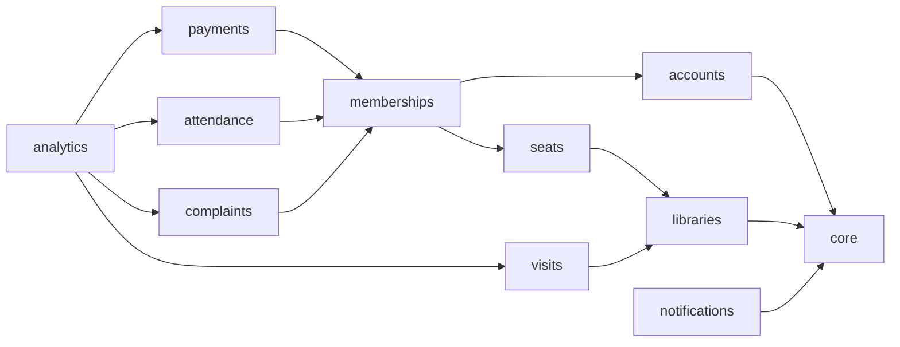

# LibraryHive — Backend Architecture & API Contracts (Phase 4)

**Version:** 1.0
**Date:** 2026-10-09
**Status:** Draft, awaiting approval
**Builds on:** `ARCHITECTURE.md` v1.0 (approved), `SPEC.md` v2.0 (data model), `FEATURES.md` v2.1 (scope; feature IDs are cited in brackets, e.g. [BOOK-02])

This document is the **frozen contract** that the four developers implement against (SRS §10.4). A change to any endpoint here needs a PR that updates this file and `frontend/lib/types.ts` together.

---

## 1. Project structure

```
backend/
├── config/
│   ├── settings/            base.py, local.py, test.py, production.py (env-driven; prod startup guard)
│   ├── urls.py              mounts /api/v1/ only
│   ├── wsgi.py, asgi.py
├── apps/
│   ├── core/
│   │   ├── models.py        BaseModel, Domain, Amenity, AuditLog
│   │   ├── exceptions.py    AppError hierarchy + error codes (§6)
│   │   ├── handlers.py      DRF exception handler → envelope
│   │   ├── responses.py     ok(data, status), paginated(page)
│   │   ├── pagination.py    page-number pagination (§4.4)
│   │   ├── permissions.py   IsOwner, IsStudent, HasLibrary, IsJobTrigger
│   │   ├── mixins.py        OwnerLibraryScopedMixin, StudentOwnedScopedMixin
│   │   ├── middleware.py    RequestIdMiddleware, AccessLogMiddleware
│   │   ├── logging.py       JSON formatter, RedactionFilter, context vars
│   │   ├── audit.py         record(...) helper (append-only)
│   │   ├── storage.py       storage backends (public / private)
│   │   ├── images.py        upload validation + re-encode pipeline
│   │   ├── dates.py         business_today() (Asia/Kolkata)
│   │   ├── views.py         health, meta vocabularies, internal job trigger
│   │   └── tests/           factories.py, test_envelope.py, test_logging.py …
│   ├── accounts/            models, services (register, claim), selectors, serializers, views, urls, tests/
│   ├── libraries/           Library, LibraryPhoto, PricingPlan; publish rules; photo pipeline
│   ├── seats/               Seat, SeatHold; availability selector; hold services
│   ├── memberships/         Membership; admission, renewal, archival services
│   ├── payments/            Payment, PaymentWebhookEvent; gateway.py; confirm service; dues selector
│   ├── notifications/       Notification, NotificationDelivery; notify(); email sender; management command
│   ├── attendance/          AttendanceRecord; check-in/out; auto-close
│   ├── complaints/          Complaint lifecycle
│   ├── visits/              VisitRequest lifecycle
│   └── analytics/           selectors only: dashboards, reports, CSV exports, domain breakdown
├── manage.py
├── requirements.txt         runtime dependencies, pinned (§13)
└── requirements-dev.txt     -r requirements.txt + test/lint tools
```

**Inside each app:** `models.py`, `services.py` (all state changes), `selectors.py` (all reads used by more than one view), `serializers.py` (input validation and output shape only), `views.py` (thin), `urls.py`, `admin.py`, `tests/`.

### 1.1 Dependency direction between apps



- Arrows point at the app being imported.
- Every app may call `notifications.services.notify()` and `core.audit.record()`.
- No cycles: `seats` does not import `memberships` models. It asks `memberships.selectors.active_membership_exists(seat)`, which is imported lazily at function level. The same applies to `payments` → `seats`.

---

## 2. Modules and responsibilities

| App | Owns (models) | Key services | Feature IDs |
|---|---|---|---|
| core | BaseModel, Domain, Amenity, AuditLog | `audit.record`, exception handling, logging, storage, images | AUTH-07/08/12, LOG-* |
| accounts | User, AccountClaim | `register`, `login`, `logout`, `update_profile`, `start_claim`, `complete_claim`, `issue_claim_code`, `request_password_reset`, `confirm_password_reset`, `find_identity` | AUTH-*, OFF-04/05 |
| libraries | Library, LibraryPhoto, PricingPlan | `create_library`, `update_library`, `refresh_publish_state`, plan CRUD, `upload_photo`, `delete_photo`, `set_cover` | LIB-*, PHO-* |
| seats | Seat, SeatHold | `create_seats`, `update_seat`, `deactivate_seat`, `set_disabled`, `create_booking_hold`, `cancel_hold`, `place_manual_hold`, `release_hold`, `expire_dead_holds` | SEAT-*, BOOK-01..05 |
| memberships | Membership | `activate_from_hold`, `admit_offline_student`, `apply_renewal`, `archive_membership` | MEM-*, OFF-01..03 |
| payments | Payment, PaymentWebhookEvent | `create_order`, `verify_checkout`, `handle_webhook`, `confirm_payment`, `record_offline_payment`, `reconcile_stale_orders` | PAY-*, BOOK-06 |
| notifications | Notification, NotificationDelivery | `notify`, `generate_renewal_notifications`, `generate_owner_summaries`, `send_pending_emails` | NOT-* |
| attendance | AttendanceRecord | `check_in`, `check_out`, `owner_check_in`/`owner_check_out`/`correct` (P1), `auto_close_open_records` | ATT-* |
| complaints | Complaint | `create_complaint`, `owner_update_complaint` | CMP-* |
| visits | VisitRequest | `create_visit`, `decide_visit`, `cancel_visit` (P1) | DEMO-* |
| analytics | — | selectors: `owner_dashboard`, `student_dashboard`, `domain_breakdown`, reports, CSV writers | DASH-* |

---

## 3. API structure

Base path: **`/api/v1/`**. Namespaces make tenant scope visible in the URL.

| Namespace | Who | Scope rule |
|---|---|---|
| `/auth/…` | public / authenticated | the caller only |
| `/meta/…`, `/libraries/…` | public | published, active libraries only; no personal data |
| `/student/…` | role `student` | rows where `student = request.user` |
| `/owner/…` | role `owner` | rows where `library = request.user.library` (**no library ID in owner URLs**; the library is implied) |
| `/payments/…` | student (orders, verify), gateway (webhook) | as stated per endpoint |
| `/notifications/…` | any authenticated user | `recipient = request.user` |
| `/internal/…`, `/health/` | job trigger token / public | — |

Owner endpoints without a library (the owner has not finished onboarding) return `409 LIBRARY_REQUIRED`, except `POST /owner/library/` and `GET /owner/library/`.

---

## 4. Cross-cutting conventions

### 4.1 Response envelope

`AGENTS.md` §2.2 is extended **compatibly**. The fields `success`, `data` and `error` are unchanged, and `error_code`, `details` and `request_id` are added.

```json
{ "success": true,  "data": { },  "error": null, "error_code": null, "details": null, "request_id": "8f2c…" }
{ "success": false, "data": null, "error": "Seat is no longer available.", "error_code": "SEAT_UNAVAILABLE",
  "details": null, "request_id": "8f2c…" }
{ "success": false, "data": null, "error": "Please correct the highlighted fields.", "error_code": "VALIDATION_ERROR",
  "details": { "phone": ["Enter a valid Indian mobile number."] }, "request_id": "8f2c…" }
```

The frontend branches on `error_code` and shows `error` and `details` to the user. The only non-envelope responses are CSV exports (§9.14) and the webhook acknowledgement body.

### 4.2 Status codes

| Code | When |
|---|---|
| 200 / 201 | success / created |
| 400 | validation or a business-rule violation by the caller (`VALIDATION_ERROR`, `BUSINESS_RULE`, specific codes) |
| 401 | missing or invalid token (`NOT_AUTHENTICATED`, `TOKEN_INVALID`) or bad login (`INVALID_CREDENTIALS`) |
| 403 | authenticated but the wrong role (`FORBIDDEN_ROLE`) |
| 404 | not found **or outside the caller's scope** (`NOT_FOUND`); IDs from other tenants are never confirmed |
| 409 | state conflict: seat taken, duplicate, already a member, library required (specific codes) |
| 413 | upload too large (`FILE_TOO_LARGE`) |
| 429 | throttled (`RATE_LIMITED`) |
| 500 | unexpected (`SERVER_ERROR`; logged with stack trace; generic message) |
| 502 | payment gateway unreachable (`GATEWAY_ERROR`) |

### 4.3 Data formats

- IDs are UUID strings.
- Datetimes are ISO 8601 UTC (`2026-10-09T05:30:00Z`). Dates are `YYYY-MM-DD` (business dates are Asia/Kolkata).
- Money is a decimal string `"1200.00"`. The gateway amount is integer `amount_paise`.
- Enumerations use the lowercase values from `SPEC.md` §6.
- Phone input accepts Indian formats, and output is always E.164 `+919876543210`.

### 4.4 Pagination

Query parameters: `?page=1&page_size=20` (max 100). Response `data`:

```json
{ "items": [ … ], "page": 1, "page_size": 20, "total": 134 }
```

### 4.5 Authentication header and throttling

- `Authorization: Bearer <access>`.
- Throttle rates (DRF scoped throttles; DB cache backend, so no Redis):

| Scope | Rate |
|---|---|
| `login` | 10/min per IP; plus scope `login_email` 20/hour per email (T04) |
| `register` | 5/min per IP |
| `claim_start` | 3 per 10 min per identity, 10/hour per IP |
| `claim_complete` | 10 per 10 min per IP (plus per-claim attempt limit 5) |
| `password_reset` | 3 per 10 min per email, 10/hour per IP (request and confirm) |
| `hold_create` | 10/min per user |
| `upload` | 30/hour per user |
| `webhook` | 120/min per IP |
| `anon` default | 120/min |
| `user` default | 300/min |

---

## 5. Authentication, authorization and tenant isolation

### 5.1 Authentication

- SimpleJWT with `ACCESS_TOKEN_LIFETIME=60 min`, `REFRESH_TOKEN_LIFETIME=7 days`, `ROTATE_REFRESH_TOKENS=True`, `BLACKLIST_AFTER_ROTATION=True` and the `token_blacklist` app.
- Claims: `user_id`, `role`, `name`.
- **Token transport (SEC-1):** access token in the JSON response and then the `Authorization` header; refresh token only in an `HttpOnly; Secure; SameSite=Strict` cookie, path `/api/v1/auth/`, max-age 7 days. Endpoints #6, #7, #8, #9, #13 and 13b set or clear it. `CORS_ALLOW_CREDENTIALS` stays false because the cookie is only used on the same-site auth proxy.
- **Login is by email.** Unclaimed offline users cannot log in (no usable password). They get the same generic `INVALID_CREDENTIALS`, so the response does not reveal that an offline record exists.
- Deactivated users are rejected at login and at token use, through `is_active` (SimpleJWT checks it).

### 5.2 Authorization (RBAC)

Three layers (ARCHITECTURE §12):

1. **View permission classes.**
   - The default is `IsAuthenticated`.
   - `/owner/*` uses `IsOwner`, plus `HasLibrary` where a library must exist.
   - `/student/*` uses `IsStudent`.
   - Public views declare `AllowAny` explicitly.
2. **Scoped querysets.**
   - `OwnerLibraryScopedMixin.get_queryset()` returns `Model.objects.filter(library=request.user.library)`.
   - `StudentOwnedScopedMixin` returns `filter(student=request.user)`.
   - Detail lookups use the scoped queryset, so other tenants' IDs get 404.
3. **Services re-check ownership** of every *referenced* ID in a request body. For example, `seat_id` in an admission must belong to the owner's library, and `membership_id` in a student order must belong to the student. A failure raises `NotFound` (404).

### 5.3 Tenant isolation test matrix (mandatory per app)

Each app contains `tests/test_isolation.py` with two libraries (A, B), two owners and two students. It asserts that Owner A gets 404 on every B object endpoint and sees no B rows in lists or reports, and that Student A gets 404 on every Student B object endpoint. This is a CI-blocking test suite [AUTH-08].

---

## 6. Error handling

`core.exceptions`:

```python
class AppError(Exception):
    status = 400; code = "BUSINESS_RULE"; message = "Request could not be completed."
class ValidationFailed(AppError):   status = 400; code = "VALIDATION_ERROR"
class NotFound(AppError):           status = 404; code = "NOT_FOUND"
class Forbidden(AppError):          status = 403; code = "FORBIDDEN_ROLE"
class Conflict(AppError):           status = 409; code = "CONFLICT"
class GatewayError(AppError):       status = 502; code = "GATEWAY_ERROR"
```

- Services raise these with specific codes, e.g. `Conflict("Seat is no longer available.", code="SEAT_UNAVAILABLE")`.
- `core.handlers.exception_handler` converts the following into the envelope: `AppError`, DRF `ValidationError` (`details` = field errors), `NotAuthenticated`/`AuthenticationFailed` (401), `PermissionDenied` (403), `Http404` (404), `Throttled` (429), and Django `IntegrityError` from known partial-unique constraints. A **constraint-name → (409, code)** map translates races that slip past service checks, e.g. `seathold_one_pending_per_seat` → `SEAT_UNAVAILABLE`.
- Anything else is logged at ERROR with a stack trace and `request_id`, and returns 500 `SERVER_ERROR` with a generic message.

### 6.1 Error code catalogue

| Code | HTTP | Meaning |
|---|---|---|
| VALIDATION_ERROR | 400 | Field validation failed (`details`) |
| BUSINESS_RULE | 400 | Generic rule violation (message explains) |
| INVALID_CREDENTIALS | 401 | Login failed |
| NOT_AUTHENTICATED / TOKEN_INVALID | 401 | Missing or expired token |
| FORBIDDEN_ROLE | 403 | Wrong role |
| NOT_FOUND | 404 | Missing or out of scope |
| LIBRARY_REQUIRED | 409 | Owner has no library yet |
| LIBRARY_EXISTS | 409 | Owner already has a library |
| EMAIL_TAKEN / PHONE_TAKEN | 409 | Duplicate identity |
| CLAIM_REQUIRED | 409 | Registration matches an offline record; claim flow needed |
| IDENTITY_CONFLICT | 409 | Phone and email belong to different accounts |
| CLAIM_INVALID | 400 | Wrong, expired or used code |
| CLAIM_LOCKED | 429 | Too many attempts |
| RESET_INVALID | 400 | Wrong, expired or used password-reset code |
| LIBRARY_NOT_BOOKABLE | 409 | Library unpublished or inactive |
| PLAN_INACTIVE | 409 | Plan inactive or from another library |
| SEAT_UNAVAILABLE | 409 | Seat held, occupied, disabled or removed |
| HOLD_EXISTS | 409 | Student already has a pending hold in this library |
| ALREADY_MEMBER | 409 | Student already has an active membership in this library |
| HOLD_EXPIRED | 409 | Hold no longer live |
| SEAT_IN_USE | 409 | Seat cannot be removed or disabled (active member or hold) |
| PLAN_NAME_TAKEN | 409 | Duplicate active plan name |
| PHOTO_LIMIT | 409 | 15 photos already |
| FILE_TOO_LARGE / FILE_TYPE | 413 / 400 | Upload rejected |
| INVALID_SIGNATURE | 400 | Payment signature mismatch |
| PAYMENT_NOT_PENDING | 409 | Order already finalised |
| SEAT_LOST_REFUND_PENDING | 409 | Paid, but the seat was taken; payment marked `needs_refund` |
| RENEWAL_NOT_OPEN | 409 | Renewal allowed only within 7 days of the due date or when overdue |
| MEMBERSHIP_ARCHIVED | 409 | Action not allowed on an archived membership |
| ALREADY_CHECKED_IN | 409 | Open attendance exists |
| NOT_CHECKED_IN | 400 | No open attendance |
| NO_ACTIVE_MEMBERSHIP | 409 | Attendance or complaint needs a membership |
| INVALID_TRANSITION | 409 | Complaint or visit status change not allowed |
| VISIT_PENDING_EXISTS | 409 | One pending visit per library |
| RATE_LIMITED | 429 | Throttled |
| GATEWAY_ERROR | 502 | Payment provider unreachable |
| SERVER_ERROR | 500 | Unexpected |
| METHOD_NOT_ALLOWED | 405 | HTTP method not supported by the endpoint (added in T01) |
| UNSUPPORTED_MEDIA_TYPE | 415 | Request content type not accepted (added in T01) |
| PARSE_ERROR | 400 | Malformed request body (added in T01) |
| SERVICE_UNAVAILABLE | 503 | Health check: database unreachable (added in T01) |
| ORIGIN_NOT_ALLOWED | 403 | Cookie endpoint called without the frontend `Origin` (SECURITY §4.3; added in T04) |

---

## 7. Validation strategy

| Layer | Validates | Example |
|---|---|---|
| Serializer | Types, required fields, formats, lengths, enums, simple ranges | `price > 0`, `duration_days 1..366`, phone parseable, `preferred_slot` enum |
| Service | Cross-field and cross-row rules, ownership of referenced IDs, state | Plan belongs to the seat's library; hold is live; membership is active; transition allowed |
| Database | Invariants (SPEC §3 constraints) | Partial uniques, checks; last line of defence, mapped to 409 |

- Serializers never write to the database; they return validated data to services.
- Output serializers are separate from input serializers where the shapes differ (e.g. `SeatPublicSerializer` vs `SeatOwnerSerializer`), so no private fields leak to public endpoints.
- Text inputs are trimmed. HTML is not accepted anywhere: plain text is stored and the frontend escapes it.

---

## 8. Transactions, locking and concurrency

### 8.1 Transactional operations

All of these run in `transaction.atomic()` and lock rows in this order to avoid deadlocks: **Library → Seat (ascending id) → Membership → Payment → Hold**.

| Operation | Locks | Invariants protected |
|---|---|---|
| `create_booking_hold` | Seat | one live hold per seat; seat free; one hold per student per library; not already a member |
| `cancel_hold` / `release_hold` | Seat | — |
| `place_manual_hold` | Seat | seat free |
| `confirm_payment` (new) | Payment, then Seat | idempotency; one member per seat; hold → completed |
| `confirm_payment` (renewal) / `apply_renewal` | Payment, Membership | idempotency; due-date arithmetic |
| `admit_offline_student` | Seat (+ identity lookup) | seat free; identity rules; payment + membership atomic |
| `record_offline_payment` (renewal) | Membership | membership active |
| `archive_membership` | Seat, then Membership | seat freed atomically; history kept |
| `deactivate_seat` / `set_disabled` | Seat | no active member or live hold |
| `upload_photo` / `set_cover` / `delete_photo` | Library | ≤15 photos; one cover |
| plan create/update/deactivate | Library | unique active name; publish state refreshed |
| `check_in` | Membership | one open record |
| `complete_claim` | AccountClaim, User | single use; attempts |
| notification inserts | — | `dedup_key` unique, `ON CONFLICT DO NOTHING` |

Side effects outside the DB (sending email, deleting storage objects) are queued with `transaction.on_commit`, so a rolled-back transaction never sends or deletes anything.

### 8.2 Booking concurrency (BOOK-02)

```python
# seats/services.py  (illustrative; final code in Phase 8)
def create_booking_hold(*, student, seat_id, plan_id) -> SeatHold:
    with transaction.atomic():
        seat = (Seat.objects.select_for_update()
                .select_related("library").get(id=seat_id, is_active=True))       # 404 if missing
        lib = seat.library
        if not (lib.is_active and lib.is_published):   raise Conflict(code="LIBRARY_NOT_BOOKABLE")
        plan = PricingPlan.objects.filter(id=plan_id, library=lib, is_active=True).first()
        if plan is None:                               raise Conflict(code="PLAN_INACTIVE")
        if seat.is_disabled:                           raise Conflict(code="SEAT_UNAVAILABLE")
        expire_dead_holds_for_seat(seat)               # pending + expires_at <= now → expired
        if memberships.selectors.active_membership_exists(seat=seat):   raise Conflict(code="SEAT_UNAVAILABLE")
        if memberships.selectors.student_is_member(student, lib):       raise Conflict(code="ALREADY_MEMBER")
        if SeatHold.objects.live().filter(seat=seat).exists():          raise Conflict(code="SEAT_UNAVAILABLE")
        expire_dead_holds_for_student(student, lib)
        if SeatHold.objects.live().filter(student=student, library=lib, kind="booking").exists():
            raise Conflict(code="HOLD_EXISTS")
        hold = SeatHold.objects.create(seat=seat, library=lib, kind="booking", student=student,
                                       plan=plan, created_by=student,
                                       expires_at=now() + timedelta(minutes=settings.SEAT_HOLD_MINUTES))
        audit.record(...); log.info("hold.created", ...)
        return hold
```

`IntegrityError` on `seathold_one_pending_per_seat` or `seathold_one_pending_per_student_library` is mapped to 409 by the handler (§6). The test runs N threads on PostgreSQL (`TransactionTestCase`) and asserts exactly one 201 and N−1 409s.

---

## 9. API contracts

**Legend.** *Auth*: `public` | `auth` (any logged-in user) | `student` | `owner` | `owner+lib` (owner whose library exists) | `gateway` | `job-token`. *Request* shows the JSON body unless marked `query` or `multipart`. *Response* shows `data`. Error cases list endpoint-specific codes; every endpoint can also return the generic `VALIDATION_ERROR`, 401, 403, 404, 429 and 500.

### 9.1 Health, meta, internal

| # | Method & path | Auth | Purpose | Request | Response `data` | Rules / errors |
|---|---|---|---|---|---|---|
| 1 | GET `/health/` | public | Liveness + DB check | — | `{status:"ok", db:"ok", version}` | 503 if DB unreachable. Not throttled. |
| 2 | GET `/meta/domains/` | public | Domain vocabulary | — | `[{code, name}]` | active only, ordered |
| 3 | GET `/meta/amenities/` | public | Amenity vocabulary | — | `[{code, name}]` | active only |
| 4 | POST `/internal/jobs/run/` | job-token | Fallback scheduler (ARCH §15) | header `X-Job-Token` | job summary `{steps:[{name, processed, …}]}` | Disabled (404) unless `JOB_TRIGGER_TOKEN` is set. Constant-time token compare. |
| 5 | GET `/schema/` | public in non-prod; staff in prod | OpenAPI 3 schema (drf-spectacular) | — | OpenAPI JSON | — |

### 9.2 Authentication and profile (`accounts`)

| # | Method & path | Auth | Purpose | Request | Response `data` | Validation / rules | Errors |
|---|---|---|---|---|---|---|---|
| 6 | POST `/auth/register/` | public | Register owner or student [AUTH-01/02] | `{role, name, email, phone, password, domain_code?}` | 201 `{user, access}` + sets the refresh cookie (SEC-1) | Password through Django validators; phone and email normalised; `domain_code` only for students and must exist. Identity rules from SPEC §4.6: a match with an **offline** student record means no account is created. | 409 `EMAIL_TAKEN`, `PHONE_TAKEN`, `CLAIM_REQUIRED` (`details:{channels:["email_otp"?, "owner_code"], masked_email?}`), `IDENTITY_CONFLICT` |
| 7 | POST `/auth/login/` | public | Login [AUTH-03] | `{email, password}` | `{access, user}` + sets the refresh cookie (SEC-1) | Throttled; logs a security event on success and failure | 401 `INVALID_CREDENTIALS` (generic) |
| 8 | POST `/auth/refresh/` | public | Rotate tokens [AUTH-04] | no body fields; refresh token read from the `HttpOnly` cookie (SEC-1) | `{access}` + sets the rotated refresh cookie | The old refresh token is blacklisted. Requires JSON content type and a matching `Origin` header (SECURITY §4.3). Called on every page load to restore the session. | 401 `TOKEN_INVALID` |
| 9 | POST `/auth/logout/` | auth | Invalidate session [AUTH-03] | no body fields; refresh token read from the cookie | `{}` and the cookie is cleared | Blacklists the refresh token; idempotent; `Origin` check as #8 | — |
| 10 | GET `/auth/me/` | auth | Current profile | — | `user` (`{id, name, email, phone, role, domain:{code,name}?, has_library (owner), created_at}`) | — | — |
| 11 | PATCH `/auth/me/` | auth | Edit profile [AUTH-05/06] | `{name?, phone?, domain_code?}` | `user` | Email is not editable; phone stays unique; domain only for students. Audited. | 409 `PHONE_TAKEN` |
| 12 | POST `/auth/claim/start/` | public | Begin claiming an offline account [OFF-04] | `{phone, email?, channel:"email_otp"\|"owner_code"}` | `{claim_session_id?, channel, masked_email?}` | `email_otp`: an offline user must match the phone (and the email if given) and have an email on file; a 6-digit OTP is sent synchronously and valid 10 min. `owner_code`: only validates that an offline record exists. **Neutral responses:** the body is identical whether or not a match exists, except for codes the user needs to act on. | 400 `CLAIM_INVALID` (no email on file → use the owner code), 429 `CLAIM_LOCKED`, 502 email failure |
| 13 | POST `/auth/claim/complete/` | public | Finish the claim, set the password, log in [OFF-04] | `{phone, code, password, email? (required if the record has none), name?}` | `{user, access}` + sets the refresh cookie (SEC-1) | Code checked against the pending claim (hashed); attempts ≤ 5; single use. Same `User.id` is kept, `is_offline=false`, `claimed_at` set. Audited and notified. | 400 `CLAIM_INVALID`, 409 `EMAIL_TAKEN`, 429 `CLAIM_LOCKED` |
| 13a | POST `/auth/password-reset/request/` | public | Ask for a password-reset code [AUTH-15] | `{email}` | `{message}` (**always the same**) | Throttle `password_reset`. If an active **online** user has this email: revoke any pending reset code, create an `AccountClaim(channel=password_reset)` (hashed 6-digit code, 30 min, 5 attempts) and email it synchronously. Offline unclaimed records, unknown emails and deactivated users get no email, and the response, status code and timing path are the same (the work is done in the same code path or after a fixed minimum delay). Logged as a security event with a masked email. | 429 `RATE_LIMITED` |
| 13b | POST `/auth/password-reset/confirm/` | public | Set a new password with the emailed code [AUTH-15] | `{email, code, new_password}` | `{message}` (the user then logs in normally; no tokens are issued) | Throttle `password_reset`. Validates the code against the pending claim (hashed compare; attempts ≤ 5, then locked; single use; expiry). Applies Django password validators. In one transaction: set the password, mark the code `used`, **blacklist every outstanding refresh token of the user**, write the audit row. Sends a "your password was changed" email. | 400 `RESET_INVALID`, 429 `CLAIM_LOCKED`, 400 `VALIDATION_ERROR` |

### 9.3 Public discovery (`libraries`, `seats`, `analytics` selectors)

| # | Method & path | Auth | Purpose | Request | Response `data` | Validation / rules |
|---|---|---|---|---|---|---|
| 14 | GET `/libraries/` | public | Discovery list [DIS-01/02/03/06] | query: `search?`, `domain?` (code), `amenity?` (repeatable, AND), `lat?`, `lng?`, `radius_km?` (default 5, max 50), `sort?` = `distance`\|`price`\|`available`, `page`, `page_size` | paginated `items:[{id, name, city, area, cover:{thumb_url}?, amenities:[code], domains:[code], starting_price, seat_counts:{total, empty, reserved, occupied}, distance_km?}]` | Published and active only. `lat` and `lng` must be given together and be valid ranges. Bounding-box SQL prefilter, then exact distance. `sort=distance` requires `lat`/`lng`. Counts are aggregate queries (no N+1). |
| 15 | GET `/libraries/{id}/` | public | Explore page [DIS-05] | — | `{id, name, description, address, city, area, latitude, longitude, contact_phone, contact_email, opens_at, closes_at, operating_notes, amenities:[{code,name}], domains:[{code,name}], plans:[{id, name, duration_days, price, timing_note}] (active), photos:[{id, url, thumb_url, caption, is_cover}], seat_counts, domain_breakdown:[{code, name, count}]}` | 404 if not published or inactive. `domain_breakdown` counts members with derived status active, due or overdue by student domain [DASH-03]. No owner personal data beyond the library's public contact. |
| 16 | GET `/libraries/{id}/seats/` | public | Live seat map [SEAT-05/08] | — | `{seats:[{id, label, row_label, position, status}], counts}` | Status derived (SPEC §4.1): `empty`\|`reserved`\|`occupied`\|`disabled`. Active seats only. Holder and occupant identity **never** included. `Cache-Control: no-store`. Polled every 15 s by the UI. |

### 9.4 Owner: library profile, plans, photos (`libraries`)

| # | Method & path | Auth | Purpose | Request | Response `data` | Validation / rules | Errors |
|---|---|---|---|---|---|---|---|
| 17 | POST `/owner/library/` | owner | Create library (onboarding step 1) [LIB-01] | `{name, description?, address, city, area?, latitude?, longitude?, contact_phone?, contact_email?, opens_at?, closes_at?, operating_notes?, domain_codes[], amenity_codes[]}` | 201 `owner_library` (detail below) | One per owner. Codes must exist. Coordinates in range and paired. Starts unpublished. **No nested plans or seats** (separate endpoints). Audited. | 409 `LIBRARY_EXISTS` |
| 18 | GET `/owner/library/` | owner | Own library + publish checklist | — | `{…all profile fields, is_published, is_active, publish_checklist:{has_profile, has_location, has_active_plan, has_active_seat}}` | — | 409 `LIBRARY_REQUIRED` |
| 19 | PATCH `/owner/library/` | owner+lib | Edit profile [LIB-02/03/04] | any subset of #17 fields | `owner_library` | Same validation as #17. `refresh_publish_state()` runs after. Audited with a diff. | — |
| 20 | GET `/owner/library/plans/` | owner+lib | All plans including inactive | — | `[{id, name, duration_days, price, timing_note, is_active, in_use:boolean}]` | — | — |
| 21 | POST `/owner/library/plans/` | owner+lib | Add plan [LIB-05] | `{name, duration_days, price, timing_note?}` | 201 plan | `price > 0`; `1 ≤ duration_days ≤ 366`; unique active name. Refreshes publish state. Audited. | 409 `PLAN_NAME_TAKEN` |
| 22 | PATCH `/owner/library/plans/{id}/` | owner+lib | Edit plan | `{name?, duration_days?, price?, timing_note?}` | plan | Affects future periods only (payments snapshot amounts). Audited with a diff. | 409 `PLAN_NAME_TAKEN` |
| 23 | POST `/owner/library/plans/{id}/deactivate/` | owner+lib | Hide plan from booking | — | plan | Existing memberships keep it. Refreshes publish state. Audited. | — |
| 24 | POST `/owner/library/plans/{id}/activate/` | owner+lib | Re-enable plan | — | plan | Name uniqueness among active plans. | 409 `PLAN_NAME_TAKEN` |
| 25 | GET `/owner/library/photos/` | owner+lib | Gallery management [PHO-02] | — | `[{id, url, thumb_url, caption, display_order, is_cover, width, height}]` | — | — |
| 26 | POST `/owner/library/photos/` | owner+lib | Upload photo [PHO-01] | multipart: `image`, `caption?` | 201 photo | ≤ 5 MB; content verified as JPG, PNG or WEBP by Pillow; re-encoded to WEBP; EXIF stripped; thumbnail made; UUID key. ≤ 15 per library (Library lock). The first photo becomes the cover. Audited. Throttle `upload`. | 413 `FILE_TOO_LARGE`, 400 `FILE_TYPE`, 409 `PHOTO_LIMIT` |
| 27 | PATCH `/owner/library/photos/{id}/` | owner+lib | Caption and order [PHO-06] | `{caption?, display_order?}` | photo | — | — |
| 28 | POST `/owner/library/photos/{id}/set-cover/` | owner+lib | Choose cover [PHO-04] | — | photo | Clears the old cover in the same transaction (partial unique). Audited. | — |
| 29 | DELETE `/owner/library/photos/{id}/` | owner+lib | Delete photo [PHO-03] | — | `{}` | Storage objects deleted on commit. A deleted cover is reassigned to the lowest `display_order` photo. Audited. | — |

### 9.5 Owner: seats and holds (`seats`)

| # | Method & path | Auth | Purpose | Request | Response `data` | Validation / rules | Errors |
|---|---|---|---|---|---|---|---|
| 30 | GET `/owner/seats/` | owner+lib | Seat manager and owner seat map [SEAT-05/07] | query `include_inactive?` | `{seats:[{id, label, row_label, position, is_active, is_disabled, disabled_reason, status, occupant?:{membership_id, student_name}, hold?:{id, kind, student_name?, expires_at?, reason?}}], counts}` | Owner sees occupant and hold details for **own** seats only. | — |
| 31 | POST `/owner/seats/` | owner+lib | Add seats [SEAT-01/02] | `{mode:"grid", rows:["A","B"], seats_per_row:1..50}` **or** `{mode:"list", seats:[{label, row_label?, position?}]}` (≤ 500 per request) | 201 `{created:[seat], skipped:[{label, reason:"exists"}]}` | Grid labels are `"{row}-{n}"` (e.g. `A-1`), with `row_label` and `position` set. Existing active labels are **skipped, never reset**. Refreshes publish state. Audited (count). | — |
| 32 | PATCH `/owner/seats/{id}/` | owner+lib | Relabel or reposition [SEAT-02] | `{label?, row_label?, position?}` | seat | Label unique among active seats. Audited. | 409 `CONFLICT` (label exists) |
| 33 | POST `/owner/seats/{id}/deactivate/` | owner+lib | Remove seat (soft) [SEAT-02] | `{reason}` | seat | Seat lock. Rejected if it has an active membership or a live hold. Refreshes publish state. Audited. | 409 `SEAT_IN_USE` |
| 34 | POST `/owner/seats/{id}/disable/` | owner+lib | Maintenance (P1) [SEAT-04] | `{reason}` | seat | Same guard as #33. Audited. | 409 `SEAT_IN_USE` |
| 35 | POST `/owner/seats/{id}/enable/` | owner+lib | End maintenance (P1) | — | seat | Audited. | — |
| 36 | POST `/owner/seats/{id}/manual-hold/` | owner+lib | Block a seat for an offline or physical reason [SEAT-07] | `{reason}` (3–200 chars) | 201 hold | Seat lock. The seat must be free (no member, no live hold). No expiry. Audited. | 409 `SEAT_UNAVAILABLE` |
| 37 | POST `/owner/holds/{id}/release/` | owner+lib | Release any hold in the library (stuck student hold or manual hold) [SEAT-07] | `{reason}` | hold | Seat lock. A pending hold becomes `released`. The student is notified if it was their booking hold. Audited. **Cannot cancel a paid membership** (use archival). | 409 `HOLD_EXPIRED` if not pending |

### 9.6 Student: booking holds (`seats`)

| # | Method & path | Auth | Purpose | Request | Response `data` | Validation / rules | Errors |
|---|---|---|---|---|---|---|---|
| 38 | POST `/student/holds/` | student | Start booking: hold the seat for 15 min [BOOK-01/02/05] | `{seat_id, plan_id}` | 201 `{id, seat:{id,label}, library:{id,name}, plan:{id,name,duration_days,price}, amount, expires_at}` | §8.2 algorithm. Throttle `hold_create`. | 409 `LIBRARY_NOT_BOOKABLE`, `PLAN_INACTIVE`, `SEAT_UNAVAILABLE`, `HOLD_EXISTS`, `ALREADY_MEMBER` |
| 39 | GET `/student/holds/current/` | student | Resume an in-progress booking | — | `[hold]` (live holds only) | Used after a page reload to show the countdown | — |
| 40 | POST `/student/holds/{id}/cancel/` | student | Abandon booking [BOOK-04] | — | hold | Own pending hold only. Becomes `cancelled`. Any pending Payment for it becomes `cancelled`. | 409 `HOLD_EXPIRED` |

### 9.7 Payments (`payments`)

| # | Method & path | Auth | Purpose | Request | Response `data` | Validation / rules | Errors |
|---|---|---|---|---|---|---|---|
| 41 | POST `/payments/orders/` | student | Create a gateway order for a new booking **or** a renewal [PAY-02, MEM-05] | `{hold_id}` **or** `{membership_id, plan_id?}` | 201 `{payment_id, gateway:"razorpay", key_id, order_id, amount_paise, currency:"INR", description, prefill:{name, email, phone}}` | **The amount is computed server-side from the plan.** *Hold*: own, live, booking hold; one pending order per hold (an older pending one becomes `cancelled`). *Renewal*: own membership, `state=active`, opens when `next_due_date ≤ today+7` or overdue; `plan_id` (optional plan change) must be active and in the same library. Creates `Payment(pending)` then calls the gateway; on gateway failure the payment is marked `failed` and 502 is returned. | 409 `HOLD_EXPIRED`, `RENEWAL_NOT_OPEN`, `PLAN_INACTIVE`, `MEMBERSHIP_ARCHIVED`; 502 `GATEWAY_ERROR` |
| 42 | POST `/payments/verify/` | student | Verify the checkout result and confirm [PAY-03, BOOK-06] | `{razorpay_order_id, razorpay_payment_id, razorpay_signature}` | `{payment:{id, status, receipt_number, amount, period_start, period_end}, membership:{id, seat, next_due_date, status}}` | Payment looked up by order ID **scoped to the caller**. HMAC-SHA256(`order_id|payment_id`, key secret), constant-time compare. On match, `confirm_payment(verified_via="checkout")` (idempotent, SPEC §4.3). Repeating the call returns the same result. | 400 `INVALID_SIGNATURE` (security log; no state change); 409 `SEAT_LOST_REFUND_PENDING`, `PAYMENT_NOT_PENDING` (failed or cancelled) |
| 43 | POST `/payments/webhook/razorpay/` | gateway | Asynchronous confirmation and failure [PAY-04/05] | raw body + `X-Razorpay-Signature`, `X-Razorpay-Event-Id` | `{status:"ok"}` | Verify HMAC of the **raw body** with the webhook secret first. Insert `PaymentWebhookEvent` (unique `event_id`); a duplicate returns 200 `ignored_duplicate`. `payment.captured` / `order.paid` → `confirm_payment(verified_via="webhook")`. `payment.failed` → pending payment `failed` (hold untouched). Unknown types → `ignored_unknown`. Always 200 after a valid signature, even on business errors (recorded in `result`/`error` and logged), so the gateway does not retry endlessly. CSRF-exempt, no auth, throttle `webhook`. | 400 `INVALID_SIGNATURE` |
| 44 | GET `/student/payments/` | student | Payment history [PAY-08]; also used by the checkout page to confirm a payment after a dropped connection | query `page`, `order_id?` (exact match; Phase 5 amendment) | paginated `[{id, library:{id,name}, purpose, method, amount, status, receipt_number, period_start, period_end, paid_at, created_at}]` | Own only | — |
| 45 | GET `/student/payments/{id}/` | student | Receipt view [PAY-12] | — | payment + `{library contact, plan name, seat label}` | Own only | — |
| 46 | GET `/owner/payments/` | owner+lib | Payments ledger [PAY-09] | query `status?`, `method?`, `channel?`, `from?`, `to?`, `search?` (student name or phone), `page` | paginated `[{…payment, student:{id,name,phone}, recorded_by?:{name}}]` | Library-scoped | — |
| 47 | GET `/owner/payments/{id}/` | owner+lib | Payment detail / receipt | — | payment detail | — | — |
| 48 | POST `/owner/members/{membership_id}/renewals/` | owner+lib | Record an offline renewal payment [PAY-07, MEM-05] | `{method:"cash"\|"upi_direct"\|"bank_transfer", plan_id?, paid_at?, notes?}` | 201 `{payment, membership}` | Membership lock. `state=active`. Amount = plan price (server-side). Period per D5 (SPEC §4.3). Receipt number from the sequence. `recorded_by` is the owner. `paid_at` ≤ now and ≥ now − 30 days (default now). Audited and notified. | 409 `MEMBERSHIP_ARCHIVED`, `PLAN_INACTIVE` |
| 49 | GET `/owner/dues/` | owner+lib | Due and overdue list [PAY-10/11] | query `status?` = `due`\|`overdue`, `bucket?` = `1-7`\|`8-15`\|`15+` (P1), `page` | paginated `[{membership_id, student:{name, phone}, seat_label, plan:{name, price}, next_due_date, days_overdue, amount_due}]`, sorted by `days_overdue` descending | Derived from `next_due_date` (D14). `amount_due` = current plan price × the number of periods overdue (minimum 1) | — |

### 9.8 Memberships and offline admission (`memberships`, `accounts`)

| # | Method & path | Auth | Purpose | Request | Response `data` | Validation / rules | Errors |
|---|---|---|---|---|---|---|---|
| 50 | GET `/owner/members/` | owner+lib | Unified member directory [MEM-04, OFF-03, MEM-08] | query `status?` = `active`\|`due`\|`overdue`\|`archived`\|`current` (default `current` = not archived), `domain?`, `source?`, `search?` (name, phone, seat), `page` | paginated `[{membership_id, student:{id, name, phone, email?, domain?, is_offline}, seat:{id,label}, plan:{id,name}, source, status, start_date, next_due_date}]` | Status derived (SPEC §3.10) | — |
| 51 | GET `/owner/members/{membership_id}/` | owner+lib | Member detail | — | membership + `payments:[…]`, `attendance_summary:{this_month_days, last_check_in}`, `complaints_count`, `other_memberships_here:[…]` (history) | — | — |
| 52 | POST `/owner/members/{membership_id}/archive/` | owner+lib | Archive and free the seat [MEM-06] | `{reason}` (3–300 chars) | membership | Locks Seat then Membership. `state=archived` and the seat is released (derived). Payments and attendance untouched. An open attendance record is auto-closed. Audited; student notified. | 409 `MEMBERSHIP_ARCHIVED` |
| 53 | POST `/owner/admissions/lookup/` | owner+lib | Pre-check identity before admission [OFF-01/05] | `{phone, email?}` | `{match:"none"\|"existing", student?:{id, name, masked_phone, masked_email, is_offline, is_member_here:boolean}}` | Normalises input. Returns only the minimum needed to confirm identity. | 409 `IDENTITY_CONFLICT`; 409 `CONFLICT` if the identity is an owner |
| 54 | POST `/owner/admissions/` | owner+lib | Offline admission: student + membership + cash payment, atomically [OFF-01/02, PAY-07] | `{student:{name, phone, email?, domain_code?}, seat_id, plan_id, start_date?, payment:{method, paid_at?, notes?}}` | 201 `{student:{id, name, is_offline, created:boolean}, membership, payment}` | One transaction (seat lock). Identity rules SPEC §4.6. The seat must be free; a **manual hold on that seat placed by this owner is consumed** (offline reservations work). `start_date` within today −30 … +30 days (default today); `next_due_date = start + plan.duration_days`. Payment `channel=offline`, `status=success`, receipt generated. Audited; owner sees a success state. | 409 `SEAT_UNAVAILABLE`, `ALREADY_MEMBER`, `IDENTITY_CONFLICT`, `PLAN_INACTIVE` |
| 55 | POST `/owner/students/{student_id}/claim-code/` | owner+lib | Issue a one-time claim code [OFF-04] | — | 201 `{code, expires_at}` (**the code is shown once**) | Only for `is_offline` students with a membership (any state) in this library. Revokes the previous pending owner code. Code hashed at rest. Audited (without the code). | 409 `CONFLICT` (already claimed) |
| 56 | GET `/student/memberships/` | student | Own memberships [MEM-03] | query `include_archived?` | `[{id, library:{id,name}, seat:{label}, plan:{id,name,price,duration_days}, source, status, start_date, next_due_date, days_to_due, renewal_open:boolean}]` | — | — |
| 57 | GET `/student/memberships/{id}/` | student | Membership card and history | — | membership + `payments:[…]` (periods) | — | — |

### 9.9 Notifications (`notifications`)

| # | Method & path | Auth | Purpose | Request | Response `data` | Rules |
|---|---|---|---|---|---|---|
| 58 | GET `/notifications/` | auth | Inbox [NOT-02] | query `unread?`, `page` | paginated `[{id, type, title, body, entity_type, entity_id, created_at, read_at}]` | `recipient = me` |
| 59 | GET `/notifications/unread-count/` | auth | Badge | — | `{count}` | Polled with the page focus or every 60 s |
| 60 | POST `/notifications/{id}/read/` | auth | Mark read | — | notification | Idempotent |
| 61 | POST `/notifications/read-all/` | auth | Mark all read | — | `{updated}` | — |

### 9.10 Attendance (`attendance`)

| # | Method & path | Auth | Purpose | Request | Response `data` | Validation / rules | Errors |
|---|---|---|---|---|---|---|---|
| 62 | POST `/student/attendance/check-in/` | student | Check in [ATT-01/05] | `{library_id}` | 201 record `{id, library, seat_label, date, check_in_at, status}` | Requires the caller's non-archived membership at that library (locked). One open record per student globally. **Trust-based** (no geofence or QR in the MVP); the owner sees the live roster. | 409 `NO_ACTIVE_MEMBERSHIP`, `ALREADY_CHECKED_IN` |
| 63 | POST `/student/attendance/check-out/` | student | Check out [ATT-02] | — | record (with `check_out_at`, `duration_minutes`) | Closes the caller's open record | 400 `NOT_CHECKED_IN` |
| 64 | GET `/student/attendance/` | student | Own history [ATT-04] | query `month?` (`YYYY-MM`), `page` | `{summary:{days_present, total_minutes}, items:[…]}` (paginated items) | — | — |
| 65 | GET `/student/attendance/current/` | student | Is the student checked in? (dashboard button) | — | `record \| null` | — | — |
| 66 | GET `/owner/attendance/live/` | owner+lib | Present now [ATT-03] | — | `[{record_id, student:{id,name}, seat_label, check_in_at}]` | Open records | — |
| 67 | GET `/owner/attendance/` | owner+lib | History [ATT-03] | query `date?`, `from?`, `to?`, `student_id?`, `page` | paginated records with student | — | — |
| 68 | POST `/owner/attendance/check-in/` | owner+lib | Manual check-in (P1) [ATT-06] | `{membership_id}` | 201 record (`check_in_method=owner`) | Same rules as #62. Audited. | as #62 |
| 69 | POST `/owner/attendance/{id}/check-out/` | owner+lib | Manual check-out (P1) | — | record | Audited | 400 `NOT_CHECKED_IN` |
| 70 | PATCH `/owner/attendance/{id}/` | owner+lib | Correct times (P1) | `{check_in_at?, check_out_at?, reason}` | record | `check_out_at > check_in_at`; not in the future; recomputes duration. Audited with a diff. | — |

### 9.11 Complaints (`complaints`)

| # | Method & path | Auth | Purpose | Request | Response `data` | Validation / rules | Errors |
|---|---|---|---|---|---|---|---|
| 71 | POST `/student/complaints/` | student | Raise complaint [CMP-01] | JSON `{library_id, category, description}` (multipart with `image` in P1) | 201 complaint | The caller must have or have had a membership at the library (latest one linked). Description 10–2000 chars. Owner notified. | 409 `NO_ACTIVE_MEMBERSHIP` |
| 72 | GET `/student/complaints/` | student | Own complaints [CMP-02] | query `status?`, `page` | paginated `[{id, library:{id,name}, category, description, status, owner_response, responded_at, resolved_at, created_at}]` | — | — |
| 73 | GET `/student/complaints/{id}/` | student | Detail (+ signed image URL, P1) | — | complaint | — | — |
| 74 | GET `/owner/complaints/` | owner+lib | Inbox [CMP-03] | query `status?`, `category?`, `page` | paginated complaints with `student:{id,name}` and seat label | — | — |
| 75 | GET `/owner/complaints/{id}/` | owner+lib | Detail | — | complaint | — | — |
| 76 | PATCH `/owner/complaints/{id}/` | owner+lib | Respond or change status [CMP-04] | `{status?: "in_progress"\|"resolved", owner_response?}` | complaint | Transitions per SPEC §4.10. `resolved` requires a non-empty response. Sets `responded_at` and `resolved_at`. Audited; student notified. | 409 `INVALID_TRANSITION` |

### 9.12 Demo / visit requests (`visits`)

| # | Method & path | Auth | Purpose | Request | Response `data` | Validation / rules | Errors |
|---|---|---|---|---|---|---|---|
| 77 | POST `/student/visits/` | student | Request a visit [DEMO-01] | `{library_id, preferred_date, preferred_slot, student_note?}` | 201 visit | Library published. Date from today to today+60. One pending per library. Owner notified. | 409 `VISIT_PENDING_EXISTS`, `LIBRARY_NOT_BOOKABLE` |
| 78 | GET `/student/visits/` | student | Own requests [DEMO-04] | query `status?`, `page` | paginated `[{id, library:{id,name}, preferred_date, preferred_slot, status, owner_note, decided_at}]` | — | — |
| 79 | POST `/student/visits/{id}/cancel/` | student | Cancel pending (P1) [DEMO-05] | — | visit | Only from `pending` | 409 `INVALID_TRANSITION` |
| 80 | GET `/owner/visits/` | owner+lib | Inbox [DEMO-02] | query `status?`, `from?`, `to?`, `page` | paginated visits with `student:{id, name, phone}` | — | — |
| 81 | POST `/owner/visits/{id}/decision/` | owner+lib | Accept or reject [DEMO-03] | `{decision:"accept"\|"reject", owner_note?}` | visit | Only from `pending`. Sets `decided_at` and `decided_by`. Audited; student notified. | 409 `INVALID_TRANSITION` |

### 9.13 Dashboards and reports (`analytics`)

| # | Method & path | Auth | Purpose | Request | Response `data` | Rules |
|---|---|---|---|---|---|---|
| 82 | GET `/owner/dashboard/` | owner+lib | KPIs [DASH-01/02/03/08] | — | `{seats:{total, empty, reserved, occupied, disabled}, members:{active, due, overdue}, today:{new_bookings, check_ins, present_now}, upcoming_renewals_7d, revenue:{this_month_total, by_method:{…}}, open_complaints, pending_visits, domain_breakdown:[…], publish_checklist}` | Each number uses the same selector as the matching list. A test asserts equality with two libraries present. |
| 83 | GET `/owner/reports/occupancy/` | owner+lib | Occupancy report [DASH-04] | — | `{counts, by_row:[{row_label, total, occupied, reserved, empty}]}` | — |
| 84 | GET `/owner/reports/revenue/` | owner+lib | Revenue summary [DASH-02] | query `from`, `to` (max 366 days) | `{total, count, by_method, by_purpose, by_month:[…]}` | Successful payments only |
| 85 | GET `/owner/reports/complaints/` | owner+lib | Complaint status report [CMP-05] | query `from?`, `to?` | `{by_status, by_category}` | — |
| 86 | GET `/owner/reports/domains/` | owner+lib | Domain distribution [DASH-03] | — | `[{code, name, count}]` | — |
| 87 | GET `/owner/exports/members.csv` · `/owner/exports/payments.csv` · `/owner/exports/attendance.csv` | owner+lib | CSV export [DASH-06] | query `from?`, `to?`, `status?` | **`text/csv` stream** (not an envelope); `Content-Disposition: attachment` | Library-scoped. Cells beginning with `= + - @` are prefixed with `'` (formula-injection protection). Audited. |
| 88 | GET `/owner/audit-log/` | owner+lib | Activity log (P1) [LOG-07] | query `action?`, `entity_type?`, `from?`, `to?`, `page` | paginated `[{id, created_at, actor:{name, role}, action, entity_type, entity_id, changes, reason}]` | Library-scoped |
| 89 | GET `/student/dashboard/` | student | Student home [DASH-07] | — | `{memberships:[…current], current_attendance, recent_payments:[…3], open_complaints, visits:[…pending/upcoming], pending_hold?}` | Own data only |

**Totals:** 91 endpoint entries (93 routes counting the 3 CSV exports separately), including 13a and 13b. P1 items are marked; they are built after the module's P0 items.

### 9.14 Replaced existing endpoints (no duplicates remain)

| Existing (Phase 0) | Replaced by |
|---|---|
| `/api/…` duplicate mount | removed |
| `POST /libraries/`, `PATCH /libraries/{id}/`, `GET /libraries/me/` | #17, #19, #18 |
| nested `pricing_plans`, `initial_seats`, `seat_layout` in the library payload | #21, #31 |
| `GET/POST /libraries/{id}/seats/` (POST for owners) | GET stays as #16; POST becomes #31 |
| `GET/POST /seats/library/{id}/` | removed |
| `GET/PATCH /seats/{id}/` (client-writable status) | #32 to #37 (no status writes) |
| `GET /libraries/{id}/domain-breakdown/` | folded into #15 and #86 |
| `POST /auth/register/`, `/auth/login/`, `/auth/refresh/`, `GET /auth/me/` | kept, with the envelope (#6 to #10) |

---

## 10. Payment verification and webhooks (detail)

`payments/gateway.py` is the **only** module that imports the Razorpay SDK.

```python
class PaymentGateway(Protocol):
    def create_order(self, *, amount_paise: int, receipt: str, notes: dict) -> GatewayOrder: ...
    def verify_checkout_signature(self, *, order_id: str, payment_id: str, signature: str) -> bool: ...
    def verify_webhook_signature(self, *, raw_body: bytes, signature: str) -> bool: ...
    def fetch_order_payments(self, *, order_id: str) -> list[GatewayPayment]: ...
```

- Secrets come from the environment only: `RAZORPAY_KEY_ID`, `RAZORPAY_KEY_SECRET` and `RAZORPAY_WEBHOOK_SECRET`. The key ID is the only value sent to the client.
- `confirm_payment(order_id, gateway_payment_id, via)`:
  1. Lock the `Payment` by `gateway_order_id`.
  2. If it is already `success`, return it (idempotent).
  3. If it is `failed` or `cancelled` but captured money arrives (late webhook), proceed with confirmation. **Money received always wins over a client-side cancel.**
  4. Apply SPEC §4.3: new membership or renewal, or `needs_refund` if the seat is lost.
  5. Write the audit row and notifications, and log `payment.confirmed`.
- **Reconciliation** (scheduled job step): for online payments still `pending` 30 minutes after creation, call `fetch_order_payments`. If captured, confirm (`verified_via=reconcile`). If there is no attempt and the hold is dead, mark `cancelled`. This covers lost callbacks and webhooks.
- The webhook view reads `request.body` (the raw bytes) **before** any parsing, verifies the signature, then stores the event.

---

## 11. Background jobs and notifications

### 11.1 Scheduled command

```
python manage.py run_scheduled_jobs [--only STEP] [--dry-run]
```

Run **hourly** by the host's cron, with the fallback #4 above. Each step runs in its own transaction(s), and a failure in one step is logged and does not stop later steps. The exit code is non-zero if any step failed, so the platform alerts.

| Step | Action | Idempotency |
|---|---|---|
| `expire_holds` | pending booking holds with `expires_at ≤ now` become `expired` | state filter |
| `reconcile_payments` | §10 | Payment row lock + status check |
| `renewal_notifications` | for non-archived memberships: due in 3 days → `renewal_due_soon`; due today → `renewal_due_today`; overdue by exactly 1 day, or found overdue with no overdue notice yet for this due date → `membership_overdue`; to the student | `dedup_key` |
| `owner_summaries` | one `owner_daily_dues_summary` per library per business date, if it has due or overdue members | `dedup_key` |
| `auto_close_attendance` | open records past closing time become `auto_closed` | state filter |
| `send_emails` | `NotificationDelivery` pending or retryable failed (attempts < 5, `next_attempt_at ≤ now`) → send; backoff 15 min × 2^attempts | per-row status update |
| `summary` | logs counts per step | — |

### 11.2 Event notifications

`notifications.services.notify(recipient, type, title, body, entity, library, dedup_key)` is called by services **inside** their transaction. It inserts with `ignore_conflicts`, and creates an email delivery row when the recipient has an email and email is enabled (`EMAIL_NOTIFICATIONS_ENABLED`, P1). Events: booking confirmed, payment received (online and offline), payment needs refund, complaint created/updated, visit requested/decided, hold released by the owner, membership archived, account claimed.

### 11.3 Email

Django email backend: `console` locally, the provider's SMTP or API backend in production (chosen in Phase 10). Plain-text and simple HTML templates in `notifications/templates/`. Claim OTP emails are sent synchronously (outside the delivery table) with a single retry.

---

## 12. Photo storage

- `core.storage.PublicMediaStorage` (library photos, public URLs) and `PrivateMediaStorage` (complaint images, signed URLs with 10-minute expiry).
- Both use `FileSystemStorage` locally and `S3Storage` (django-storages, S3-compatible endpoint) in production, selected by `STORAGE_BACKEND=local|s3`.
- `core.images.process_upload(file)`:
  1. Reject if larger than `MAX_UPLOAD_BYTES`.
  2. `Image.open().verify()`, then reopen.
  3. Format must be in {JPEG, PNG, WEBP}.
  4. Reject pixel counts above 40 MP (decompression-bomb guard).
  5. Convert to RGB and resize to a max 1920 px long edge, saved as WEBP q=82.
  6. Produce a 480 px thumbnail.
  7. Return the two byte blobs and their dimensions.
- The original file is **not** stored.

---

## 13. Configuration and dependencies

**Environment variables** (complete list goes into `backend/.env.example`):

`DJANGO_SETTINGS_MODULE`, `ENVIRONMENT` (`local`/`staging`/`production`), `APP_VERSION`, `SECRET_KEY`, `JWT_SIGNING_KEY` (separate JWT key, SECURITY §4.1), `ADMIN_URL`, `REFRESH_COOKIE_SECURE` (default true; browsers accept Secure cookies on http://localhost), `NUM_PROXIES` (trusted proxies for client IPs), `AWS_PRIVATE_BUCKET_NAME` (private media, SECURITY §9), `DEBUG`, `ALLOWED_HOSTS`, `DATABASE_URL`, `CORS_ALLOWED_ORIGINS`, `CSRF_TRUSTED_ORIGINS`, `FRONTEND_URL`, `RAZORPAY_KEY_ID`, `RAZORPAY_KEY_SECRET`, `RAZORPAY_WEBHOOK_SECRET`, `STORAGE_BACKEND`, `AWS_STORAGE_BUCKET_NAME`, `AWS_S3_ENDPOINT_URL`, `AWS_ACCESS_KEY_ID`, `AWS_SECRET_ACCESS_KEY`, `MEDIA_PUBLIC_BASE_URL`, `EMAIL_BACKEND`, `EMAIL_HOST`/`EMAIL_PORT`/`EMAIL_HOST_USER`/`EMAIL_HOST_PASSWORD` (or the provider API key), `DEFAULT_FROM_EMAIL`, `EMAIL_NOTIFICATIONS_ENABLED`, `JOB_TRIGGER_TOKEN`, `LOG_LEVEL`, `SEAT_HOLD_MINUTES`, `MEMBERSHIP_DUE_WINDOW_DAYS`, `RENEWAL_RESTART_AFTER_OVERDUE_DAYS`, `MAX_LIBRARY_PHOTOS`, `MAX_UPLOAD_BYTES`, `CLAIM_OTP_MINUTES`, `PASSWORD_RESET_MINUTES`, `CLAIM_CODE_DAYS`, `CLAIM_MAX_ATTEMPTS`.

`DATABASE_URL` replaces the separate `DB_*` variables in `AGENTS.md` §11 and is parsed by `dj-database-url`.

**Runtime dependencies** (exact versions are pinned during implementation, Phase 8):
- Django 6.1.x (matches the existing migrations)
- djangorestframework, djangorestframework-simplejwt (+ token_blacklist)
- django-cors-headers, python-decouple, dj-database-url, psycopg[binary]
- Pillow, django-storages[s3] (boto3), razorpay, phonenumbers
- drf-spectacular, gunicorn, whitenoise

**Dev dependencies:** ruff (lint and format), coverage.

The current `requirements.txt` (global freeze) is replaced entirely.

---

## 14. Logging and auditability

### 14.1 Application log events (LOG-01 to LOG-05)

Every line is JSON with `ts, level, logger, event, message, request_id, user_id, library_id` plus event fields. Event names:

| Area | Events (level) |
|---|---|
| Request | `http.request` (INFO; method, path, status, duration_ms); `http.error` (ERROR with stack) |
| Auth / security | `auth.login_succeeded` (INFO), `auth.login_failed` (WARNING; masked email, IP), `auth.logout`, `auth.refresh_failed` (WARNING), `security.permission_denied` (WARNING), `security.rate_limited` (WARNING), `security.invalid_payment_signature` (WARNING), `security.invalid_webhook_signature` (WARNING), `claim.started`, `claim.failed` (WARNING), `claim.completed`, `auth.password_reset_requested`, `auth.password_reset_failed` (WARNING), `auth.password_reset_completed` |
| Booking | `hold.created`, `hold.conflict` (WARNING), `hold.cancelled`, `hold.released`, `hold.expired_batch` |
| Payments | `payment.order_created`, `payment.gateway_error` (ERROR), `payment.confirmed`, `payment.failed`, `payment.needs_refund` (WARNING), `webhook.received`, `webhook.duplicate`, `payment.reconciled` |
| Membership | `admission.completed` (with `linked_existing_user`), `admission.identity_conflict` (WARNING), `membership.renewed`, `membership.archived` |
| Jobs | `job.step_started`, `job.step_finished` (counts), `job.step_failed` (ERROR), `email.sent`, `email.failed` (WARNING) |

**Redaction filter:**
- Drops keys named `password`, `token`, `access`, `refresh`, `code`, `otp`, `signature`, `secret` and `authorization`.
- Masks emails (`r***@gmail.com`) and phones (`+9198******10`).
- Request bodies are never logged.

### 14.2 Audit actions (LOG-06)

`library.create`, `library.update`, `plan.create`, `plan.update`, `plan.deactivate`, `plan.activate`, `photo.upload`, `photo.delete`, `photo.set_cover`, `seat.create_batch`, `seat.update`, `seat.deactivate`, `seat.disable`, `seat.enable`, `hold.manual_place`, `hold.release`, `admission.create`, `membership.create`, `membership.renew`, `membership.archive`, `payment.offline_record`, `payment.status_change`, `claim.code_issued`, `account.claimed`, `account.password_reset`, `profile.update`, `complaint.update`, `visit.decide`, `attendance.manual`, `attendance.correct`, `export.download`.

`core.audit.record()` is called inside the service's transaction, so the audit row commits or rolls back with the change.

---

## 15. Testing strategy

| Level | What | Tooling |
|---|---|---|
| Service tests | Every service: success path, each error code, state after the call | Django `TestCase` on **PostgreSQL** |
| API tests | Each endpoint: envelope shape, status codes, permissions (anonymous, wrong role) | DRF `APIClient` |
| Isolation tests | §5.3 matrix per app | `test_isolation.py` |
| Concurrency tests | Parallel holds on one seat; parallel confirm (verify + webhook) of one payment; parallel admission vs online booking on one seat; double check-in | `TransactionTestCase` + threads, each with its own DB connection |
| Idempotency tests | Webhook replay ×3; `run_scheduled_jobs` ×5 gives one notification per milestone; verify called twice | — |
| Payment security | Forged checkout signature, forged webhook signature, amount tampering (client-sent amount ignored), another student's order ID | — |
| Identity tests | Offline then online signup (claim required); claim with wrong, expired or used code; conflicting phone/email; never matches by name | — |
| Password-reset tests | Identical response for known and unknown emails; wrong, expired, reused and locked codes; new password validated; all refresh tokens blacklisted afterwards; offline records get no email | `locmem` email backend |
| Upload tests | Oversize, wrong type renamed as `.jpg`, decompression bomb, EXIF stripped | generated images |
| Logging tests | Redaction filter; `request_id` header present; audit row written in the same transaction | — |

- **Test doubles are allowed only at the gateway and email boundary in tests**: a fake `PaymentGateway` that signs with a test secret, and Django's `locmem` email backend. Product code never contains mocks (AGENTS §1.3).
- An optional manual smoke test against Razorpay **test mode** runs in a staging environment.
- **Test data:** `core/tests/factories.py` with plain factory functions (no extra dependency).
- **Coverage gate:** 85% line coverage on `services.py` and `selectors.py`, enforced in CI (Phase 11).
- **CI:** `ruff check`, `python manage.py makemigrations --check --dry-run`, `python manage.py test` against a PostgreSQL service container.

---

## 16. Follow-ups after approval

1. `AGENTS.md` §2.2: add `error_code`, `details` and `request_id` to the envelope description. §5: replace the step text with references to §9.7 and §10. §11: replace `DB_*` with `DATABASE_URL`.
2. `frontend/lib/types.ts` is generated or hand-synced from `/api/v1/schema/` during Phase 8 (Phase 5 defines the screens that consume these contracts).
3. **Forgot password (approved by the user in Phase 5)** is now in scope as AUTH-15: endpoints 13a and 13b, reusing the `AccountClaim` table. A transactional email provider is therefore required from the first release (claim OTP and password reset); only notification emails stay P1.
