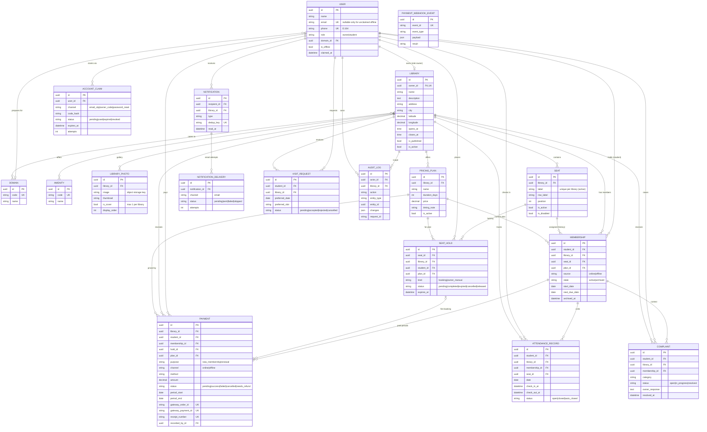

# LibraryHive — Entity Relationship Diagram

**Version:** 2.0 (Phase 3). Supersedes v1, which had separate OWNER/STUDENT tables and JSON pricing.
**Date:** 2026-10-09
**Source of truth:** `SPEC.md` v2.0. This diagram shows keys and the main fields only; constraints, indexes and full field lists are in `SPEC.md` §3.

> Project folder structure and API contracts that were in v1 of this file now live in `ARCHITECTURE.md` and (Phase 4) `BACKEND_ARCHITECTURE.md`.

## 1. Full model

## 2. Key invariants (enforced in the database)

| Invariant | Constraint (SPEC.md) |
|---|---|
| One owner has at most one library | `Library.owner_id` unique (one-to-one) |
| One pending hold per seat | `seathold_one_pending_per_seat` (partial unique) |
| One pending booking hold per student per library | `seathold_one_pending_per_student_library` |
| One active membership per seat (one occupant, D1) | `membership_one_live_per_seat` |
| One active membership per student per library | `membership_one_live_per_student_library` |
| At most one cover photo per library | `libraryphoto_one_cover` |
| No duplicate person | unique normalised `phone`, unique `email` |
| A payment is never confirmed twice | unique `gateway_order_id`, `gateway_payment_id`, webhook `event_id`; row lock in `confirm_payment` |
| No duplicate notification | unique `dedup_key` |
| One open attendance record per student | `attendance_one_open_per_student` |
| One pending visit request per student per library | `visit_one_pending_per_student_library` |

## 3. Derived (not stored) values

| Value | Derived from |
|---|---|
| Seat status (empty / reserved / occupied / disabled) | `Seat.is_disabled`, active `Membership`, live `SeatHold` |
| Membership status (active / due / overdue / archived) | `Membership.state`, `next_due_date`, business date |
| Library capacity | count of active seats |
| Dues | `next_due_date` + current plan price (D14) |
| Renewal history | successful `Payment` rows (`period_start`, `period_end`) |
