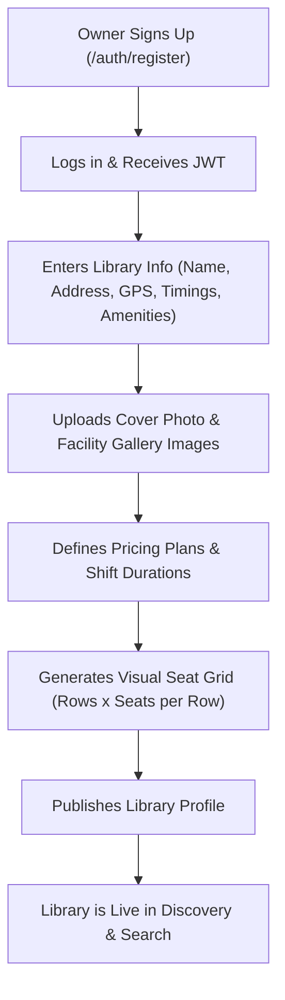
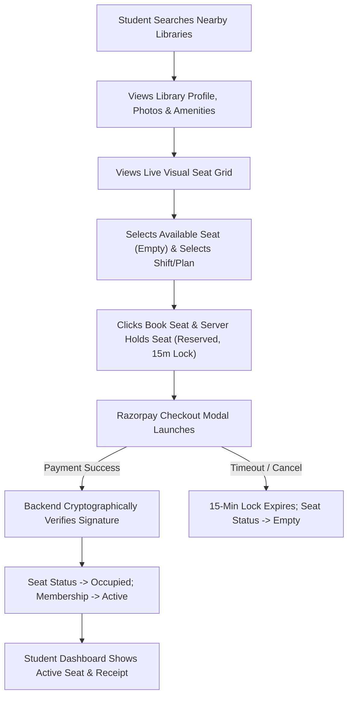
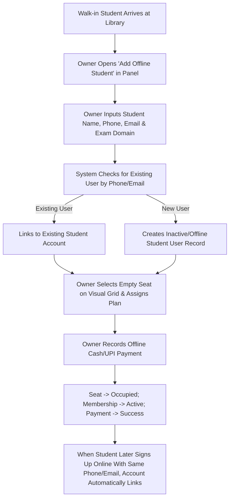
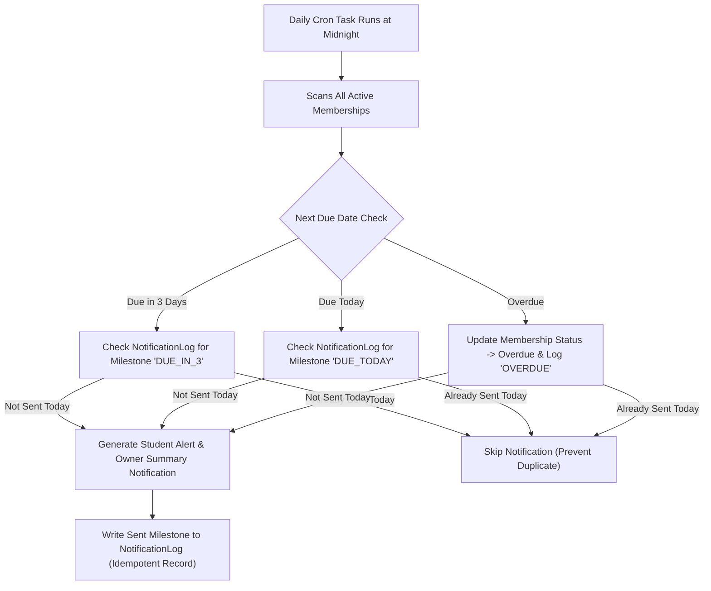
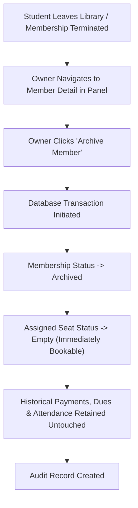
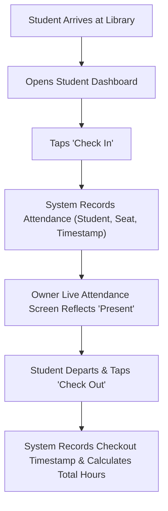

# LibraryHive — Product Features & Requirements Specification (MVP)

**Document Version:** 1.0 (Production MVP Baseline)  
**System Name:** LibraryHive  
**Product Type:** Two-Sided Multi-Tenant SaaS Platform for Study Libraries & Reading Rooms  
**Target Environments:** Responsive Web (Mobile & Desktop)  
**Document Status:** Approved Architectural & Product Baseline  

---

## 1. Product Overview

LibraryHive is a comprehensive, production-grade, multi-tenant B2B2C SaaS platform connecting students/aspirants preparing for competitive exams (UPSC, SSC, NEET, JEE, GATE, CA, etc.) with study libraries and reading rooms.

Currently, study libraries operate using physical paper registers, manual cash collection, unorganized WhatsApp groups, and fragmented spreadsheets. Students have zero real-time visibility into seat availability, seating layouts, shift timings, or amenities before physically visiting multiple libraries.

LibraryHive eliminates this friction by offering:
1. **For Library Owners:** A full-featured operational operating system to manage seat inventory, online and offline student registrations, shift-based memberships, fee collections, automated expiry notifications, attendance tracking, demo requests, and student complaints.
2. **For Students:** A transparent discovery and self-service portal to find nearby libraries, inspect amenities and photo galleries, view live visual seat grids, book specific seats for desired shifts, pay fees securely via digital payments, track attendance, and log complaints.

---

## 2. MVP Objective

The objective of the LibraryHive MVP is to deliver a fully functional, reliable, production-ready web platform that digitizes the entire lifecycle of a study library's operations and a student's membership. 

The MVP satisfies four core operational pillars:
1. **Zero Double-Bookings:** Enforce strict concurrency control at the database level so two students can never book or hold the same seat in the same shift.
2. **Harmonious Coexistence of Online & Offline Students:** Allow owners to register walk-in students without generating duplicate student profiles or conflicting memberships when that student later registers online.
3. **Automated Expiry & Dues Tracking:** Automatically calculate renewal dates, trigger idempotent expiry notifications to owners without duplicate alerts, and provide instant visibility into overdue fees.
4. **Verified Digital & Cash Payments:** Secure online payment processing via a single gateway (Razorpay) backed by cryptographic server-side signature verification, alongside audited offline cash/UPI recording by owners.

---

## 3. User Classes & Roles

| Role | Description | Access Scope |
|---|---|---|
| **Library Owner (`owner`)** | The proprietor, manager, or administrator operating a study library or reading room. | Full administrative access to their own library, seat inventory, member roster, offline admissions, fee tracking, attendance records, complaints, demo requests, and analytics. Strictly isolated from other libraries. |
| **Student / Member (`student`)** | An aspirant or student discovering libraries, booking seats, or holding an active membership. | Public access to library discovery, profiles, galleries, and seat maps. Authenticated access to personal bookings, memberships, digital payments, attendance check-in/out, and complaint tracking. |
| **Unauthenticated Visitor (`public`)** | Any student or guest browsing the platform without an account. | Can search libraries by geolocation, keyword, or exam domain, view public library profiles, photo galleries, amenities, timings, pricing plans, and live seat availability. Must register or log in to reserve, pay, or request demos. |

---

## 4. User-Role Feature Matrix

| Feature Module | Public Visitor | Student (`student`) | Library Owner (`owner`) |
|---|:---:|:---:|:---:|
| **Authentication & Profile** |
| Register / Login (JWT) | ✅ | ✅ | ✅ |
| View / Edit Own Profile | ❌ | ✅ | ✅ |
| Student Domain Selection (UPSC, NEET, etc.) | ❌ | ✅ | ❌ (Configures library domains) |
| **Library Management** |
| Discover & Search Libraries (Geo/Domain) | ✅ | ✅ | ✅ |
| View Public Library Profile, Amenities & Timings | ✅ | ✅ | ✅ |
| View Library Photo Gallery & Cover Photo | ✅ | ✅ | ✅ |
| Setup / Edit Library Profile & Timings | ❌ | ❌ | ✅ (Own Library) |
| Upload / Delete Library Photos & Cover Photo | ❌ | ❌ | ✅ (Own Library) |
| Configure Pricing Plans (Monthly, Shift-wise) | ❌ | ❌ | ✅ (Own Library) |
| **Seat Inventory & Visual Grid** |
| View Live Visual Seat Grid & Availability | ✅ | ✅ | ✅ (Own Library) |
| Interactive Visual Seat Selection | ❌ | ✅ | ✅ (For Offline Admission) |
| Bulk Grid Seat Generator (Rows × Seats) | ❌ | ❌ | ✅ (Own Library) |
| Manual Seat Status Override / Relabeling | ❌ | ❌ | ✅ (Own Library) |
| **Booking & Reservations** |
| Hourly / Shift Seat Booking | ❌ | ✅ | ❌ (Directly Admits) |
| Atomic Seat Hold (15-min Timeout) | ❌ | ✅ | ❌ |
| Booking Management & Approval / Cancellation | ❌ | ✅ (View Own) | ✅ (Manage All for Library) |
| **Student & Membership Management** |
| Offline Walk-in Student Registration | ❌ | ❌ | ✅ (Own Library) |
| Unified Student Directory (Online + Offline) | ❌ | ❌ | ✅ (Own Library) |
| View Active Memberships & History | ❌ | ✅ (Own Only) | ✅ (All Library Members) |
| Membership Archival (Free Seat, Keep History) | ❌ | ❌ | ✅ (Own Library) |
| Membership Renewal Flow | ❌ | ✅ | ✅ (Record Manual Renewal) |
| **Fees & Payments** |
| Online Payment Gateway (Razorpay UPI/Card) | ❌ | ✅ | ❌ |
| Record Offline / Cash / Manual Payment | ❌ | ❌ | ✅ (Own Library) |
| Payment History & Receipt Details | ❌ | ✅ (Own Only) | ✅ (All Library Records) |
| Overdue Dues Tracking & Aging List | ❌ | ❌ | ✅ (Own Library) |
| **Automated Notifications** |
| In-App Notification Center | ❌ | ✅ | ✅ |
| Automated Membership Expiry Alerts (Idempotent) | ❌ | ✅ | ✅ (Owner Daily Summary) |
| Booking & Payment Confirmation Alerts | ❌ | ✅ | ✅ |
| **Attendance Management** |
| Self Check-in / Check-out (Dashboard/QR) | ❌ | ✅ | ❌ |
| Real-time Present Member List & Logs | ❌ | ❌ | ✅ (Own Library) |
| Manual Attendance Override & Marking | ❌ | ❌ | ✅ (Own Library) |
| **Demo & Visit Requests** |
| Submit Demo / Visit Request | ❌ | ✅ | ❌ |
| Manage, Approve, Reject Demo Requests | ❌ | ❌ | ✅ (Own Library) |
| **Complaints & Issues** |
| Submit Categorized Complaint | ❌ | ✅ | ❌ |
| View & Respond to Complaints | ❌ | ✅ (Own Complaints) | ✅ (All Library Complaints) |
| Resolve / Close Complaint | ❌ | ❌ | ✅ (Own Library) |
| **Dashboards & Analytics** |
| Student Dashboard (Seats, Dues, QR, Alerts) | ❌ | ✅ | ❌ |
| Owner Dashboard (Occupancy, Revenue, Dues) | ❌ | ❌ | ✅ |
| Domain-wise Aspirant Breakdown Chart | ✅ | ✅ | ✅ |
| CSV Export (Members, Payments, Attendance) | ❌ | ❌ | ✅ (Own Library) |

---

## 5. Complete MVP Feature List

### 5.1 Owner Capabilities

1. **Owner Registration & Secure Authentication:**
   - Multi-tenant signup and JWT login (email and secure password).
   - Session retention, token refresh, and strict role validation.
   - Enforce single-library-per-owner constraint for MVP.

2. **Library Profile Setup & Management:**
   - One-time onboarding wizard capturing library name, complete physical address, GPS coordinates (latitude/longitude), contact phone, and contact email.
   - Configurable opening time, closing time, and descriptive operational notes (e.g., "Open 24x7 during exam seasons").
   - Facility and amenity tags: High-speed WiFi, Air Conditioning, Personal Power Sockets, Ergonomic Chairs, RO Drinking Water, Discussion Rooms, Locker Facility, CCTV Surveillance.
   - Target competitive exam domains catered to (UPSC, SSC, NEET, JEE, CA, Banking, State PSC, General Study).

3. **Library Photos Upload & Gallery Management:**
   - Upload multiple library photos (study hall, cabins, reception, amenities).
   - Designate a high-resolution Cover Photo displayed on search cards and explore headers.
   - Edit photo captions, reorder gallery, and delete outdated images.
   - Served via secure local media storage in development and S3-compatible cloud storage in production.

4. **Pricing Plans Configuration:**
   - Define multi-tier plans with distinct durations and shift types (e.g., Monthly Morning Shift: 30 days @ ₹1,200; Monthly Full Day: 30 days @ ₹2,200; Quarterly Saver: 90 days @ ₹6,000).
   - Ability to add, modify, or deactivate plans.

5. **Visual Seat Inventory & Layout Management:**
   - Grid layout generator: quick generation using row designations (e.g., `["A", "B", "C", "D"]`) and seats per row (e.g., `8` seats/row = 32 seats).
   - Custom seat label editor (e.g., "Cabin 1", "Desk A-12").
   - Real-time visual seat map showing operational state:
     - `Empty` (Green)
     - `Reserved` (Amber — in-process booking hold)
     - `Occupied` (Blue / Red — active member assigned)
     - `Maintenance / Blocked` (Gray)
   - Owner manual override: change seat status, block seats for maintenance, or release seats directly from the grid.

6. **Student Management & Offline Admission Coexistence:**
   - Complete member directory with search, filtering by status (`active`, `due`, `overdue`, `archived`), seat number, domain, and shift.
   - **Offline Student Registration:**
     - Form to register walk-in students directly (Name, Phone Number, Email, Domain, Address, Photo ID details).
     - Select seat directly from the visual grid and assign pricing plan / shift.
     - Record upfront cash/offline UPI payment.
     - Instantly mark seat as Occupied and create an Active Membership.
   - **Coexistence Guarantee:** Phone number and email normalization ensure that if an offline student later signs up online via the student app, the system links the existing account rather than creating duplicate records or throwing unhandled errors.

7. **Membership Lifecycle & Archival:**
   - Automated calculation of `start_date` and `next_due_date` based on plan duration.
   - Member statuses: `Active`, `Due` (within 3 days of expiry), `Overdue` (past due date), `Archived`.
   - **Member Exit / Archival:** When a student leaves or vacates, owner archives the record. The assigned seat is atomically transitioned back to `Empty`, while complete tenure, payment receipts, attendance history, and complaint records are permanently preserved for auditing.

8. **Fee Tracking & Overdue Management:**
   - Centralized fee ledger showing paid fees, pending dues, and overdue amounts.
   - Dedicated "Dues & Overdue" aging view sorted by days overdue (1–7 days, 8–15 days, 15+ days).
   - One-click record of manual fee collection (Cash, Direct UPI, Bank Transfer) with receipt note generation.

9. **Automated Membership-Expiry Notifications (Deduplicated):**
   - Scheduled daily background task inspecting upcoming and elapsed expiration dates.
   - In-app notification triggers at milestones: 3 days prior, 1 day prior, and on due date.
   - **Idempotency & Duplicate Prevention:** Logged against a unique combination of `(membership_id, milestone, date)` in `NotificationLog`. The owner is alerted without receiving repeated alerts on the same day.

10. **Attendance Management:**
    - Live list of students currently checked into the library with entry timestamps.
    - Historical attendance logs filterable by date, student, and seat.
    - Owner capability to manually check-in or check-out students (e.g., student forgot phone or manual register sync).

11. **Demo & Visit Request Management:**
    - Dedicated inbox of prospective student demo requests.
    - View student name, phone, desired visit date, and preferred slot.
    - One-click Actions: Approve, Reject, or Mark Completed with optional owner notes.

12. **Complaint & Issue Resolution:**
    - Centralized complaints inbox categorized by issue type: Noise / Discipline, AC / Temperature, Internet / WiFi, Cleanliness, Lighting / Power Socket, Seating Discomfort, Other.
    - Filter by status (`Open`, `In Progress`, `Resolved`).
    - Post official owner response notes and mark issue as Resolved.

13. **Owner Executive Dashboard & Reporting:**
    - Real-time KPI summary cards: Total Seats, Occupied Seats, Vacant Seats, Reserved Holds, Total Active Members, Today's Check-ins, Overdue Payments Count, Open Complaints.
    - Visual occupancy progress bar and domain-wise member distribution chart (UPSC vs NEET vs SSC).
    - CSV Data Export for members, payment ledgers, and attendance sheets.

---

### 5.2 Student Capabilities

1. **Student Registration & Profile:**
   - Simple mobile/email registration with password and JWT authentication.
   - Student profile capturing name, phone number, primary target exam/domain (UPSC, NEET, JEE, SSC, etc.), and optional emergency contact.

2. **Library Discovery & Advanced Search:**
   - Proximity search using browser geolocation (`lat`, `lng`, `radius` in km).
   - Keyword search across library name, area, and city.
   - Filter by exam domain catered to, AC/amenity availability, and operating hours.
   - Result cards displaying distance (km), cover photo, starting monthly fee, total seats, and live empty seat count.

3. **Public Library Profile & Virtual Tour:**
   - Comprehensive library explore page showcasing cover photo and full photo gallery.
   - Verified list of facilities and amenities (WiFi, Power Backup, AC, RO Water, Lockers).
   - Daily opening and closing hours and operational rules.
   - Domain breakdown chart illustrating student peer group (e.g., "45% UPSC, 30% SSC Aspirants").
   - Pricing plans table detailing shift timings, durations, and rates.

4. **Live Visual Seat Grid & Interactive Selection:**
   - High-fidelity interactive floor layout showing all seats arranged by rows and numbers.
   - Visual distinction between Empty, Reserved, and Occupied seats.
   - Real-time click-to-select interaction displaying selected seat details, plan options, and shift timings.

5. **Basic Hourly / Shift Booking Flow:**
   - Select plan duration (Monthly, Quarterly, Shift/Hourly Pass).
   - Select operational shift (Full Day, Morning Slot, Evening Slot, Night Slot).
   - Initiate booking: atomically holds the seat in `Reserved` state for 15 minutes while awaiting payment.
   - Automatic countdown timer in UI; if payment is aborted or expires, seat automatically returns to `Empty`.

6. **Online Fee Payment (Razorpay):**
   - Seamless checkout supporting UPI (Google Pay, PhonePe, Paytm, BHIM), Credit/Debit Cards, and NetBanking.
   - Instant cryptographic server-side signature verification (`order_id`, `payment_id`, `signature`) and webhook fallback.
   - Upon confirmed payment, seat immediately transitions from `Reserved` to `Occupied`, membership status is activated, and digital receipt is generated.

7. **Membership Self-Service & Renewal:**
   - View active membership card showing assigned seat label, plan name, shift hours, start date, and next due date.
   - Proactive renewal button available 7 days prior to expiry.
   - 1-click renewal payment extending the `next_due_date` seamlessly without releasing the seat.

8. **Demo / Visit Scheduling:**
   - "Schedule a Free Demo Visit" button on any library explore page.
   - Select intended visit date and time slot.
   - Track approval status in the student dashboard.

9. **Attendance Check-In / Check-Out:**
   - Quick 1-tap check-in and check-out button on the student dashboard when visiting the library.
   - View monthly personal attendance history and total hours spent.

10. **Complaint / Issue Reporting:**
    - Submit a complaint directly to the library owner selecting category, detailed description, and urgency.
    - View owner responses and real-time status updates (`Open` → `In Progress` → `Resolved`).

11. **Student Dashboard:**
    - Consolidated command center:
      - Active Seat Badge & Library Card
      - Next Due Date Countdown & Quick Renewal
      - Today's Attendance Check-in Button
      - Recent Payments & Downloadable Receipts
      - Open Complaints Status
      - Scheduled Demo Visit Status

---

## 6. End-to-End User Workflows

### Workflow 1: Library Owner Onboarding & Full Setup


### Workflow 2: Student Discovery, Visual Seat Selection & Online Booking


### Workflow 3: Offline Walk-In Student Registration (Coexistence)


### Workflow 4: Automated Expiry, Dues & Deduplicated Notification


### Workflow 5: Member Archival & Seat Release


### Workflow 6: Attendance Tracking & Verification


---

## 7. Edge Cases & Handling Strategy

1. **Simultaneous Seat Selection (Race Condition):**
   - *Risk:* Two students submit reservations for the exact same seat at the exact same fraction of a second.
   - *Mitigation:* Database row-level lock (`select_for_update`) within an atomic transaction. The first request acquires the lock and transitions seat to `reserved` with a timestamp; the second request fails with HTTP 409 Conflict ("Seat is currently being reserved by another student").

2. **Abandoned Payment Window (Orphaned Seat):**
   - *Risk:* Student initiates payment, reserving a seat, but closes the browser or leaves UPI app pending.
   - *Mitigation:* Explicit 15-minute `reserved_until` expiry timestamp. The seat listing queries treat expired reservations as `empty`. A lightweight background task or lazy-evaluation cleans up expired reservations.

3. **Offline Student Registers Online Later:**
   - *Risk:* Owner registers John Doe with phone `9876543210`. Later, John creates an online account with phone `9876543210`. If unhandled, this could crash with a unique constraint violation or create two distinct users.
   - *Mitigation:* Account creation checks existing phone and email records. If an offline profile exists without an online auth credential, the system converts the offline record into a full active user account, attaching existing memberships and payment histories seamlessly.

4. **Network Drop During Payment Webhook:**
   - *Risk:* Student's bank debits money, but user's browser drops connection before reaching success page, and webhook is delayed.
   - *Mitigation:* Razorpay Webhook is verified independently and idempotently on the backend. When the webhook arrives, it transitions `payment.status` to `success`, marks `seat.status` to `occupied`, and activates the membership regardless of whether the frontend client is online.

5. **Owner Archiving Member With Pending Dues:**
   - *Risk:* Owner archives a non-paying member, inadvertently erasing unpaid balance records.
   - *Mitigation:* Archival only decouples the `seat_id` and sets `membership.status = "archived"`. All past payment entries and overdue balance calculations remain immutable in the historical ledger.

6. **Repeated Notification Spam:**
   - *Risk:* If the daily cron task runs multiple times (e.g., worker restart), owners and students could receive dozens of duplicate expiry emails/in-app pings.
   - *Mitigation:* Database uniqueness constraint on `NotificationLog(membership_id, milestone, send_date)`. Subsequent runs on the same date will fail fast or skip cleanly.

---

## 8. Feature Priority & Implementation Order

```
[Phase 1: Core Foundation]
├── Authentication & Role-Based Access Control (Owner / Student)
├── Library Profile Setup & Location Coordinates
├── Pricing Plan Configuration
└── Visual Seat Inventory & Grid Generation

[Phase 2: Discovery, Media & Demo Visits]
├── Library Photo Upload & Cover Photo Gallery
├── Public Library Discovery (Geo & Domain Filtering)
├── Public Library Explore Page & Amenities
└── Demo / Visit Request Scheduling & Management

[Phase 3: Booking, Concurrency & Payments]
├── Atomic Shift-based Seat Reservation (15-min Lock)
├── Razorpay Payment Integration & Signature Verification
├── Offline / Cash Payment Entry by Owner
└── Membership Activation & Digital Receipts

[Phase 4: Operations & Student Lifecycle]
├── Unified Student Roster (Online + Offline Coexistence)
├── Member Archival & Atomic Seat Release
├── Automated Expiry & Deduplicated Notification Engine
├── Attendance Tracking (Self Check-in/out & Owner Roster)
└── Categorized Complaint Management & Resolution

[Phase 5: Dashboards, Analytics & Audit]
├── Owner Executive Dashboard (Occupancy, Dues Aging, Revenue)
├── Student Command Dashboard
├── Domain Breakdown Visualizations
└── CSV Data Export for Auditing
```

---

## 9. Future / P2 Scope (Post-MVP)

The following features are formally recognized as post-MVP enhancements and must **NOT** be built during MVP development:
- Native iOS and Android applications (MVP is 100% responsive web).
- Drag-and-drop 2D/3D visual floor plan designer (MVP uses structured row-column grid).
- Automated SMS and WhatsApp messaging gateways (MVP relies on production in-app notifications and email alerts).
- Multi-branch library management under a single owner account (MVP assumes 1 owner = 1 library).
- Automated biometric fingerprint / turnstile gate integration (MVP uses web check-in/out and QR).
- Platform Super-Admin monetization and subscription billing for library owners.
- Student waitlist and automated seat-swap negotiation.
- In-app real-time peer-to-peer chat between students and owners.

---

## 10. Explicit Out-of-Scope Features

The following features are completely out of scope and shall not be designed or implemented:
- Book cataloging, lending, and ISBN barcode tracking (LibraryHive is a seat & study-room management SaaS, not a public book lending library system).
- Library staff payroll, employee salary management, and staff shifts.
- Cafeteria inventory, food ordering, and canteen billing.
- AI-driven automated seat recommendation or dynamic surge pricing.

---

## 11. MVP Definition of Done (DoD)

A feature is considered **Done** and ready for production MVP deployment only when:
1. **End-to-End Functional Completeness:** Both frontend UI and backend APIs are fully implemented without mock data, fake delays, or placeholder hardcoding.
2. **Atomic Concurrency Tested:** Seat booking handles simultaneous concurrent attempts safely without double-allocation.
3. **Coexistence Verified:** Offline student creation and online student registration link seamlessly without crashing or duplicating records.
4. **Payment Integrity:** Razorpay test-mode transactions verify HMAC SHA-256 signatures server-side and trigger atomic membership activation.
5. **Idempotent Notifications:** Automated expiry cron jobs execute without producing duplicate notifications for the same student on the same day.
6. **Data Isolation (Multi-Tenancy):** Owner endpoints strictly verify that an owner cannot read or mutate another library's data (403 Forbidden).
7. **Responsive UI:** Tested across desktop (1920x1080, 1366x768) and mobile viewports (375px–430px) with dedicated empty, loading, and error states.
8. **Automated Test Coverage:** Core business logic (booking locks, payment verification, offline student deduplication, permissions) is backed by passing automated tests.
