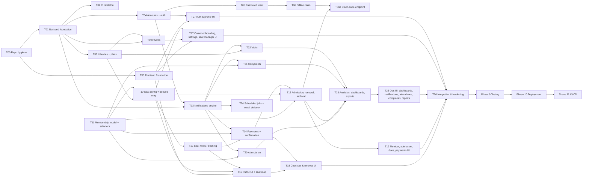

# LibraryHive — Implementation Plan (Phase 7)

**Version:** 1.0
**Date:** 2026-10-09
**Status:** **APPROVED** (2026-10-09). Later decisions recorded on 2026-10-09: D15 (team), external-dependency notes, and **D19: fresh implementation from the approved design** (legacy application code retired; see T00 and §5).
**Builds on (all approved):** `FEATURES.md` v2.2 · `ARCHITECTURE.md` · `SPEC.md` v2.0 · `BACKEND_ARCHITECTURE.md` (endpoint numbers `#n`) · `UI_ARCHITECTURE.md` · `SECURITY.md` (SEC-1 approved)

This plan says **who builds what, in which order, and how we know it is done**. No code is written in this phase.

---

## 1. Planning principles

1. **One owner per backend app and per frontend area.** Every task has exactly one owner; nobody edits another owner's app except through a reviewed PR that the owner approves.
2. **Contracts first.** The data model (`SPEC.md`) and API contract (`BACKEND_ARCHITECTURE.md` §9) are frozen. Any change goes through the contract-change rule in §7.
3. **Dependency order, P0 before P1.** P1 items in a module start only after that module's P0 items are done.
4. **No stubs, no fake data in product code** (AGENTS §1.3). If a dependency is not ready, the dependent feature waits or is merged without that part. It never ships a placeholder value. Test doubles are allowed only in tests (gateway, email).
5. **Every task ends green:** tests, lint, type check and build pass, and the task's checklist in `ARCHITECTURE.md` §23.1 (old code removed) is done.
6. **Fresh implementation from the approved design (D19, 2026-10-09).** The application code written before the approved design is retired (preserved in `legacy/*` tags). Every module is built from `SPEC.md`, `BACKEND_ARCHITECTURE.md` and `UI_ARCHITECTURE.md`. A legacy piece may be reused only if it is explicitly verified against the approved contract and the reuse is stated in the PR description.

---

## 2. Team assignment (final)

`FEATURES.md` gave tentative owners per feature. Assigning **by app** (the rule in `ARCHITECTURE.md` §8.1) changes a few of them; the changes are listed in §2.2 and `FEATURES.md` is updated to match.

### 2.1 Ownership map

| Person | Area | Backend apps | Frontend areas | Main features |
|---|---|---|---|---|
| **P1: Platform & Identity** | Foundation, security, auth, logging, CI, deployment | `core`, `accounts`, `config/` | Frontend foundation (`components/ui`, `components/layout`, `lib/api-client.ts`, `lib/auth*`, providers, `next.config`), auth pages, profile pages | AUTH-*, OFF-04, LOG-01..06/08/10/11, NFR-01/02/06/07/08 |
| **P2: Library & Seats** | Library profile, photos, discovery, seat configuration, seat holds, seat map, visits | `libraries`, `seats`, `visits` | Landing, discover, library page, `components/seat-map`, `components/library`, owner onboarding, library settings, seat manager, visit screens | LIB-*, PHO-*, DIS-*, SEAT-*, BOOK-01..05/07, DEMO-* |
| **P3: Membership & Payments** | Memberships, offline admission, renewals, archival, payments, dues | `memberships`, `payments` | Checkout and renewal, `components/booking`, student memberships and payments, owner members, admission, dues, payments | MEM-*, OFF-01/02/03/05, PAY-*, BOOK-06 |
| **P4: Operations & Insights** | Notifications, attendance, complaints, dashboards, reports | `notifications`, `attendance`, `complaints`, `analytics` | Dashboards (owner, student), notifications, attendance, complaints, reports, activity log, `components/charts` | NOT-*, ATT-*, CMP-*, DASH-*, LOG-07, LOG-09 |

**Team (D15, decided 2026-10-09):** **P1 = Divyanshi · P2 = Priya · P3 = Jagriti · P4 = Ritesh.** Person C (the earlier booking/payment/membership role) has no unpushed work to preserve.

**Who wrote the existing code (from git history, for hand-over):** Priya Saini, initial setup (core, accounts, libraries) and the unmerged `complaints-work` branch · Rathourdivyanshi6398, Person A owner setup and Person B discovery/seat map (Person B commits not yet pushed) · RITESH JHA, bookings, payments, memberships and notifications on `main` · Jagritipandey625, discovery and explore pages on `main` and the unmerged seat-map branch. Under D15, several areas are now owned by someone other than their original author (e.g. payments written by Ritesh are owned by Jagriti as P3; discovery written by Jagriti is owned by Priya as P2; complaints written by Priya are owned by Ritesh as P4). The original author is asked to review the first PR that restructures their code (§7).

### 2.2 Changes from the tentative owners in FEATURES.md (and why)

| Feature(s) | Was | Now | Reason |
|---|---|---|---|
| LIB-*, PHO-*, SEAT-01/02/04/07 | P1 | **P2** | `libraries` and `seats` become one owner's domain (P2 already owned the seat map, discovery and the explore page). P1 takes the platform foundation, which is on everyone's critical path. |
| BOOK-01..05, SEAT-03, SEAT-09 | P3 / P2 | **P2** | Holds live in the `seats` app; the seat-lock protocol (SPEC §4.1) should have one owner. P3 calls `seats.services` when confirming payments and admissions. |
| OFF-04 (claim) | P3 | **P1** | The claim uses `AccountClaim` in `accounts`, shared with password reset (AUTH-15). P3's admission UI calls P1's claim-code endpoint (#55). |
| NOT-*, LOG-09 | P3 | **P4** | Balances load: P3 carries the payment and booking-confirmation complexity. Notifications are a cross-cutting service every app calls. |
| PAY-10/11 (dues) | P4 | **P3** | Dues are derived from `memberships` and live in `payments` (#49). |
| MEM-06/08 UI | P4 | **P3** | Archival lives on the member detail screen, which P3 builds. |
| NFR-04 (fake-data removal) | P1 (setup) / P2 | **P2** | All three existing pages (discover, library page, owner setup) are rebuilt by P2. |

### 2.3 Shared files (one owner, others contribute by PR)

| File / area | Owner | Rule |
|---|---|---|
| `backend/config/settings/*`, `config/urls.py`, `requirements*.txt` | P1 | Others add their app's URL include, settings and dependencies via PR |
| `backend/apps/core/*` | P1 | Changes affect everyone; needs a second reviewer |
| `frontend/components/ui/*`, `components/layout/*`, `lib/api-client.ts`, `lib/auth*`, `next.config.mjs` | P1 | New UI kit components are requested from P1 or added by PR with P1's review |
| `frontend/lib/api-types.gen.ts` | generated | Regenerated by whoever changes an endpoint; CI checks freshness |
| `frontend/lib/api/<app>.ts`, `lib/schemas/<area>.ts` | the app's owner | — |
| `run_scheduled_jobs` command (orchestrator) | P4 | Each step function is owned by its app owner: `expire_holds` (P2), `reconcile_payments` (P3), `renewal_notifications` / `owner_summaries` / `send_emails` / `auto_close_attendance` (P4) |
| `seed_demo` management command (replaces `seed_libraries`) | P1 | Each owner provides `apps/<app>/seed.py` creating realistic demo data **through their services** |
| `README.md`, `.env.example` files, CI workflows | P1 | — |

---

## 3. Milestones and dependency order

The brief's suggested order (foundation → … → deployment) is followed. Work runs in parallel wherever the dependency graph allows.

| Milestone | Tasks | Exit criterion |
|---|---|---|
| **M0 Foundation** | T00–T03 | Fresh clone runs backend (PostgreSQL) and frontend with documented commands; CI green; envelope, logging, audit and UI kit usable by everyone |
| **M1 Identity & library** | T04–T10, T13 | Owner can register, log in, create a library with plans, seats and photos; library appears in discovery; seat map shows derived status; notifications engine available |
| **M2 Booking & money** | T11, T12, T14, T15, T06b | Student can hold a seat and pay in Razorpay test mode; owner can admit an offline student with cash; renewals and archival work; claim flow works end to end |
| **M3 Operations** | T20–T24 | Attendance, complaints, visits, dashboards, reports, exports and scheduled jobs work |
| **M4 Frontend complete** | T07, T16–T19, T25 | Every screen in `UI_ARCHITECTURE.md` implemented with all four states |
| **M5 Integration** | T26 | All flows pass end to end; isolation and security checklists pass; no obsolete code remains; ready for Phase 9 |

**Effort sizes** (relative): S ≈ 1–2 days, M ≈ 3–5 days, L ≈ 6–10 days of focused work for one person. A calendar is **NOT SPECIFIED — REQUIRES DECISION**: it depends on the team's weekly hours and deadline (§9).

---

## 4. Tasks

Branch names follow `AGENTS.md` §10: **`feature/<task-name>`** (one short-lived branch per task, from the latest `main`, deleted after merge), `fix/<issue>` for fixes, `docs/<doc>` for documentation, `chore/<topic>` for repository maintenance. Every task's tests run against **PostgreSQL**.

### Stage 0 — Foundation

#### T00 Legacy cleanup and repository reset · P1 · S · `chore/legacy-cleanup` (revised 2026-10-09 by D19)
The application code from before the approved design is **retired, not reconciled** (D19). Nothing from it is merged into the new implementation.

| Step | Action | Shared repository? |
|---|---|---|
| 0a | Annotated `legacy/*` tags on every legacy head: `legacy/main-2026-10-05` (c54717d), `legacy/local-main-person-b-2026-10-04` (944478b, never pushed), `legacy/complaints-work`, `legacy/feature-fr-03-discovery`, `legacy/feature-fr-04-explore`, `legacy/feature-fr-05-seat-map`, `legacy/person-c-booking-payment-membership` | Local; **pushing the tags needs confirmation** |
| 0b | Branch `chore/legacy-cleanup` from `origin/main`: commit the approved documents; remove all legacy application code (`backend/`, `frontend/`); add the Docker PostgreSQL setup, `.env.example`, `.gitignore` and `README.md` | Local |
| 0c | Push the tags, then push `chore/legacy-cleanup` and open a PR to `main` | **Confirmation required (each)** |
| 0d | Review and merge the PR into `main` | **Confirmation required** |
| 0e | Delete the legacy remote branches, one at a time, **after** their tags are on GitHub | **Confirmation required immediately before each deletion** |
| 0f | Local: point `main` at the new `origin/main`; keep the local `docs/phase-0-7-snapshot` branch until the PR is merged | Local |

- **Dependencies:** none. **Tests:** `docker compose config` validates; the database container starts and passes its health check.
- **DoD:** `main` contains only the approved documents and the local-development setup; every legacy head is reachable through a `legacy/*` tag on GitHub; no history rewritten; no branch deleted without confirmation.

#### T01 Backend foundation · P1 · L · `feature/platform-foundation`
- **Backend files:** `config/settings/{base,local,test,production}.py`, `config/urls.py` (only `/api/v1/`), `requirements.txt`, `requirements-dev.txt`, `backend/.env.example`; `apps/core/`: `models.py` (Domain, Amenity, AuditLog), `exceptions.py`, `handlers.py`, `responses.py`, `pagination.py`, `permissions.py`, `mixins.py`, `middleware.py` (request ID, access log), `logging.py` (JSON + redaction), `audit.py`, `storage.py`, `images.py`, `dates.py`, `views.py` (#1 health, #2–#3 meta, #5 schema).
- **DB:** new tables `core_domain`, `core_amenity` (+ data migration seeding the vocabularies from SPEC §3.3), `core_auditlog`.
- **APIs:** #1, #2, #3, #5.
- **Config:** DRF defaults (IsAuthenticated, exception handler, pagination, throttle rates and DB cache), SimpleJWT settings (§SECURITY 4.1), CORS/hosts/HTTPS from env, production startup guard, `TIME_ZONE=Asia/Kolkata`, `DATA_UPLOAD_MAX_MEMORY_SIZE`.
- **Must not reappear (legacy patterns):** global-freeze `requirements.txt`, hardcoded settings, SQLite default, `/api/` duplicate mount.
- **Tests:** envelope for success, validation, 401, 403, 404, 429, 500; constraint→409 mapping; redaction filter; request ID header; production guard refuses unsafe settings; image pipeline (oversize, fake JPG, SVG, bomb, EXIF stripped); **route-inventory test** (fails on unexpected `AllowAny`).
- **DoD:** `makemigrations --check` clean; backend starts against the Docker PostgreSQL from the T00 setup; documented local PostgreSQL setup works on Windows and Linux.

#### T02 CI skeleton · P1 · S · `feature/ci-pipeline`
- **Files:** `.github/workflows/ci.yml`.
- **Do:** backend job (ruff, `makemigrations --check --dry-run`, `manage.py test` with a PostgreSQL service); frontend job (lint, `tsc --noEmit`, `next build`). Branch protection on `main` requiring CI and one review. (Deployment workflows and the rest of CI/CD come in Phase 11.)
- **Dependencies:** T01, T03.
- **DoD:** a PR with a failing test cannot be merged.

#### T03 Frontend foundation · P1 · L · `feature/frontend-foundation`
- **Implementation notes (2026-10-09):** see `UI_ARCHITECTURE.md` §17 (Tailwind 4 CSS tokens, unified `radix-ui`, TypeScript 5.9 / ESLint 9 for tool compatibility, `BACKEND_ORIGIN` and `MEDIA_ORIGIN` env vars, CSP nonce via `proxy.ts`). The full login/refresh round trip is verified end to end in T04, once the auth endpoints exist.
- **Frontend files:** `package.json` (dependencies in UI §15), `tailwind.config.ts`, `postcss.config`, `app/globals.css` (tokens), `app/layout.tsx` (font, providers), `app/global-error.tsx`, `app/not-found.tsx`, `next.config.mjs` (**rewrite `/api/v1/auth/*` to the backend for SEC-1**, security headers and CSP from SECURITY §8), `tsconfig.json` (`strict: true`), ESLint config, Vitest config; `components/ui/*` (full kit, UI §2.3), `components/layout/*` (PublicShell, StudentShell, OwnerShell, AuthGuard); `lib/api-client.ts`, `lib/auth.ts`, `lib/auth-context.tsx` (in-memory access token, refresh on load), `lib/query-keys.ts`, `lib/errors.ts`, `lib/format.ts`, `lib/types.ts`, `lib/api-types.gen.ts` + generation script; `frontend/.env.example`.
- **Must not reappear (legacy patterns):** inline-styled header in `layout.tsx`, `declarations.d.ts`, `NEXT_PUBLIC_RAZORPAY_KEY_ID`, `/api` base URL.
- **Dependencies:** T00 (T04's auth endpoints for the full refresh flow; until then the AuthProvider is tested with unit tests only).
- **Tests:** api-client (envelope unwrap, single-flight refresh on 401, error mapping, server time offset); AuthGuard redirects; UI kit components with `axe`.
- **DoD:** shells render at all six viewports; lint (incl. `jsx-a11y`, `no-explicit-any`) and build pass.

### Stage 1 — Identity

#### T04 Accounts and authentication · P1 · M · `feature/auth`
- **Backend:** `apps/accounts/` `models.py` (User changes, SPEC §3.1), `phone.py` (`normalize_phone`), `services.py` (`register`, `login`, `logout`, `update_profile`, `find_identity`), `selectors.py`, `serializers.py`, `views.py`, `urls.py`, `admin.py`.
- **DB:** migration: `updated_at`, `is_offline`, `claimed_at`, `domain` FK (data-migrate the free-text domain), phone E.164 + unique, email nullable + checks; `token_blacklist` tables.
- **APIs:** #6–#11 with the refresh cookie (SEC-1), `CLAIM_REQUIRED` and `IDENTITY_CONFLICT` behaviour.
- **Tests:** register owner and student; duplicate email and phone; password validators; generic login failure; throttling; refresh rotation and reuse rejected; logout blacklists and clears cookie; cookie flags (`HttpOnly`, `Secure`, `SameSite=Strict`, path); `Origin` check on cookie endpoints; register matching an offline record returns `CLAIM_REQUIRED`; deactivated user rejected.
- **DoD:** all auth security tests in SECURITY §20 "Auth" pass.

#### T05 Password reset · P1 · S · `feature/password-reset`
- **Backend:** `AccountClaim` model (all three channels), `services.request_password_reset` / `confirm_password_reset`, email templates; APIs **#13a, #13b**.
- **Tests:** SECURITY §20 one-time-code tests; neutral responses; all refresh tokens blacklisted after reset; offline records get no email.
- **Dependencies:** T04.

#### T06 Offline account claim · P1 · M · `feature/account-claim`
- **Backend:** `start_claim`, `complete_claim`, `issue_claim_code` services; APIs **#12, #13**. Tests create offline users directly through the model factory until T15 provides admissions.
- **Tests:** claim via email OTP and via owner code; wrong, expired, reused, locked codes; same `User.id` kept and history visible; never matches by name; conflicting identity rejected.
- **T06b** (after T15): API **#55** owner claim-code issuance; tests that only offline students with a membership in the owner's library qualify (others 404).

#### T07 Auth and profile screens · P1 · M · `feature/auth-ui`
- **Frontend:** `app/(auth)/login`, `register`, `claim`, `forgot-password`, `reset-password`; `student/profile`, `owner/profile`; `lib/api/auth.ts`, `lib/schemas/auth.ts`.
- **Dependencies:** T03, T04, T05, T06.
- **Tests:** form validation and server error mapping; `?next=` accepts only relative paths; Playwright: register → login → logout; claim flow.
- **DoD:** UI §6 behaviour, all four states, six viewports.

### Stage 2 — Library and seats

#### T08 Libraries and pricing plans · P2 · M · `feature/library-management`
- **Backend:** `apps/libraries/` `models.py` (Library and PricingPlan changes, SPEC §3.5, §3.7), `services.py` (`create_library`, `update_library`, plan CRUD, `refresh_publish_state`), `selectors.py` (public list with bounding box, detail, `starting_price`, seat counts via `seats.selectors`), serializers (owner vs public output), views, urls.
- **DB:** add description, city, area, decimal coordinates (0,0 → NULL), M2M domains (data-migrate `domains_catered`) and amenities, `is_published`, `published_at`, `is_active`, `operating_notes` rename, drop `total_seats`, owner FK to PROTECT; plan `timing_note`, `is_active`, checks, partial unique name.
- **APIs:** #14, #15 (without `domain_breakdown` until T23 adds it; **the field is omitted, not faked**), #17–#24.
- **Must not reappear (legacy patterns):** nested `pricing_plans` / `initial_seats` / `seat_layout` handling, `libraries/me`, domain-breakdown duplicates, silent `except Exception` blocks.
- **Tests:** library create/edit/permission tests (written fresh against the contract); publish rules; plan deactivation keeps referenced plans; coordinates validation; discovery filters, radius and sorting; query count does not grow per library; isolation (§SECURITY 6.4).

#### T09 Library photos · P2 · M · `feature/library-photos`
- **Backend:** `LibraryPhoto` model, `upload_photo`, `delete_photo`, `set_cover`, `update_photo`; APIs #25–#29; photos in #14 (cover thumbnail) and #15.
- **DB:** `libraries_libraryphoto` with the one-cover partial unique.
- **Dependencies:** T01 (images and storage), T08.
- **Tests:** 15-photo limit under concurrency; one cover; delete cover reassigns; storage objects removed only after commit; another owner's photo gives 404; upload security tests.

#### T10 Seat configuration and derived seat map · P2 · M · `feature/seat-management`
- **Backend:** `apps/seats/` `models.py` (Seat changes, SPEC §3.8), `services.py` (`create_seats`, `update_seat`, `deactivate_seat`, `set_disabled`), `selectors.py` (`seat_map` with derived status, counts), views, urls.
- **DB:** drop `status`; add `row_label`, `position` (backfilled by parsing existing labels), `is_active`, `is_disabled`, `disabled_reason`; partial unique label.
- **APIs:** #16, #30–#35.
- **Dependencies:** T08; **T11** (needs `memberships.selectors.active_membership_exists` for the Occupied status).
- **Must not reappear (legacy patterns):** client-writable status, `seats/library/{id}/` route, PUT alias, duplicated seat-creation logic.
- **Tests:** seat configuration tests (written fresh against the contract); grid generation never resets existing seats; cannot deactivate or disable a seat in use; public map never exposes identities; isolation.

#### T11 Membership model and selectors · P3 · S · `feature/membership-model`
- **Backend:** `Membership` model (SPEC §3.10), `selectors.py` (`annotate_status`, `active_membership_exists(seat)`, `student_is_member(student, library)`, `current_membership(student, library)`), admin.
- **DB:** `memberships_membership` with partial uniques and checks.
- **Why early:** unblocks T10, T12, T20, T21 without waiting for admission and payments.
- **Tests:** derived status at the boundaries (today+3, today, yesterday, archived) in Asia/Kolkata; constraints reject a second active membership per seat and per student-library.

#### T12 Seat holds (booking start) · P2 · M · `feature/seat-holds`
- **Backend:** `SeatHold` model, `create_booking_hold`, `cancel_hold`, `place_manual_hold`, `release_hold`, `expire_dead_holds` (+ scheduled step `expire_holds`); APIs #36–#40.
- **DB:** `seats_seathold` with partial uniques and checks.
- **Dependencies:** T10, T11, T13 (notification to the student when the owner releases their hold).
- **Tests:** **concurrency** (N threads, one seat → exactly 1 success, N−1 `SEAT_UNAVAILABLE`); dead holds treated as free immediately; one hold per student per library; `ALREADY_MEMBER`; plan from another library rejected; owner manual hold blocks booking; release audited.

### Stage 3 — Membership and payments

#### T13 Notifications engine · P4 · M · `feature/notifications`
- **Backend:** `apps/notifications/` `Notification`, `NotificationDelivery` models, `services.notify()` (dedup key, `ignore_conflicts`, delivery row creation), selectors, APIs #58–#61, email sender abstraction.
- **DB:** both tables with unique `dedup_key` and `(notification, channel)`.
- **Why early (stage 1):** every other app calls `notify()`.
- **Tests:** dedup (insert 5×, one row); recipient isolation; unread count; mark read is idempotent.

#### T14 Payments and booking confirmation · P3 · L · `feature/payments`
- **Backend:** `apps/payments/` `Payment`, `PaymentWebhookEvent` models, receipt sequence migration, `gateway.py` (Razorpay adapter), `services.py` (`create_order`, `verify_checkout`, `handle_webhook`, `confirm_payment`, `reconcile_stale_orders`), selectors (history, ledger), views, urls; `memberships.services.activate_from_hold`.
- **APIs:** #41 (new booking part), #42, #43, #44–#47.
- **Dependencies:** T11, T12, T13; Razorpay **test-mode keys** (D2) to run the manual staging check (automated tests use the fake gateway).
- **Tests:** SECURITY §10.5 (forged signatures, another student's order, amount tampering, replayed webhooks, verify-vs-webhook race, late capture after hold expiry → confirm or `needs_refund`); idempotency; reconciliation; isolation; envelope on gateway errors (502).
- **DoD:** a real test-mode payment on a local or staging environment completes and creates exactly one membership.

#### T15 Admission, renewal and archival · P3 · L · `feature/membership-lifecycle`
- **Backend:** `memberships.services` `admit_offline_student`, `apply_renewal`, `archive_membership`; `payments.services.record_offline_payment`; dues selector; APIs #41 (renewal part), #48–#54, #56, #57.
- **Dependencies:** T04 (`find_identity`), T10, T11, T14.
- **Tests:** admission creates or links the user per the SPEC §4.6 table (new, existing, conflict, owner identity); admission vs online booking race on one seat (one wins); manual hold consumed by its owner's admission; renewal date arithmetic (on time, early, overdue ≤ 15 days, > 15 days) and renewal window (`RENEWAL_NOT_OPEN`); archival frees the seat and keeps history; dues sorted by days overdue; isolation.

### Stage 4 — Operations

#### T20 Attendance · P4 · M · `feature/attendance`
- **Backend:** `AttendanceRecord` model, `check_in`, `check_out`, `auto_close_open_records` (+ scheduled step), P1-priority owner corrections; APIs #62–#67 (P0), #68–#70 (P1).
- **Dependencies:** T11, T13.
- **Tests:** one open record (double-tap concurrency); check-out without check-in; archived member rejected; check-in at another library rejected; auto-close at closing time; isolation.

#### T21 Complaints · P4 · S · `feature/complaints`
- **Backend:** `Complaint` model and services; APIs #71–#76 (image upload P1).
- **Dependencies:** T11, T13.
- **Tests:** only members (current or past) of the library can complain; transitions; response required to resolve; notifications; isolation.

#### T22 Visits · P2 · S · `feature/visits`
- **Backend:** `VisitRequest` model and services; APIs #77–#81. **Frontend:** visit dialog on the library page, `student/visits`, `owner/visits`.
- **Dependencies:** T08, T13, T16.
- **Tests:** one pending per library; date range; transitions; notifications; isolation.

#### T23 Analytics, dashboards and exports · P4 · M · `feature/analytics`
- **Backend:** `apps/analytics/selectors.py` (owner dashboard, student dashboard, domain breakdown, occupancy, revenue, complaints), CSV writers; APIs #82–#89; adds `domain_breakdown` to #15 (coordinated PR with P2).
- **Dependencies:** T15, T20, T21, T22.
- **Tests:** each dashboard number equals its list's count (two libraries present); revenue counts successful payments only; CSV injection escaping; exports scoped to the library; audit-log view scoped and without IP.

#### T24 Scheduled jobs and email delivery · P4 · M · `feature/scheduled-jobs`
- **Backend:** `run_scheduled_jobs` command (orchestrator, `--only`, `--dry-run`, non-zero exit on failure), steps `renewal_notifications`, `owner_summaries`, `send_emails` (backoff, attempts), wiring of P2's `expire_holds`, P3's `reconcile_payments`, P4's `auto_close_attendance`; API #4 (job trigger, disabled unless the token is set).
- **Dependencies:** T12, T14, T15, T20, T13.
- **Tests:** run 5× → one notification per milestone; owner summary once per library per day; email retry and backoff; a failing step does not stop later steps; exit code.

### Stage 5 — Frontend screens

#### T16 Public screens and seat map · P2 · L · `feature/public-ui`
- **Frontend:** `app/(public)/page.tsx` (landing), `discover/`, `libraries/[id]/`; `components/seat-map/*` (SeatMap, legend, a11y grid, list view), `components/library/*` (LibraryCard, LibraryMap, LocationPicker, PhotoGallery, Lightbox); `lib/geocode.ts`; `lib/api/libraries.ts`, `lib/api/seats.ts`; booking panel up to hold creation (navigates to P3's checkout).
- **Must not reappear (legacy patterns):** `app/student/discover/`, `app/student/library/[id]/`, `components/seat-map/SeatGrid.tsx`, `components/charts/DomainChart.tsx` (replaced by P4's `DomainBars`), city presets, hardcoded amenities and shifts, `alert()` booking.
- **Dependencies:** T03, T08, T09, T10, T12.
- **Tests:** SeatMap states, keyboard navigation and screen-reader labels; booking panel handles `SEAT_UNAVAILABLE`, `HOLD_EXISTS`, `ALREADY_MEMBER`; login round-trip keeps the selection; Playwright: discover → library → select seat → hold.

#### T17 Owner onboarding, library settings and seat manager · P2 · L · `feature/owner-library-ui`
- **Frontend:** `owner/onboarding/` (7 steps), `owner/library/` (Profile · Plans · Photos tabs sharing step components), `owner/seats/` (owner-mode SeatMap, side panel actions, add-seats dialog), `components/owner/PublishChecklist`.
- **Must not reappear (legacy patterns):** `app/owner/setup/page.tsx`.
- **Dependencies:** T03, T08, T09, T10, T12.
- **Tests:** wizard resumes at the first incomplete step; unsaved-changes warning; seat actions per status; Playwright: owner registers → onboarding → library live.

#### T18 Checkout and renewal · P3 · M · `feature/checkout-ui`
- **Frontend:** `student/book/[holdId]/`, `student/memberships/[id]/renew/`, `components/booking/*` (HoldCountdown, PaymentSummary, RazorpayButton, PlanPicker), `lib/razorpay.ts`, `lib/api/payments.ts`.
- **Dependencies:** T14, T15, T16.
- **Tests:** checkout state machine (UI §5.3) including `confirming_slow` polling by `order_id`, `dismissed`, `expired`, `seat_lost`; countdown uses server offset; manual staging check with Razorpay test mode (success, failure, dismissed, UPI).

#### T19 Membership, admission, dues and payments screens · P3 · L · `feature/membership-ui`
- **Frontend:** `student/memberships/`, `student/payments/` (+ printable receipt), `owner/members/` (+ detail with archive and record-renewal dialogs), `owner/members/new` (admission with identity lookup and claim-code display), `owner/dues/`, `owner/payments/`; `lib/api/memberships.ts`.
- **Dependencies:** T06b, T15, T17 (seat picker), T03.
- **Tests:** admission identity states (none, existing, conflict); claim code shown once; archive confirmation; tables collapse to cards on mobile; Playwright: owner admits an offline student with cash.

#### T25 Operations screens · P4 · L · `feature/operations-ui`
- **Frontend:** `student/page.tsx` (dashboard), `owner/page.tsx` (dashboard), `student/attendance/`, `owner/attendance/`, `student/complaints/*`, `owner/complaints/*`, `student|owner/notifications/`, `owner/reports/`, `owner/activity/` (P1), `components/charts/*` (StatCard, OccupancyBar, DomainBars), `components/attendance/*`, `components/notifications/*` (bell in both shells, via a PR to P1's shells).
- **Dependencies:** T13, T20, T21, T23, T03.
- **Tests:** dashboard cards link to matching lists; check-in button states; complaint transitions; notification bell count; CSV download.

### Stage 6 — Integration

#### T26 Integration and hardening · P1 coordinates, all four contribute · M · `feature/integration`
- **Do:**
  - `seed_demo` command (each app's `seed.py`; realistic demo data created through services, clearly labelled as demo and never loaded in production).
  - Full end-to-end runs of every primary workflow (SRS §7) on PostgreSQL.
  - Complete the isolation matrix in every app.
  - Run the SECURITY §20 checklist.
  - Verify every row of `ARCHITECTURE.md` §23.1 (obsolete code gone, no hybrid).
  - Update the docs where the implementation forced a change (via §7).
  - Remove `seed_libraries`.
- **DoD:** M5 criterion; hand-over to Phase 9 (Testing).

---

## 5. Legacy code (D19)

All application code that existed before the approved design is removed in **T00** and preserved only in the `legacy/*` tags. No task restructures or merges it. The "Must not reappear" bullets in §4 list legacy patterns that a reviewer must reject if they show up again, in particular:

- the fake payment-success endpoint and any other temporary or test endpoint in product code;
- client-controlled payment amounts;
- stored or client-writable seat status (status is derived, SPEC §4.1) and the `Booking` model (replaced by `SeatHold`);
- duplicate API mounts and routes (`/api/` next to `/api/v1/`, `seats/library/{id}/`);
- migrations with missing cross-app dependencies (every app starts with a fresh `0001` migration);
- hardcoded secrets, demo credentials and fake frontend data (amenities, shifts, `alert()` actions);
- inline-styled pages and the global-freeze `requirements.txt`.

**Reuse rule:** a developer may consult the legacy tags for ideas, but code is copied only if it is verified against the approved contract, and the PR states what was reused and how it was checked.

## 6. Global Definition of Done (every task)

A task is done only when **all** of these hold (AGENTS §12, FEATURES §1):

1. Matches the contract in `BACKEND_ARCHITECTURE.md` / `UI_ARCHITECTURE.md` / `SPEC.md` (or the docs were updated via §7).
2. **UI + API + DB + validation + authorization + error handling + tests** all present for the features in the task.
3. Business rules enforced in services; no logic that only the frontend enforces.
4. Isolation tests for the task's endpoints exist and pass.
5. State-changing operations write audit rows and log events as listed in BACKEND §14.
6. No `any`, no inline styles, no hardcoded business data, no mock or placeholder in product code.
7. Loading, error, empty and success states for every new screen; checked at 375, 768 and 1366 px (all six viewports before M4).
8. `ruff`, `makemigrations --check`, backend tests, ESLint, `tsc`, `next build` all pass in CI.
9. Obsolete code for the task removed (§5).
10. Reviewed and approved by one other team member (the owner of a dependent module where possible).

---

## 7. Working agreements

| Topic | Rule |
|---|---|
| Branches & commits | `feature/<task-name>` (names in §4), `fix/<issue>`, `docs/<doc>`, `chore/<topic>`; branches are short-lived and deleted after merge; `main` is the only long-lived branch and the stable integration branch; Conventional Commits (AGENTS §10). Small PRs (ideally < 500 changed lines excluding migrations and generated types). |
| Reviews | Every PR needs one approval. Suggested pairing: P1 ↔ P2, P3 ↔ P4, plus the owner of any app the PR touches. `core` changes need two approvals. |
| **Contract changes** | Any change to an endpoint, error code, model field or constraint: (1) PR that updates `BACKEND_ARCHITECTURE.md` / `SPEC.md`, (2) regenerated `api-types.gen.ts`, (3) approval from every person consuming it. No silent contract drift. |
| Migrations | Only the app owner creates migrations for their app. Rebase and re-run `makemigrations` before merging; never edit a merged migration. |
| Merge order | Follow the dependency graph (§3). A task may merge partially only if the merged part is complete and real (e.g. #15 without `domain_breakdown`, never with a fake one). |
| Daily sync | Short written update in the team channel: done, next, blocked. Blockers on a dependency are raised the same day. |
| Secrets | Each developer uses their own Razorpay **test** keys or the shared test account; never commit keys. |
| **Shared Git operations** | Pushing commits, opening PRs from automation, deleting or modifying remote branches, and rewriting shared history (rebase/force-push of shared branches) happen **only after explicit confirmation from the project lead**. Local branches, commits and file changes do not need confirmation. History is never rewritten on shared branches; integration uses merges. |
| Local environment | PostgreSQL locally (native install or a single container); documented in `README.md` (T01/T02). |

---

## 8. Risks specific to the plan

| Risk | Mitigation |
|---|---|
| P1 foundation (T01, T03) blocks everyone in week 1 | Others start with model work that only needs `BaseModel` (already exists): P2 (T08 models), P3 (T11), P4 (T13). Those PRs merge after T01. |
| P2 carries many screens (T16, T17, T22) | T22 is small and can slip to after T16/T17 without blocking anyone; if needed, T22's frontend can be reassigned by agreement (ownership change recorded in this file). |
| Payment test-mode keys late (D2) | All payment logic is built and tested with the fake gateway; only the final staging check waits for keys. |
| Concurrency bugs found late | Concurrency tests are part of T12, T14, T15, T20 DoD, not deferred to Phase 9. |
| Contract drift between frontend and backend | Generated types + CI freshness check + the contract-change rule (§7). |

---

## 9. Open planning items

| ID | Item | Status |
|---|---|---|
| D15 | Map real team members to P1–P4 | **DECIDED 2026-10-09:** P1 Divyanshi, P2 Priya, P3 Jagriti, P4 Ritesh. Person C has no unpushed work to preserve. |
| D18 | Deadline and weekly hours per person (to turn sizes into a calendar) | **Pending:** the team will provide both before a calendar is made. No values are assumed. |
| D2 | Razorpay test-mode keys | **Recorded 2026-10-09:** provided before T14 is signed off. Not a blocker for T00/T01 or for building T14 with the fake gateway. |
| L1–L5 | Legal and contact content (SECURITY §19.1) | `[PRE-LAUNCH REQUIREMENT]`, not on the implementation critical path |
| — | Email provider credentials | **Recorded 2026-10-09:** provided before staging email-flow testing. Local development uses the console email backend. Not a blocker for T00/T01. |
| **D19** | Implementation strategy | **DECIDED 2026-10-09:** fresh implementation from the approved design; legacy code retired and preserved in `legacy/*` tags (T00, §5). Supersedes G1 and G2 (no reconciliation of legacy code). |
