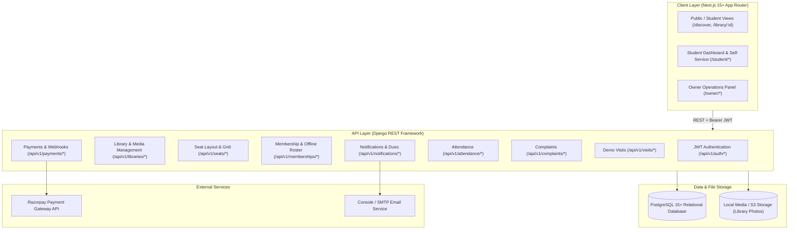
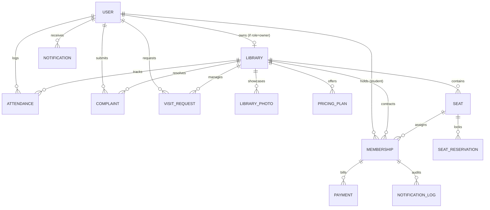

# LibraryHive — Comprehensive Technical & Product Specification (MVP)

**Document Version:** 1.0 (Production Technical Specification)  
**System Name:** LibraryHive  
**Architecture Style:** Modular Monolith (Django REST Framework Backend + Next.js App Router Frontend)  
**Target Database:** PostgreSQL 15+ (SQLite in local dev fallback)  
**Document Status:** Approved Technical Blueprint  

---

## 1. Product, Problem & Target Users

### 1.1 The Problem
Study libraries, reading halls, and self-study centers cater to millions of aspirants preparing for competitive examinations (UPSC, NEET, JEE, GATE, SSC, Banking, CA). However, these facilities operate with severe administrative inefficiencies:
- **Paper & Spreadsheet Dependency:** Admissions, seat allocations, fee records, and attendance are tracked in physical ledgers, easily leading to errors, lost revenue, and uncollected dues.
- **Double-Allocation & Conflict:** Without atomic seat locks, library owners frequently double-book the same desk across overlapping shifts.
- **Zero Visibility for Students:** Students must physically travel to libraries just to see if seats with AC, WiFi, or power sockets are available, or discover which peer exam groups study there.
- **Uncollected Dues & Disorganized Expiries:** Owners lose 10%–25% of renewal fees due to lack of timely, tracked expiry reminders.
- **Unaddressed Complaints:** Broken chairs, non-working AC, or noisy study halls are reported haphazardly over WhatsApp and forgotten.

### 1.2 Target Users
1. **Library Owners & Managers (`owner`):** Small business owners and administrators running one or more study rooms seeking a single operational hub for seats, admissions, fees, attendance, and member retention.
2. **Students & Aspirants (`student`):** Learners preparing for exams seeking transparent seat discovery, visual seat reservation, guaranteed desk space, digital fee payments, and hassle-free study environments.
3. **Public Visitors (`public`):** Prospective learners searching for nearby libraries without an immediate account.

---

## 2. Contradiction & Gap Analysis (SRS vs. ER Diagram vs. Existing Code)

Before standardizing the specification, the technical contradictions across existing artifacts were audited and reconciled:

| Area | Draft SRS (v0.1) | ERDIAGRAM.md | Existing Backend Implementation | Production MVP Reconciliation (This Spec) |
|---|---|---|---|---|
| **User Identity** | Generic "Student" & "Owner" entities. | Separate `OWNER` and `STUDENT` tables with independent IDs. | Single `apps.accounts.models.User` table inheriting `AbstractBaseUser` with `role="owner"\|"student"` and `domain`. | **Adopt Single User Model:** Use `apps.accounts.models.User` with role-based segregation. Eliminates auth duplication and allows JWT tokens to carry `role` and `id` natively. |
| **Offline Student Registration** | SRS mentioned online student registration only. | Not present in ER diagram. | Not implemented in backend. | **Add Walk-In / Offline Student Admission:** Allow owners to register offline students by entering name, phone, email, and exam stream. Normalizes phone numbers to prevent duplicate profiles if the student later signs up online. |
| **Pricing & Timings** | Timings in profile; monthly/quarterly plans. | Timings, pricing plans, and domains stored as JSON blobs on `LIBRARY`. | Relational `PricingPlan` model; `opens_at`/`closes_at` as `TimeField`; `domains_catered` as CharField. | **Relational Pricing Plans:** Maintain the relational `PricingPlan` table for strict price calculation, foreign key integrity in memberships, and shift modeling. |
| **Library Photos & Media** | Not specified in draft SRS. | No image entities in ER diagram. | No photo models or image storage in `libraries` app. | **Add LibraryPhoto Entity:** Model `LibraryPhoto` with caption, display order, `is_cover`, and file upload endpoints. Implement cover photo on `Library`. |
| **Seat Shifts & Hourly Booking** | Static seat states: Empty, Reserved, Occupied. | Static seat status: `empty\|reserved\|occupied`. | `Seat` model has static `status` field. | **Shift-Aware Booking & Seating:** Seat maintains a physical label and coordinates; visual grid displays status dynamically based on selected shift (Full Day, Morning, Evening, Night) and date. |
| **Payment Gateway** | "Razorpay or Cashfree" | `apps.payments.gateway.py` (Razorpay/Cashfree wrapper stub). | App is empty boilerplate. | **Single Gateway (Razorpay):** Standardize on Razorpay for UPI, card, and netbanking in India with mandatory server-side signature verification. Support manual cash/offline UPI records by owner. |
| **Attendance** | Listed as "Out of scope" / future QR. | Not in ER diagram. | Blank `apps/core` without attendance. | **Incorporate Attendance Module:** Implement `Attendance` entity with self-service check-in/out for students and live attendance roster for owners. |
| **Demo Visits** | Not mentioned in draft SRS. | Not in ER diagram. | Not implemented. | **Add VisitRequest Entity:** Support student demo visit scheduling and owner approval inbox. |
| **Expiry Notifications** | "Notify student and owner" | Mentioned as generic reminder. | Not implemented. | **Idempotent Notification Engine:** Background cron scanning due dates with a `NotificationLog` deduplication table preventing duplicate daily alerts. |

---

## 3. System Architecture & Tech Stack



- **Backend Framework:** Python 3.12+ / Django 6.0+ with Django REST Framework (DRF)
- **Frontend Framework:** Next.js 15+ (React 19, TypeScript, Tailwind CSS, Lucide Icons)
- **Database:** PostgreSQL 15+ (with SQLite support in local offline development)
- **Authentication:** Stateless JWT (`rest_framework_simplejwt`) with custom claims (`role`, `user_id`, `name`)
- **Payment Gateway:** Razorpay SDK (Standard Checkout + Webhook verification)
- **File Storage:** Django `FileSystemStorage` for development; S3-compatible storage abstraction for production

---

## 4. Database Entities, Schema & Data Dictionary

### 4.1 ER Diagram (Production MVP)



---

### 4.2 Entity Definitions

#### Entity 1: `User` (`apps.accounts.models.User`)
Represents all system actors (Library Owners, Online Students, and Offline Walk-in Students).
- `id` (UUID, Primary Key, default `uuid.uuid4`)
- `name` (CharField, max_length=150, required)
- `email` (EmailField, unique=True, indexed)
- `phone` (CharField, max_length=15, unique=True, indexed, null=True, blank=True)
- `role` (CharField, choices=`[('owner', 'Library Owner'), ('student', 'Student')]`, required)
- `domain` (CharField, max_length=50, blank=True, null=True) — Target exam (e.g., UPSC, NEET, JEE, SSC, Banking)
- `is_offline_student` (BooleanField, default=False) — True if admitted by owner before online account creation
- `is_active` (BooleanField, default=True)
- `is_staff` (BooleanField, default=False)
- `created_at` (DateTimeField, auto_now_add=True)
- `updated_at` (DateTimeField, auto_now=True)

#### Entity 2: `Library` (`apps.libraries.models.Library`)
The primary tenant entity representing a physical study library or reading room.
- `id` (UUID, Primary Key)
- `owner` (OneToOneField to `User`, related_name=`"library"`, on_delete=CASCADE)
- `name` (CharField, max_length=150, required)
- `address` (CharField, max_length=255, required)
- `latitude` (FloatField, default=0.0)
- `longitude` (FloatField, default=0.0)
- `contact_phone` (CharField, max_length=20, blank=True, null=True)
- `contact_email` (EmailField, blank=True, null=True)
- `total_seats` (PositiveIntegerField, default=0)
- `opens_at` (TimeField, null=True, blank=True)
- `closes_at` (TimeField, null=True, blank=True)
- `operating_hours` (CharField, max_length=100, blank=True)
- `domains_catered` (CharField, max_length=255, blank=True) — Comma-separated list of target exam domains
- `facilities` (JSONField, default=list) — Array of string tags: `["WiFi", "AC", "Power Backup", "RO Water", "Lockers", "CCTV", "Discussion Room"]`
- `cover_photo` (ImageField, upload_to="libraries/covers/", null=True, blank=True)
- `created_at` (DateTimeField, auto_now_add=True)
- `updated_at` (DateTimeField, auto_now=True)

#### Entity 3: `LibraryPhoto` (`apps.libraries.models.LibraryPhoto`)
Gallery images showcasing facilities, cabins, and ambiance.
- `id` (UUID, Primary Key)
- `library` (ForeignKey to `Library`, related_name=`"photos"`, on_delete=CASCADE)
- `image` (ImageField, upload_to="libraries/gallery/")
- `caption` (CharField, max_length=150, blank=True)
- `display_order` (PositiveIntegerField, default=0)
- `is_cover` (BooleanField, default=False)
- `created_at` (DateTimeField, auto_now_add=True)

#### Entity 4: `PricingPlan` (`apps.libraries.models.PricingPlan`)
Pricing packages defining duration, rates, and operational shifts.
- `id` (UUID, Primary Key)
- `library` (ForeignKey to `Library`, related_name=`"plans"`, on_delete=CASCADE)
- `name` (CharField, max_length=50) — e.g. "Monthly Morning Shift", "Quarterly Full Day"
- `duration_days` (PositiveIntegerField, default=30)
- `price` (DecimalField, max_digits=8, decimal_places=2)
- `shift` (CharField, max_length=20, choices=`[('full_day', 'Full Day (24/12h)'), ('morning', 'Morning Shift'), ('evening', 'Evening Shift'), ('night', 'Night Shift')]`, default=`"full_day"`)
- `shift_hours` (CharField, max_length=50, blank=True) — e.g. "06:00 AM - 02:00 PM"
- `created_at` (DateTimeField, auto_now_add=True)

#### Entity 5: `Seat` (`apps.seats.models.Seat`)
A discrete desk or cabin unit within a library.
- `id` (UUID, Primary Key)
- `library` (ForeignKey to `Library`, related_name=`"seats"`, on_delete=CASCADE)
- `label` (CharField, max_length=50) — e.g. "Row A - Seat 1"
- `row` (CharField, max_length=10, blank=True) — e.g. "A"
- `number` (PositiveIntegerField, null=True, blank=True) — e.g. 1
- `status` (CharField, max_length=15, choices=`[('empty', 'Empty'), ('reserved', 'Reserved'), ('occupied', 'Occupied'), ('maintenance', 'Maintenance')]`, default=`"empty"`)
- `created_at` (DateTimeField, auto_now_add=True)
- `updated_at` (DateTimeField, auto_now=True)
- *Constraint:* `unique_together = ('library', 'label')`

#### Entity 6: `SeatReservation` (`apps.seats.models.SeatReservation`)
Concurrency hold table managing the 15-minute checkout lock to prevent double-booking.
- `id` (UUID, Primary Key)
- `seat` (ForeignKey to `Seat`, related_name=`"reservations"`, on_delete=CASCADE)
- `student` (ForeignKey to `User`, related_name=`"seat_reservations"`, on_delete=CASCADE)
- `library` (ForeignKey to `Library`, on_delete=CASCADE)
- `shift` (CharField, max_length=20, default=`"full_day"`)
- `reserved_at` (DateTimeField, auto_now_add=True)
- `expires_at` (DateTimeField) — Current timestamp + 15 minutes
- `status` (CharField, max_length=15, choices=`[('pending', 'Pending Payment'), ('completed', 'Completed'), ('expired', 'Expired'), ('cancelled', 'Cancelled')]`, default=`"pending"`)

#### Entity 7: `Membership` (`apps.memberships.models.Membership`)
Contract linking a student, library, assigned seat, and payment plan.
- `id` (UUID, Primary Key)
- `student` (ForeignKey to `User`, related_name=`"memberships"`, on_delete=PROTECT)
- `library` (ForeignKey to `Library`, related_name=`"memberships"`, on_delete=CASCADE)
- `seat` (ForeignKey to `Seat`, related_name=`"memberships"`, null=True, blank=True, on_delete=SET_NULL)
- `plan` (ForeignKey to `PricingPlan`, related_name=`"memberships"`, on_delete=PROTECT)
- `shift` (CharField, max_length=20, default=`"full_day"`)
- `start_date` (DateField, required)
- `next_due_date` (DateField, required)
- `status` (CharField, max_length=15, choices=`[('active', 'Active'), ('due', 'Due'), ('overdue', 'Overdue'), ('archived', 'Archived')]`, default=`"active"`)
- `is_offline_registration` (BooleanField, default=False)
- `notes` (TextField, blank=True)
- `created_at` (DateTimeField, auto_now_add=True)
- `updated_at` (DateTimeField, auto_now=True)

#### Entity 8: `Payment` (`apps.payments.models.Payment`)
Immutable financial ledger for both digital gateway transactions and offline cash recordings.
- `id` (UUID, Primary Key)
- `membership` (ForeignKey to `Membership`, related_name=`"payments"`, on_delete=PROTECT)
- `student` (ForeignKey to `User`, related_name=`"payments"`, on_delete=PROTECT)
- `library` (ForeignKey to `Library`, related_name=`"payments"`, on_delete=CASCADE)
- `amount` (DecimalField, max_digits=8, decimal_places=2)
- `method` (CharField, max_length=15, choices=`[('razorpay', 'Razorpay Online'), ('cash', 'Cash'), ('upi_direct', 'Direct UPI Transfer'), ('card', 'Debit/Credit Card')]`)
- `status` (CharField, max_length=15, choices=`[('pending', 'Pending'), ('success', 'Success'), ('failed', 'Failed'), ('refunded', 'Refunded')]`, default=`"pending"`)
- `razorpay_order_id` (CharField, max_length=100, blank=True, null=True, unique=True)
- `razorpay_payment_id` (CharField, max_length=100, blank=True, null=True)
- `razorpay_signature` (CharField, max_length=255, blank=True, null=True)
- `recorded_by` (ForeignKey to `User`, null=True, blank=True, on_delete=SET_NULL) — Captured when owner enters manual cash payment
- `receipt_number` (CharField, max_length=50, unique=True)
- `notes` (TextField, blank=True)
- `paid_at` (DateTimeField, null=True, blank=True)
- `created_at` (DateTimeField, auto_now_add=True)

#### Entity 9: `Attendance` (`apps.core.models.Attendance` / `apps.attendance.models.Attendance`)
Daily physical check-in and check-out tracking.
- `id` (UUID, Primary Key)
- `student` (ForeignKey to `User`, related_name=`"attendance_records"`, on_delete=CASCADE)
- `library` (ForeignKey to `Library`, related_name=`"attendance_records"`, on_delete=CASCADE)
- `seat` (ForeignKey to `Seat`, null=True, blank=True, on_delete=SET_NULL)
- `date` (DateField, default=datetime.date.today)
- `check_in` (DateTimeField, null=True, blank=True)
- `check_out` (DateTimeField, null=True, blank=True)
- `duration_minutes` (PositiveIntegerField, default=0)
- `method` (CharField, max_length=15, choices=`[('self', 'Self Web App'), ('manual', 'Owner Manual'), ('qr', 'QR Code Scan')]`, default=`"self"`)
- `status` (CharField, max_length=15, choices=`[('present', 'Present'), ('checked_out', 'Checked Out')]`, default=`"present"`)
- `created_at` (DateTimeField, auto_now_add=True)

#### Entity 10: `VisitRequest` (`apps.libraries.models.VisitRequest`)
Prospective student requests for a free demo day or library tour.
- `id` (UUID, Primary Key)
- `student` (ForeignKey to `User`, related_name=`"visit_requests"`, on_delete=CASCADE)
- `library` (ForeignKey to `Library`, related_name=`"visit_requests"`, on_delete=CASCADE)
- `preferred_date` (DateField, required)
- `preferred_slot` (CharField, max_length=50, blank=True) — e.g. "Morning 10:00 AM"
- `status` (CharField, max_length=15, choices=`[('pending', 'Pending Review'), ('approved', 'Approved'), ('rejected', 'Rejected'), ('completed', 'Completed')]`, default=`"pending"`)
- `owner_notes` (TextField, blank=True)
- `created_at` (DateTimeField, auto_now_add=True)
- `updated_at` (DateTimeField, auto_now=True)

#### Entity 11: `Complaint` (`apps.complaints.models.Complaint`)
Ticketing system for student grievances.
- `id` (UUID, Primary Key)
- `student` (ForeignKey to `User`, related_name=`"complaints"`, on_delete=CASCADE)
- `library` (ForeignKey to `Library`, related_name=`"complaints"`, on_delete=CASCADE)
- `category` (CharField, max_length=30, choices=`[('noise', 'Noise / Disturbance'), ('ac', 'AC / Heating Issue'), ('wifi', 'WiFi / Internet'), ('cleanliness', 'Cleanliness / Hygiene'), ('power', 'Power Socket / Lighting'), ('seat', 'Seat / Furniture'), ('other', 'Other Issue')]`)
- `description` (TextField, required)
- `status` (CharField, max_length=15, choices=`[('open', 'Open'), ('in_progress', 'In Progress'), ('resolved', 'Resolved')]`, default=`"open"`)
- `owner_response` (TextField, blank=True)
- `resolved_at` (DateTimeField, null=True, blank=True)
- `created_at` (DateTimeField, auto_now_add=True)
- `updated_at` (DateTimeField, auto_now=True)

#### Entity 12: `Notification` & `NotificationLog`
Deduplication and dispatch record for alerts.
- `id` (UUID, Primary Key)
- `recipient` (ForeignKey to `User`, related_name=`"notifications"`, on_delete=CASCADE)
- `library` (ForeignKey to `Library`, null=True, blank=True, on_delete=CASCADE)
- `title` (CharField, max_length=150)
- `message` (TextField)
- `notification_type` (CharField, max_length=30) — e.g. `EXPIRY_WARNING`, `PAYMENT_SUCCESS`, `COMPLAINT_UPDATE`, `VISIT_APPROVED`
- `related_membership` (ForeignKey to `Membership`, null=True, blank=True, on_delete=SET_NULL)
- `milestone` (CharField, max_length=30, blank=True) — e.g. `DUE_IN_3_DAYS`, `DUE_TODAY`, `OVERDUE`
- `send_date` (DateField, default=datetime.date.today)
- `is_read` (BooleanField, default=False)
- `created_at` (DateTimeField, auto_now_add=True)
- *Constraint:* `unique_together = ('recipient', 'related_membership', 'milestone', 'send_date')` guarantees zero duplicate notification spam.

---

## 5. API Contracts & Endpoint Specifications

**Base URL:** `/api/v1/`  
**Authentication Scheme:** `Authorization: Bearer <access_token>`  
**Standard Response Envelope:**
```json
{
  "success": true,
  "data": {},
  "error": null
}
```
**Standard Error Envelope:**
```json
{
  "success": false,
  "data": null,
  "error": "Detailed human-readable error explanation."
}
```

---

### 5.1 Authentication & Profile Endpoints (`apps.accounts`)

| Method | Endpoint | Access | Request Body | Description |
|---|---|---|---|---|
| `POST` | `/auth/register/` | Public | `{ name, email, phone, password, role, domain? }` | User registration (owner or student). Checks phone/email deduplication. |
| `POST` | `/auth/login/` | Public | `{ email, password }` | Authenticates credentials and returns JWT access + refresh tokens + user profile. |
| `POST` | `/auth/refresh/` | Public | `{ refresh }` | Issues fresh JWT access token. |
| `GET` | `/auth/me/` | Authenticated | None | Returns profile of currently authenticated user. |
| `PATCH` | `/auth/me/` | Authenticated | `{ name?, phone?, domain? }` | Update user personal details. |

---

### 5.2 Library & Photo Management Endpoints (`apps.libraries`)

| Method | Endpoint | Access | Request Body | Description |
|---|---|---|---|---|
| `GET` | `/libraries/` | Public | Query: `?search=&domain=&lat=&lng=&radius=` | Search libraries by proximity, text keyword, or domain. |
| `GET` | `/libraries/{id}/` | Public | None | Retrieve comprehensive library profile, verified amenities, operating hours, and plans. |
| `POST` | `/libraries/` | Owner | Multipart / JSON: `{ name, address, latitude, longitude, contact_phone, contact_email, opens_at, closes_at, operating_hours, domains_catered, facilities, pricing_plans, initial_seats }` | One-time owner onboarding and initial setup. |
| `PATCH` | `/libraries/{id}/` | Owner | Partial Library payload | Update library profile, amenities, operating hours. |
| `GET` | `/libraries/me/` | Owner | None | Return authenticated owner's library profile. |
| `POST` | `/libraries/{id}/photos/` | Owner | Multipart: `image` (file), `caption`, `is_cover`, `display_order` | Upload a photo to the library gallery or set cover photo. |
| `DELETE` | `/libraries/{id}/photos/{photo_id}/` | Owner | None | Remove photo from library gallery. |
| `POST` | `/libraries/{id}/plans/` | Owner | `{ name, duration_days, price, shift, shift_hours }` | Add new pricing plan. |
| `PATCH` | `/libraries/{id}/plans/{plan_id}/` | Owner | Partial PricingPlan payload | Modify pricing plan rate or duration. |

---

### 5.3 Seat Inventory & Visual Grid Endpoints (`apps.seats`)

| Method | Endpoint | Access | Request Body | Description |
|---|---|---|---|---|
| `GET` | `/libraries/{id}/seats/` | Public | Query: `?shift=full_day&date=YYYY-MM-DD` | Returns live visual seat grid with calculated status for requested shift. |
| `POST` | `/libraries/{id}/seats/` | Owner | Array: `[{ label, status }]` or `{ rows: ["A","B"], seats_per_row: 5 }` | Bulk seat generator or batch creation. |
| `PATCH` | `/seats/{id}/` | Owner | `{ status, label? }` | Manual seat status override or maintenance toggle. |
| `POST` | `/seats/{id}/reserve/` | Student | `{ plan_id, shift }` | **Atomic Seat Hold:** Locks seat in `reserved` state for 15 minutes; returns reservation details. Fails with 409 if already held. |
| `POST` | `/seats/{id}/release/` | Student / Owner | None | Explicit cancellation of active reservation hold before payment. |

---

### 5.4 Membership, Roster & Offline Admission Endpoints (`apps.memberships`)

| Method | Endpoint | Access | Request Body | Description |
|---|---|---|---|---|
| `GET` | `/memberships/mine/` | Student | None | Retrieve student's own active/past memberships and digital ID card. |
| `GET` | `/memberships/` | Owner | Query: `?status=active|due|overdue|archived&search=` | Filterable member roster for the owner's library. |
| `POST` | `/memberships/offline-admission/` | Owner | `{ name, phone, email, domain, seat_id, plan_id, shift, start_date, payment_method, amount_paid, notes }` | **Offline Admission:** Creates/links student, assigns seat, starts membership, and records cash/UPI payment atomically. |
| `PATCH` | `/memberships/{id}/archive/` | Owner | `{ exit_notes? }` | **Member Archival:** Sets status to `archived`, frees assigned seat to `empty`, and retains historical records. |
| `POST` | `/memberships/{id}/renew/` | Student / Owner | `{ plan_id?, payment_method? }` | Extend membership duration and compute new `next_due_date`. |

---

### 5.5 Fee Tracking & Payment Endpoints (`apps.payments`)

| Method | Endpoint | Access | Request Body | Description |
|---|---|---|---|---|
| `POST` | `/payments/create-order/` | Student | `{ reservation_id, plan_id }` | Creates Razorpay server order with amount and receipt tracking. |
| `POST` | `/payments/verify/` | Student | `{ razorpay_order_id, razorpay_payment_id, razorpay_signature, reservation_id }` | **Cryptographic Signature Verification:** Verifies HMAC SHA-256 signature; converts reservation to active membership and seat to `occupied`. |
| `POST` | `/payments/webhook/` | Gateway | Razorpay Webhook Payload + `X-Razorpay-Signature` Header | Asynchronous payment status reconciliation fallback. |
| `POST` | `/payments/manual-record/` | Owner | `{ membership_id, amount, method: 'cash'\|'upi_direct', notes? }` | Record manual fee collection by owner. |
| `GET` | `/payments/history/` | Authenticated | Query: `?membership_id=` | Paginated transaction ledger for student or owner. |
| `GET` | `/payments/dues/` | Owner | Query: `?days_overdue=7` | Aging dues report showing due and overdue members with contact info. |

---

### 5.6 Attendance Management Endpoints (`apps.attendance`)

| Method | Endpoint | Access | Request Body | Description |
|---|---|---|---|---|
| `POST` | `/attendance/check-in/` | Student | `{ library_id, seat_id? }` | Student 1-tap physical check-in. |
| `POST` | `/attendance/check-out/` | Student | `{ attendance_id? }` | Student check-out; computes total duration in minutes. |
| `GET` | `/attendance/live/` | Owner | None | Live roster of students currently inside the library. |
| `GET` | `/attendance/logs/` | Authenticated | Query: `?date=&student_id=` | Daily/monthly attendance history. |
| `POST` | `/attendance/manual-mark/` | Owner | `{ student_id, date, status, check_in_time, check_out_time }` | Owner manual attendance correction. |

---

### 5.7 Demo / Visit Requests Endpoints (`apps.visits`)

| Method | Endpoint | Access | Request Body | Description |
|---|---|---|---|---|
| `POST` | `/visits/` | Student | `{ library_id, preferred_date, preferred_slot }` | Request a free trial visit or library tour. |
| `GET` | `/visits/` | Authenticated | Query: `?status=pending|approved` | List visit requests (student sees own; owner sees library's). |
| `PATCH` | `/visits/{id}/` | Owner | `{ status: 'approved'\|'rejected'\|'completed', owner_notes? }` | Owner decision and status update on visit request. |

---

### 5.8 Complaints & Issue Management Endpoints (`apps.complaints`)

| Method | Endpoint | Access | Request Body | Description |
|---|---|---|---|---|
| `POST` | `/complaints/` | Student | `{ library_id, category, description }` | Submit a categorized grievance. |
| `GET` | `/complaints/` | Authenticated | Query: `?status=open|resolved` | List complaints (student sees own; owner sees library's). |
| `PATCH` | `/complaints/{id}/` | Owner | `{ status: 'in_progress'\|'resolved', owner_response }` | Update complaint status and post resolution notes. |

---

### 5.9 Dashboard & Analytics Endpoints (`apps.analytics`)

| Method | Endpoint | Access | Description |
|---|---|---|---|
| `GET` | `/analytics/owner-dashboard/` | Owner | Aggregated real-time metrics: Occupancy, Today's Check-ins, Overdue Revenue, Pending Complaints, Domain Breakdown. |
| `GET` | `/analytics/student-dashboard/` | Student | Summary of active seat, days until fee due, today's attendance status, open tickets. |
| `GET` | `/analytics/domain-breakdown/{library_id}/` | Public / Owner | Domain count distribution (e.g. UPSC: 24, NEET: 12) for charts. |
| `GET` | `/analytics/export/csv/` | Owner | Query: `?type=members|payments|attendance` — Streams raw CSV report for auditing. |

---

## 6. Business Logic, Constraints & Concurrency Rules

### 6.1 Concurrency & Double-Booking Prevention Algorithm
```python
# Concurrency Algorithm: Atomic Reservation with Row Lock
def reserve_seat_atomic(seat_id, student, shift, plan):
    with transaction.atomic():
        # Lock seat row against concurrent reads/writes
        seat = Seat.objects.select_for_update().get(id=seat_id)
        
        # Check active memberships for this seat and shift
        if Membership.objects.filter(seat=seat, shift=shift, status__in=['active', 'due', 'overdue']).exists():
            raise ConflictError("Seat is currently occupied by an active member in this shift.")
            
        # Check unexpired active reservations
        now = timezone.now()
        active_hold = SeatReservation.objects.filter(
            seat=seat,
            shift=shift,
            status='pending',
            expires_at__gt=now
        ).exclude(student=student).exists()
        
        if active_hold:
            raise ConflictError("Seat is currently held by another student awaiting payment.")
            
        # Create or refresh 15-minute reservation
        reservation, _ = SeatReservation.objects.update_or_create(
            seat=seat,
            student=student,
            shift=shift,
            defaults={
                'status': 'pending',
                'reserved_at': now,
                'expires_at': now + timedelta(minutes=15)
            }
        )
        seat.status = 'reserved'
        seat.save(update_fields=['status', 'updated_at'])
        return reservation
```

### 6.2 Offline & Online Student Coexistence Rule
When an owner registers a walk-in student with phone number $P$ and email $E$:
1. Query `User.objects.filter(Q(phone=P) | Q(email=E)).first()`.
2. **If User Exists:**
   - Link the membership and payments directly to this `User` ID.
   - Retain existing credentials.
3. **If User Does Not Exist:**
   - Create a new `User` record with `role="student"`, `is_offline_student=True`, and an unusable password (`user.set_unusable_password()`).
4. **When Student Registers Online Later:**
   - The signup endpoint checks for matching phone or email with `is_offline_student=True`.
   - If found, it updates the password, verifies email/phone, clears `is_offline_student=False`, and activates online login.
   - All historical memberships, seat allocations, and payment receipts are immediately visible in the student's dashboard.

### 6.3 Expiry Calculation & Deduplicated Notifications Rule
1. For any plan with `duration_days = D`, when starting on date $S$:
   $$\text{next\_due\_date} = S + D \text{ days}$$
2. Scheduled task runs daily at 00:05 UTC.
3. For each active membership:
   - If $\text{next\_due\_date} - \text{today} = 3$: milestone is `DUE_IN_3_DAYS`.
   - If $\text{next\_due\_date} - \text{today} = 0$: milestone is `DUE_TODAY`.
   - If $\text{next\_due\_date} < \text{today}$: update status to `overdue`, milestone is `OVERDUE`.
4. Before dispatching notifications:
   ```python
   already_logged = NotificationLog.objects.filter(
       related_membership=membership,
       milestone=milestone,
       send_date=today
   ).exists()
   if not already_logged:
       dispatch_notification(membership, milestone)
       NotificationLog.objects.create(
           related_membership=membership,
           milestone=milestone,
           send_date=today
       )
   ```

---

## 7. Security, Authorization & Multi-Tenancy

1. **Role-Based Access Control (RBAC):**
   - Every request is validated by DRF permissions: `IsAuthenticated`, `IsOwner`, `IsStudent`.
   - No student can call owner endpoints; no owner can act as a student.
2. **Strict Multi-Tenancy Isolation (`IsLibraryOwnerOf`):**
   - Owners can only access objects belonging to their own library (`request.user.library == obj.library`).
   - Any attempt to access another library's records returns HTTP 403 Forbidden.
3. **Payment Security:**
   - Frontend payment responses are strictly treated as untrusted hints.
   - The backend recalculates order amount from `PricingPlan.price` and cryptographically verifies Razorpay signatures using HMAC SHA-256 before granting access to seats.
4. **File Upload Security:**
   - Validated MIME types: `image/jpeg`, `image/png`, `image/webp`.
   - File size capped at 5 MB per photo.
   - Uploaded files are renamed with random UUIDs to prevent file-path traversal attacks.

---

## 8. Testing & Quality Assurance Plan

| Test Category | Scope & Strategy | Success Benchmark |
|---|---|---|
| **Unit Tests** | Models, managers, serializers, pricing calculations, date math. | 100% pass rate. |
| **Concurrency Tests** | Parallel threads reserving the same seat simultaneously. | Zero double-reservations; exactly 1 success and $N-1$ HTTP 409 Conflicts. |
| **Deduplication Tests** | Executing expiry notification cron command 5 times in a loop. | Exactly 1 notification record created per student/milestone. |
| **Permission Tests** | Owner A modifying Owner B's library, seats, members, or complaints. | 100% blocked with HTTP 403 Forbidden. |
| **Payment Verification Tests** | Tampered Razorpay signature or forged amounts. | Rejected with HTTP 400 Bad Request; seat remains unassigned. |
| **Offline Coexistence Tests** | Offline student registration followed by online signup with same phone. | Seamless account conversion without duplicate key crash. |

---

## 9. Deployment & Production Readiness

- **Containerization:** Production Dockerfile for Django backend (gunicorn + gevent/uvicorn) and Next.js frontend (Node.js Alpine standalone).
- **Environment Separation:** Strict isolation of secrets (`SECRET_KEY`, `RAZORPAY_KEY_ID`, `RAZORPAY_KEY_SECRET`, `DATABASE_URL`) via environment variables.
- **Database Migrations:** Zero-downtime, backwards-compatible Django migrations executed prior to container swap.
- **Static & Media Serving:** Static assets handled via WhiteNoise/CDN; media uploads served via secured object storage endpoints.
- **Monitoring & Logging:** Standard JSON structured logging for payment verifications, authentication failures, and booking errors.
