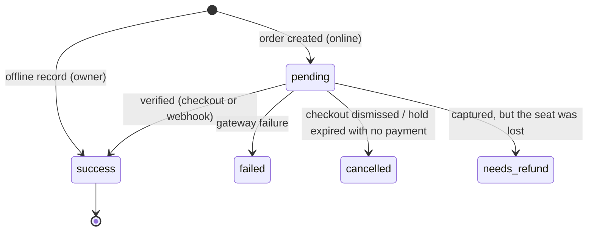
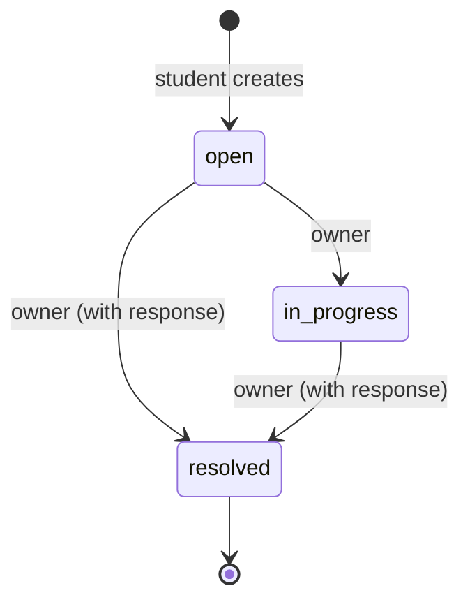
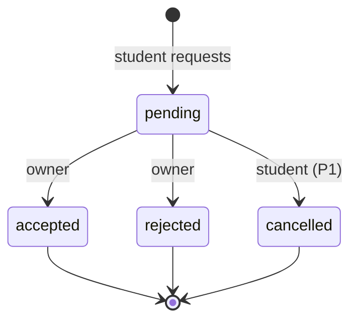

# LibraryHive — Data Model Specification (Phase 3)

**Version:** 2.0. Supersedes SPEC v1.0.
**Date:** 2026-10-09
**Status:** Draft, awaiting approval
**Inputs:** SRS §5, `FEATURES.md` v2.1 (decisions D1 to D17), `ARCHITECTURE.md` v1.0 (approved), existing models (`PROJECT_AUDIT.md` §4), the old `ERDIAGRAM.md`

**Scope of this document:** the final relational model (entities, fields, keys, constraints, indexes, validation, delete behaviour, ownership and tenancy) and the data-level rules for concurrency, payments, history, notifications and identity.
**Not in scope:** API endpoints (Phase 4, `BACKEND_ARCHITECTURE.md`); the API tables in SPEC v1.0 are withdrawn.

**Database:** PostgreSQL 15+ in every environment (ARCHITECTURE §9). Partial unique indexes and `CHECK` constraints below are PostgreSQL features and are expressed in Django with `UniqueConstraint(condition=…)` and `CheckConstraint`.

---

## 1. Global conventions

| Convention | Rule |
|---|---|
| Primary keys | UUID v4, `id`, immutable (`core.BaseModel`). |
| Timestamps | `created_at` and `updated_at` on every table (`BaseModel`). All datetimes are stored in UTC (`USE_TZ=True`). |
| Business "today" | Computed in **`Asia/Kolkata`** (`TIME_ZONE`). All libraries are in India for the MVP. Used for due dates, attendance dates and notification milestones. |
| Money | `Decimal(10,2)`, INR. Never float. The gateway receives integer paise computed server-side. |
| Enumerations | Stored as short lowercase strings with Django `TextChoices` and a `CHECK` constraint generated from the choices. |
| Delete behaviour | **History tables are never hard-deleted.** FKs from history rows use `PROTECT`. Users, libraries, plans and seats are *deactivated*, never deleted. `CASCADE` is used only for pure child data (photos, delivery records). |
| Tenancy | Every tenant-owned row carries `library_id` (denormalised where needed for direct scoping). Owner→Library is one-to-one. |
| Text normalisation | Emails lowercased and trimmed. Phones normalised to E.164 (India default `+91`) by one helper (`accounts.normalize_phone`, using the `phonenumbers` library). Labels and names trimmed. |
| Derived over stored | Values that can be computed from other rows are **not stored**: seat status, membership Due/Overdue, library seat capacity, dues. This removes drift (`PROJECT_AUDIT.md` §16, §20). |

---

## 2. Entity overview

| # | Entity | App | Why it exists | Replaces / notes |
|---|---|---|---|---|
| 1 | `User` | accounts | Every person: owners, online students, offline students | Existing model, extended |
| 2 | `AccountClaim` | accounts | One-time verification codes: offline-to-online account claim (D4) and password reset (AUTH-15) | New |
| 3 | `Domain` | core | Controlled exam/stream vocabulary (LIB-04) | Replaces comma strings |
| 4 | `Amenity` | core | Controlled facility vocabulary (LIB-03) | Replaces hardcoded UI list |
| 5 | `AuditLog` | core | Append-only business audit trail (LOG-06) | New |
| 6 | `Library` | libraries | The tenant | Existing, changed |
| 7 | `LibraryPhoto` | libraries | Gallery and cover (PHO-*) | New |
| 8 | `PricingPlan` | libraries | Plans with duration and price | Existing, extended |
| 9 | `Seat` | seats | Physical seat configuration | Existing; **`status` column removed** |
| 10 | `SeatHold` | seats | Booking holds and owner manual holds | New (SPEC v1 "SeatReservation") |
| 11 | `Membership` | memberships | Student ↔ library ↔ seat ↔ plan tenure | New |
| 12 | `Payment` | payments | Every online and offline payment; also the renewal/period history | New |
| 13 | `PaymentWebhookEvent` | payments | Idempotent webhook processing | New |
| 14 | `Notification` | notifications | In-app notifications with a dedup key | New (merges SPEC v1 Notification + NotificationLog) |
| 15 | `NotificationDelivery` | notifications | Email delivery status and retries | New |
| 16 | `AttendanceRecord` | attendance | Check-in / check-out | New |
| 17 | `Complaint` | complaints | Complaint lifecycle | New |
| 18 | `VisitRequest` | visits | Demo/visit requests | New |

### 2.1 Entities deliberately **not** created

| Candidate | Why not |
|---|---|
| Separate `Owner` / `Student` tables | One `User` with `role` (existing, working). Avoids duplicated auth and identity rows; it is what makes offline-to-online linking possible without merging rows. |
| `Booking` | A booking *attempt* is a `SeatHold`; a confirmed booking is a `Membership` + `Payment`. A third table would duplicate state. |
| `Fee` / invoice | D14: dues are derived from `Membership.next_due_date` and the plan price. One payment equals one period. |
| `NotificationLog` | Its dedup role is the unique `Notification.dedup_key`; delivery status lives in `NotificationDelivery`. |
| `MembershipPeriod` | Each successful `Payment` stores `period_start` and `period_end`, which already gives the full renewal history. |
| Analytics tables | Dashboards and reports are aggregate queries on live tables (MVP scale). |
| `LibraryDomain` / `LibraryAmenity` | Implicit Django M2M through tables (no extra fields needed). |

---

## 3. Entity definitions

Column notation: **N** = nullable. Constraint names follow `<table>_<purpose>`.

### 3.1 `User` (accounts), existing model, extended

| Field | Type | N | Default | Notes |
|---|---|---|---|---|
| id | UUID PK | | uuid4 | existing |
| name | varchar(150) | | | trimmed, 2–150 chars |
| email | varchar(254) | **N** | | lowercased. Nullable **only** for unclaimed offline students without email. |
| phone | varchar(16) | **N** | | E.164. Required by the API for owners and students; nullable only for staff/superusers. |
| role | varchar(10) | | | `owner` \| `student` |
| domain_id | FK → Domain | N | | students only; `SET_NULL` |
| is_offline | bool | | false | true = created by an owner, not yet claimed. Renamed from `is_offline_student` in AGENTS. |
| claimed_at | timestamptz | N | | set when an offline record is claimed |
| is_active, is_staff, is_superuser, last_login, password | | | | Django auth fields (existing). Offline users have an unusable password. |
| created_at, updated_at | | | | `updated_at` added (User now extends `BaseModel`) |

**Constraints**
- `user_email_unique`: unique on `email` (Postgres allows multiple NULLs). Values are always stored lowercased, so uniqueness is case-insensitive in practice.
- `user_phone_unique`: unique on `phone`.
- `user_offline_is_student`: `CHECK (NOT is_offline OR role = 'student')`.
- `user_online_has_email`: `CHECK (is_offline OR email IS NOT NULL OR is_staff)`. Every login-capable account has an email.

**Indexes:** unique indexes above; `(role)`.
**Delete:** never deleted. Deactivated via `is_active=false`. All history FKs to User are `PROTECT`.
**Ownership / tenancy:** global identity, not tenant-owned. Owners see a student's identity fields only through that student's membership, payment, attendance, complaint or visit in *their* library.

### 3.2 `AccountClaim` (accounts)

Short-lived one-time codes that prove ownership. Used to claim an offline record (OFF-04, D4) and to reset a forgotten password (AUTH-15, `channel = password_reset`). All channels share the same hashing, expiry and attempt-limit rules.

| Field | Type | N | Notes |
|---|---|---|---|
| user_id | FK → User | | the offline user being claimed, or the user resetting a password; `CASCADE` (codes have no value without the user) |
| channel | varchar | | `email_otp` \| `owner_code` \| `password_reset` |
| code_hash | varchar(128) | | hashed with Django's password hasher; the plain code is never stored |
| issued_by_id | FK → User | N | the owner who issued an `owner_code`; `SET_NULL` |
| library_id | FK → Library | N | library of the issuing owner; `PROTECT` |
| status | varchar | | `pending` \| `used` \| `expired` \| `revoked` |
| expires_at | timestamptz | | email OTP 10 min; password reset 30 min; owner code 7 days |
| attempts | smallint | | default 0. After 5 failed attempts the claim becomes `revoked`. |
| used_at | timestamptz | N | |

**Constraints:** `accountclaim_one_pending`: unique `(user_id, channel)` where `status='pending'`. Issuing a new code revokes the previous one in the same transaction. `CHECK (channel <> 'owner_code' OR issued_by_id IS NOT NULL)`.
**Index:** `(user_id, status)`.

### 3.3 `Domain` and `Amenity` (core), vocabularies

| Field | Type | Notes |
|---|---|---|
| code | varchar(40), **unique** | e.g. `upsc`, `ssc`, `neet`, `jee`, `gate`, `ca`, `banking`, `cat`, `state_psc`, `general`; amenities: `wifi`, `ac`, `power_socket`, `ro_water`, `ergonomic_chair`, `locker`, `cctv`, `discussion_room`, `power_backup`, `parking`, `washroom` |
| name | varchar(60) | display label |
| sort_order | smallint | |
| is_active | bool | retired values stay for history |

Seeded by a data migration; changed through Django admin only. Not tenant-owned (global, read-only to users).

### 3.4 `AuditLog` (core)

| Field | Type | N | Notes |
|---|---|---|---|
| actor_id | FK → User | N | `PROTECT`; null for system jobs |
| actor_role | varchar(10) | | `owner` \| `student` \| `system` \| `staff` |
| library_id | FK → Library | N | `PROTECT`; tenant scope of the event |
| action | varchar(60) | | dotted verb, e.g. `membership.archive`, `seat.override`, `payment.offline_record` |
| entity_type | varchar(40) | | e.g. `membership` |
| entity_id | UUID | | |
| changes | jsonb | | `{field: [old, new]}`; sensitive fields are never included |
| reason | text | | required by the service for overrides and archival |
| ip_address | inet | N | |
| request_id | varchar(64) | | correlates with application logs |

No `updated_at` semantics. Rows are **append-only**: the model has no update or delete paths (save-on-existing raises), there is no API, and the admin is read-only.
**Indexes:** `(library_id, created_at DESC)`, `(entity_type, entity_id)`, `(actor_id, created_at DESC)`.
**Tenancy:** an owner reads only rows with `library_id = own library` (LOG-07).

### 3.5 `Library` (libraries), existing model, changed

| Field | Type | N | Change | Notes |
|---|---|---|---|---|
| owner_id | OneToOne → User | | on_delete **CASCADE → PROTECT** | an owner has exactly one library |
| name | varchar(150) | | | |
| description | text | | **new** | ≤ 2000 chars, blank allowed |
| address | varchar(255) | | | |
| city | varchar(80) | | **new** | used by search |
| area | varchar(80) | | **new** | locality, used by search |
| latitude | decimal(9,6) | **N** | float default 0 → **nullable decimal** | `CHECK latitude BETWEEN -90 AND 90` |
| longitude | decimal(9,6) | **N** | same | `CHECK longitude BETWEEN -180 AND 180` |
| contact_phone | varchar(16) | N | | E.164 |
| contact_email | varchar(254) | N | | |
| opens_at, closes_at | time | N | | |
| operating_notes | varchar(200) | | renamed from `operating_hours` | free text, e.g. "Open 24×7 during exams" |
| domains | M2M → Domain | | replaces `domains_catered` | |
| amenities | M2M → Amenity | | **new** | |
| is_published | bool | | **new** | maintained by `libraries.services.refresh_publish_state()` (LIB-07) |
| published_at | timestamptz | N | **new** | |
| is_active | bool | | **new** | deactivation instead of deletion |
| total_seats | — | | **removed** | derived: count of active seats |

**Constraints:** `library_coords_pair`: `CHECK ((latitude IS NULL) = (longitude IS NULL))`. `library_published_requires_coords`: `CHECK (NOT is_published OR latitude IS NOT NULL)`.
**Publish rule (service):** published ⇔ active and name, address and coordinates set, ≥1 active plan, and ≥1 active seat. Re-evaluated whenever any of these change.
**Indexes:** `(is_published, is_active)`; `(latitude, longitude)` for the bounding-box prefilter; `(city)`.
**Delete:** never. `is_active=false` hides the library from discovery and blocks new bookings.

### 3.6 `LibraryPhoto` (libraries)

| Field | Type | N | Notes |
|---|---|---|---|
| library_id | FK → Library | | `CASCADE` (photos have no history value) |
| image | varchar(255) (storage key) | | `libraries/{library_id}/{uuid}.webp`, re-encoded display version |
| thumbnail | varchar(255) | | `…/{uuid}_thumb.webp` |
| width, height | int | | after re-encode |
| size_bytes | int | | `CHECK size_bytes <= 5242880` (original upload limit; re-encoded files are smaller) |
| caption | varchar(150) | | blank allowed |
| display_order | smallint | | default 0 |
| is_cover | bool | | default false |
| uploaded_by_id | FK → User | N | `SET_NULL` |

**Constraints:** `libraryphoto_one_cover`: unique `(library_id)` where `is_cover = true`. Max 15 photos per library, enforced in the service under a lock on the Library row.
**Storage rule:** the database stores **only keys and metadata**; binaries live in object storage (ARCHITECTURE §13). Deleting a photo deletes both objects after the DB commit (`on_commit`). If the cover is deleted, the lowest `display_order` photo becomes the cover in the same transaction.
**Index:** `(library_id, display_order)`.

### 3.7 `PricingPlan` (libraries), existing model, extended

| Field | Type | N | Change | Notes |
|---|---|---|---|---|
| library_id | FK → Library | | CASCADE → **PROTECT** | |
| name | varchar(60) | | | |
| duration_days | smallint | | | `CHECK duration_days BETWEEN 1 AND 366` |
| price | decimal(10,2) | | | `CHECK price > 0` |
| timing_note | varchar(100) | | **new** | descriptive only, e.g. "6 AM – 2 PM" (D1: does not affect availability) |
| is_active | bool | | **new** | deactivate instead of delete |

**Constraint:** `pricingplan_unique_active_name`: unique `(library_id, lower(name))` where `is_active`.
**Rules:** a plan referenced by any membership or payment can never be deleted (`PROTECT`), only deactivated. Editing price or duration affects **future** periods only, because each `Payment` snapshots `amount`, `period_start` and `period_end`.
**Index:** `(library_id, is_active)`.

### 3.8 `Seat` (seats), existing model, changed

| Field | Type | N | Change | Notes |
|---|---|---|---|---|
| library_id | FK → Library | | CASCADE → **PROTECT** | |
| label | varchar(50) | | | trimmed |
| row_label | varchar(10) | | **new** | e.g. "A"; replaces regex parsing in `SeatGrid.tsx` |
| position | smallint | N | **new** | order within row |
| is_active | bool | | **new** | false = removed (kept for history) |
| is_disabled | bool | | **new** | D6 / SEAT-04 (P1) |
| disabled_reason | varchar(200) | | **new** | |
| status | — | | **removed** | derived (§4.1) |

**Constraints:** `seat_unique_active_label`: unique `(library_id, lower(label))` where `is_active`. `CHECK (NOT is_disabled OR is_active)`.
**Rules:** a seat cannot be deactivated or disabled while it has a non-archived membership or a live pending hold (service check under the seat lock, then 409).
**Index:** `(library_id, is_active, row_label, position)`.
**Data migration:** the existing `status` values are seed and demo data with no backing records. They are dropped, and all seats become *Empty*.

### 3.9 `SeatHold` (seats)

One row per hold. It covers a student's 15-minute booking hold and an owner's manual hold (SEAT-07).

| Field | Type | N | Notes |
|---|---|---|---|
| seat_id | FK → Seat | | `PROTECT` |
| library_id | FK → Library | | `PROTECT`; must equal `seat.library_id` (service + test) |
| kind | varchar | | `booking` \| `owner_manual` |
| student_id | FK → User | N | `PROTECT`; required for `booking` |
| plan_id | FK → PricingPlan | N | `PROTECT`; required for `booking` |
| status | varchar | | `pending` \| `completed` \| `expired` \| `cancelled` \| `released` |
| expires_at | timestamptz | N | `booking`: created + `SEAT_HOLD_MINUTES` (15). `owner_manual`: NULL (no expiry). |
| reason | varchar(200) | | required for `owner_manual` |
| created_by_id | FK → User | | `PROTECT` |
| closed_at | timestamptz | N | when it left `pending` |

**Constraints**
- `seathold_one_pending_per_seat`: unique `(seat_id)` where `status='pending'`. **The DB-level guarantee against two concurrent holds.**
- `seathold_one_pending_per_student_library`: unique `(student_id, library_id)` where `status='pending' AND kind='booking'`.
- `seathold_booking_fields`: `CHECK (kind <> 'booking' OR (student_id IS NOT NULL AND plan_id IS NOT NULL AND expires_at IS NOT NULL))`.
- `seathold_manual_fields`: `CHECK (kind <> 'owner_manual' OR (expires_at IS NULL AND reason <> ''))`.

**Liveness rule:** a hold is *live* ⇔ `status='pending' AND (expires_at IS NULL OR expires_at > now())`. A pending row with `expires_at` in the past is **dead** for every read, even before the cleanup job marks it `expired`.
**Indexes:** partial uniques above; `(library_id, status)`; `(status, expires_at)` for cleanup.

### 3.10 `Membership` (memberships)

| Field | Type | N | Notes |
|---|---|---|---|
| student_id | FK → User | | `PROTECT` |
| library_id | FK → Library | | `PROTECT` |
| seat_id | FK → Seat | | `PROTECT`. **Kept after archival** as the seat history; occupancy is decided by `state`, not by clearing the FK. |
| plan_id | FK → PricingPlan | | `PROTECT`. The current plan; may change at renewal. |
| source | varchar | | `online` \| `offline` |
| state | varchar | | `active` \| `archived` (stored lifecycle) |
| start_date | date | | first day of the tenure |
| next_due_date | date | | end of the paid period. `CHECK next_due_date > start_date`. |
| archived_at | timestamptz | N | |
| archived_by_id | FK → User | N | `PROTECT` |
| archive_reason | varchar(300) | | required on archive |
| created_by_id | FK → User | | `PROTECT` (student for online, owner for offline) |

**Status exposed to users (SRS Active / Due / Overdue / Archived)** is **derived**, not stored (D5):

```
if state = 'archived'                         → ARCHIVED
elif next_due_date < today                    → OVERDUE
elif next_due_date <= today + 3 days          → DUE
else                                          → ACTIVE
```

It is computed in one selector (a SQL `CASE` annotation), so lists, filters, dashboards and the notification job always agree, and correctness never depends on a job having run. Filters translate to date ranges on the indexed `next_due_date`.

**Constraints**
- `membership_one_live_per_seat`: unique `(seat_id)` where `state='active'`. With D1 (full-day seats) this means **one occupant per seat**.
- `membership_one_live_per_student_library`: unique `(student_id, library_id)` where `state='active'`.
- `membership_archive_fields`: `CHECK (state <> 'archived' OR archived_at IS NOT NULL)`.

**Indexes:** `(library_id, state, next_due_date)`, `(student_id, state)`.
**Delete:** never. There is no delete endpoint.

### 3.11 `Payment` (payments)

The immutable ledger for online and offline money. A successful payment also records which period it paid for.

| Field | Type | N | Notes |
|---|---|---|---|
| library_id | FK → Library | | `PROTECT` |
| student_id | FK → User | | `PROTECT` |
| membership_id | FK → Membership | N | `PROTECT`. Null for a first online booking until confirmation creates the membership. |
| hold_id | FK → SeatHold | N | `PROTECT`; the hold an online first booking pays for |
| plan_id | FK → PricingPlan | | `PROTECT` |
| purpose | varchar | | `new_membership` \| `renewal` |
| channel | varchar | | `online` \| `offline` |
| method | varchar | | `gateway` \| `cash` \| `upi_direct` \| `bank_transfer` |
| amount | decimal(10,2) | | **copied from `plan.price` on the server**. `CHECK amount > 0`. |
| currency | char(3) | | `INR` |
| status | varchar | | `pending` \| `success` \| `failed` \| `cancelled` \| `needs_refund` |
| period_start, period_end | date | N | set on success. `CHECK (period_end > period_start)`. |
| gateway_order_id | varchar(64) | N | **unique** |
| gateway_payment_id | varchar(64) | N | **unique** |
| verified_via | varchar | N | `checkout` \| `webhook` \| `reconcile` \| `manual` |
| receipt_number | varchar(32) | | **unique**, `LH-{YYYY}-{seq:06d}` from a PostgreSQL sequence (`payment_receipt_seq`) |
| recorded_by_id | FK → User | N | `PROTECT`; the owner who recorded an offline payment |
| failure_reason | varchar(255) | | |
| notes | varchar(500) | | |
| paid_at | timestamptz | N | |

**Constraints**
- `payment_online_has_order`: `CHECK (channel <> 'online' OR gateway_order_id IS NOT NULL)`.
- `payment_offline_recorded`: `CHECK (channel <> 'offline' OR (recorded_by_id IS NOT NULL AND status = 'success'))`.
- `payment_success_complete`: `CHECK (status <> 'success' OR (paid_at IS NOT NULL AND period_start IS NOT NULL AND period_end IS NOT NULL AND membership_id IS NOT NULL))`.
- `payment_renewal_has_membership`: `CHECK (purpose <> 'renewal' OR membership_id IS NOT NULL)`.

**Immutability:** after a row reaches `success`, `needs_refund`, `failed` or `cancelled`, only the allowed transitions in §4.3 are possible. Amount, plan, period and student never change. There is no delete.
**Indexes:** uniques above; `(library_id, paid_at DESC)`; `(student_id, created_at DESC)`; `(status, created_at)` for reconciliation; `(membership_id)`.

### 3.12 `PaymentWebhookEvent` (payments)

| Field | Type | N | Notes |
|---|---|---|---|
| event_id | varchar(64) | | **unique**; the gateway event ID (`X-Razorpay-Event-Id`) |
| event_type | varchar(60) | | e.g. `payment.captured`, `payment.failed` |
| payload | jsonb | | the verified body |
| received_at | timestamptz | | |
| processed_at | timestamptz | N | |
| result | varchar | | `processed` \| `ignored_duplicate` \| `ignored_unknown` \| `error` |
| error | text | | |

Only **signature-valid** events are stored. Invalid ones are rejected (400) and written only to the security log (LOG-04), so forged requests cannot fill the table.

### 3.13 `Notification` (notifications)

| Field | Type | N | Notes |
|---|---|---|---|
| recipient_id | FK → User | | `PROTECT` |
| library_id | FK → Library | N | `PROTECT` |
| type | varchar(40) | | `renewal_due_soon`, `renewal_due_today`, `membership_overdue`, `owner_daily_dues_summary`, `booking_confirmed`, `payment_received`, `payment_needs_refund`, `complaint_created`, `complaint_updated`, `visit_requested`, `visit_decided`, `account_claimed` |
| title | varchar(150) | | |
| body | varchar(1000) | | |
| entity_type, entity_id | varchar(40), UUID | N | deep-link target |
| dedup_key | varchar(200) | | **unique**; see §4.5 |
| read_at | timestamptz | N | |

**Indexes:** `(recipient_id, read_at, created_at DESC)` for the inbox and unread count.
**Tenancy:** owner and student each read only `recipient_id = self`.

### 3.14 `NotificationDelivery` (notifications)

| Field | Type | N | Notes |
|---|---|---|---|
| notification_id | FK → Notification | | `CASCADE` |
| channel | varchar | | `email` (in-app needs no delivery row) |
| status | varchar | | `pending` \| `sent` \| `failed` \| `skipped` (e.g. recipient has no email) |
| attempts | smallint | | max 5 |
| next_attempt_at | timestamptz | N | exponential backoff |
| last_error | varchar(500) | | |
| provider_message_id | varchar(120) | | |
| sent_at | timestamptz | N | |

**Constraint:** unique `(notification_id, channel)`. **Index:** `(status, next_attempt_at)`.

### 3.15 `AttendanceRecord` (attendance)

| Field | Type | N | Notes |
|---|---|---|---|
| student_id | FK → User | | `PROTECT` |
| library_id | FK → Library | | `PROTECT` |
| membership_id | FK → Membership | | `PROTECT`; must be non-archived at check-in |
| seat_id | FK → Seat | N | `PROTECT`; snapshot of the member's seat |
| date | date | | business date (Asia/Kolkata) of check-in |
| check_in_at | timestamptz | | |
| check_out_at | timestamptz | N | |
| duration_minutes | int | N | computed on close |
| check_in_method | varchar | | `self` \| `owner` |
| check_out_method | varchar | N | `self` \| `owner` \| `auto` |
| status | varchar | | `open` \| `closed` \| `auto_closed` |

**Constraints:** `attendance_one_open_per_student`: unique `(student_id)` where `check_out_at IS NULL`. `CHECK (check_out_at IS NULL OR check_out_at > check_in_at)`. `CHECK ((status = 'open') = (check_out_at IS NULL))`.
**Indexes:** `(library_id, date)`, `(student_id, date DESC)`, `(library_id, status)` for "present now".

### 3.16 `Complaint` (complaints)

| Field | Type | N | Notes |
|---|---|---|---|
| student_id | FK → User | | `PROTECT` |
| library_id | FK → Library | | `PROTECT` |
| membership_id | FK → Membership | | `PROTECT`; the student's (current or past) membership at that library |
| category | varchar | | `noise`, `ac`, `wifi`, `cleanliness`, `power_lighting`, `seat_furniture`, `staff`, `other` |
| description | text | | 10–2000 chars |
| status | varchar | | `open` \| `in_progress` \| `resolved` |
| owner_response | text | | ≤ 2000 |
| responded_at | timestamptz | N | |
| resolved_at | timestamptz | N | |
| resolved_by_id | FK → User | N | `PROTECT` |
| image | varchar(255) | N | private storage key (CMP-06, P1) |

**Constraint:** `CHECK ((status = 'resolved') = (resolved_at IS NOT NULL))`.
**Index:** `(library_id, status, created_at DESC)`, `(student_id, created_at DESC)`.

### 3.17 `VisitRequest` (visits)

| Field | Type | N | Notes |
|---|---|---|---|
| student_id | FK → User | | `PROTECT` |
| library_id | FK → Library | | `PROTECT` |
| preferred_date | date | | ≥ today (business date) at creation; ≤ today + 60 days |
| preferred_slot | varchar | | `morning` \| `afternoon` \| `evening` |
| student_note | varchar(500) | | |
| status | varchar | | `pending` \| `accepted` \| `rejected` \| `cancelled` |
| owner_note | varchar(500) | | |
| decided_at | timestamptz | N | |
| decided_by_id | FK → User | N | `PROTECT` |

**Constraint:** `visit_one_pending_per_student_library`: unique `(student_id, library_id)` where `status='pending'`. `CHECK (status IN ('pending','cancelled') OR decided_at IS NOT NULL)`.
**Index:** `(library_id, status, preferred_date)`, `(student_id, created_at DESC)`.

---

## 4. Special rules

### 4.1 Seat concurrency and derived seat status

**Displayed status** (computed in `seats.selectors.seat_map(library)` with one query using `EXISTS` subqueries):

| Order | Condition | Status |
|---|---|---|
| 1 | `seat.is_disabled` | `disabled` |
| 2 | a membership with `state='active'` on the seat | `occupied` |
| 3 | a **live** hold (§3.9) on the seat | `reserved` |
| 4 | otherwise | `empty` |

Students only ever see `empty`, `reserved`, `occupied` and `disabled`. Who holds or occupies a seat is never exposed publicly.

**Locking protocol (every writer of holds or memberships for a seat follows it):**
1. `BEGIN` (`transaction.atomic`).
2. `SELECT … FROM seat WHERE id = :seat FOR UPDATE`. **The seat row is the mutex for that seat.**
3. Within the lock: mark any dead pending hold on this seat `expired`.
4. Check that the seat is active and not disabled, has no `active` membership, and has no live hold (except the caller's own hold, when converting it).
5. Insert or modify the hold or membership.
6. `COMMIT`. If a partial unique index fires anyway, it is mapped to **409 Conflict**.

When one transaction must lock several seats, it locks them in ascending `id` order (prevents deadlocks). Writers that also touch the student's other rows lock the seat first.

### 4.2 Booking conflicts

| Conflict | Guarded by |
|---|---|
| Two students hold the same seat | Seat lock + `seathold_one_pending_per_seat` |
| Hold on an occupied seat | Seat lock + check (step 4) |
| Two members on one seat (e.g. a confirmation racing an offline admission) | Seat lock + `membership_one_live_per_seat` |
| Student holds several seats in one library | `seathold_one_pending_per_student_library` |
| Student already a member of the library | `membership_one_live_per_student_library` (checked before the hold too) |
| Booking a seat or plan from another library | Service: `plan.library_id = seat.library_id` and the plan is active |
| Abandoned hold blocks the seat | Liveness rule (§3.9): dead immediately after `expires_at`, without waiting for the job |

### 4.3 Payment integrity

**State machine**



- The amount comes only from `PricingPlan.price` at order time and is stored on the row. The client never sends an amount.
- **Confirmation is one function** that locks the `Payment` row (`FOR UPDATE`) and returns immediately if the status is already `success`. Unique `gateway_order_id` and `gateway_payment_id`, plus unique webhook `event_id`, make repeats harmless.
- `success` for `new_membership` (one transaction):
  1. Lock the seat.
  2. Mark the hold `completed`, or re-acquire it if it expired but the seat is still free.
  3. Create the `Membership` (`start_date` = today, `next_due_date` = start + plan duration).
  4. Set the payment's `period_start`/`period_end` and `membership_id`.
  5. Write the audit row and the notifications.
- `success` for `renewal`: extend `next_due_date` per D5. The new period starts at the previous `next_due_date`, or today if the member is more than 15 days overdue, and lasts `plan.duration_days`. The seat is kept.
- If the seat was lost (a late payment after the hold expired and the seat was taken), the payment becomes `needs_refund`, and the owner and student are notified (refund handled outside the system, PAY-14).

### 4.4 Membership history

- Memberships are never deleted. Archival sets `state='archived'`, `archived_at`, `archived_by` and `archive_reason` **and keeps `seat_id`**. The partial unique index no longer counts it, so the seat is immediately free (derived status becomes `empty`).
- The period history is the ordered list of the membership's successful payments (`period_start`, `period_end`, amount, plan, method).
- A returning student gets a **new** membership row. Old rows remain as tenure history.
- Archival does not touch payments, attendance or complaints (SRS FR-10). Archiving a member with unpaid dues leaves the dues visible in history (the overdue period is derivable from `next_due_date`).

### 4.5 Notification idempotency

`dedup_key` is built deterministically by the code that creates the notification:

| Notification | `dedup_key` |
|---|---|
| Renewal milestone to the student | `renewal:{membership_id}:{milestone}:{due_date}:{recipient_id}` |
| Owner daily dues summary | `owner_dues:{library_id}:{business_date}` |
| Booking confirmed / payment received | `payment:{payment_id}:{type}:{recipient_id}` |
| Complaint created / updated | `complaint:{complaint_id}:{status}:{recipient_id}` |
| Visit requested / decided | `visit:{visit_id}:{status}:{recipient_id}` |

Insertion uses `INSERT … ON CONFLICT (dedup_key) DO NOTHING` (`bulk_create(ignore_conflicts=True)`). Re-running the job any number of times creates no duplicates (NOT-06).

Renewal milestones use the **due date**, not the run date, in the key. A student is therefore reminded once per milestone per period, and renewing (which changes the due date) starts fresh reminders. The renewal milestones are `due_soon` (3 days before), `due_today` and `overdue` (first day overdue). Repeated overdue reminders are not in the MVP.

Email delivery rows are created with the notification (when the recipient has an email). The job sends `pending` and retries `failed` rows (max 5 attempts with backoff), so a crash between send and status update can at most re-send one email for one notification. This is accepted at-least-once behaviour for email.

### 4.6 Offline / online student identity and duplicate prevention

**Identity keys:** normalised `phone` (unique) and lowercased `email` (unique). **Names are never used for matching.**

**Owner adds an offline student (OFF-01):**
1. Normalise phone and email.
2. Look up by phone and, separately, by email.
3. Decide:

| Phone match | Email match | Result |
|---|---|---|
| none | none | Create `User(role=student, is_offline=true, unusable password)` |
| user X | none or X | Link to X (online or offline). X's existing data is **not** shown to this owner beyond the name and masked contact needed to confirm. |
| none | user X | Link to X |
| user X | user Y (X ≠ Y) | **Reject (409):** "Phone and email belong to different accounts". |
| an owner account | — | **Reject (409):** owners cannot be admitted as students. |

**Student registers online (AUTH-02 / OFF-04):**
- **No match:** create a normal online account.
- **A match with an online account:** reject as a duplicate (email or phone already registered).
- **A match with an *offline* account:** no account is created. A claim is required.
  - Send an email OTP when the offline record has that email, or ask for the owner-issued claim code.
  - **After verification** (in one transaction): set the email (if it was missing and is unused), the password and `claimed_at`, and set `is_offline=false`. Audit and notify.
  - The same `User.id` is kept, so every membership, payment and attendance row stays attached. There is no row merging.
- **Phone matches offline user X but email matches online user Y:** reject (409) and ask the student to contact the library.

### 4.7 Library ownership isolation

| Data | Scope key | Owner sees | Student sees |
|---|---|---|---|
| Library private settings, plans (incl. inactive), seats config, photos mgmt | `library.owner_id` | own library | public fields only of published libraries |
| SeatHold | `library_id` / `student_id` | own library's holds | own holds |
| Membership, Payment, Attendance, Complaint, VisitRequest | `library_id` / `student_id` | own library's rows | own rows |
| AuditLog | `library_id` | own library's rows | none |
| Notification | `recipient_id` | own | own |
| AccountClaim | `user_id` / `library_id` | codes they issued | own (via the flow only) |
| User (student identity) | via a related row in the owner's library | name, phone and email of their own members, admitted students and visit/complaint authors | self |

`library_id` is denormalised onto SeatHold, Payment, AttendanceRecord, Complaint and Notification so that every owner query is a single indexed filter. Services set it from the parent row, never from client input, and tests assert consistency.

### 4.8 Photo storage references

Covered in §3.6. In short: object keys only in the DB, UUID names, server-side re-encode, at most one cover (partial unique), and object deletion after the DB commit. Complaint images use a separate private prefix (`complaints/{library_id}/{uuid}.webp`) served via signed URLs.

### 4.9 Attendance integrity

- Check-in requires a non-archived membership of the student **at that library**. The membership is locked (`FOR UPDATE`) during check-in to serialise double taps; `attendance_one_open_per_student` is the DB backstop. A second open check-in anywhere returns 409.
- Check-out closes the caller's open record; with no open record it returns 400.
- Auto-close: the hourly job closes records still open after the library's `closes_at` (or 23:59 business time if unset), with `status='auto_closed'`, `check_out_method='auto'`, and `check_out_at` = closing time.
- Owner corrections (ATT-06, P1) go through the service and are audited.

### 4.10 Complaint lifecycle



Only the owner of the complaint's library changes the status. A response is required to resolve. Every change is audited and notified. Reopening is not in the MVP (the student files a new complaint).

### 4.11 Demo / visit request lifecycle



There is at most one pending request per student per library. No calendar or slot-capacity engine is part of the MVP.

---

## 5. Migration from the current schema

There is no production data. The current DB contains only seed and demo data, so migrations are written as normal forward migrations from the existing chain (no reset, so existing teammates' DBs keep working). The seed command is rewritten to match.

| Current (`PROJECT_AUDIT.md` §4) | Migration |
|---|---|
| `User` (no `updated_at`, phone not unique) | Add `updated_at`, `is_offline`, `claimed_at` and `domain_id`; data-migrate phone to E.164; add unique constraints (the migration fails loudly if duplicates exist in a dev DB); make email nullable plus checks. |
| `User.domain` free text | Map to the `Domain` FK by code where it matches; otherwise NULL. |
| `Library.domains_catered` string | Split to the `domains` M2M. Drop the column. |
| `Library.operating_hours` | Rename to `operating_notes`. |
| `Library.latitude/longitude` float default 0 | Convert to nullable decimal; `0,0` becomes NULL. |
| `Library.total_seats` | Drop (derived). |
| `Library.owner` CASCADE | Change to PROTECT. |
| `PricingPlan` | Add `timing_note`, `is_active`; FK to PROTECT; checks. |
| `Seat.status` | Drop (derived). Add `row_label`, `position`, `is_active`, `is_disabled`, `disabled_reason`; backfill `row_label` and `position` by parsing the existing "Row X - Seat N" labels once. |
| — | Create all new tables, constraints, indexes and the `payment_receipt_seq` sequence; seed `Domain` and `Amenity`. |

---

## 6. Enumerations (single source)

| Enum | Values |
|---|---|
| `User.role` | owner, student |
| `SeatHold.kind` | booking, owner_manual |
| `SeatHold.status` | pending, completed, expired, cancelled, released |
| Seat display status (derived) | empty, reserved, occupied, disabled |
| `Membership.state` | active, archived |
| Membership display status (derived) | active, due, overdue, archived |
| `Membership.source` | online, offline |
| `Payment.purpose` | new_membership, renewal |
| `Payment.channel` | online, offline |
| `Payment.method` | gateway, cash, upi_direct, bank_transfer |
| `Payment.status` | pending, success, failed, cancelled, needs_refund |
| `Payment.verified_via` | checkout, webhook, reconcile, manual |
| `AccountClaim.channel` / `.status` | email_otp, owner_code, password_reset / pending, used, expired, revoked |
| `NotificationDelivery.status` | pending, sent, failed, skipped |
| `AttendanceRecord.status` | open, closed, auto_closed |
| `Complaint.status` | open, in_progress, resolved |
| `VisitRequest.status` | pending, accepted, rejected, cancelled |
| `VisitRequest.preferred_slot` | morning, afternoon, evening |

Configurable settings (env, with defaults): `SEAT_HOLD_MINUTES=15`, `MEMBERSHIP_DUE_WINDOW_DAYS=3`, `RENEWAL_RESTART_AFTER_OVERDUE_DAYS=15`, `MAX_LIBRARY_PHOTOS=15`, `MAX_UPLOAD_BYTES=5242880`, `CLAIM_OTP_MINUTES=10`, `PASSWORD_RESET_MINUTES=30`, `CLAIM_CODE_DAYS=7`, `CLAIM_MAX_ATTEMPTS=5`.
