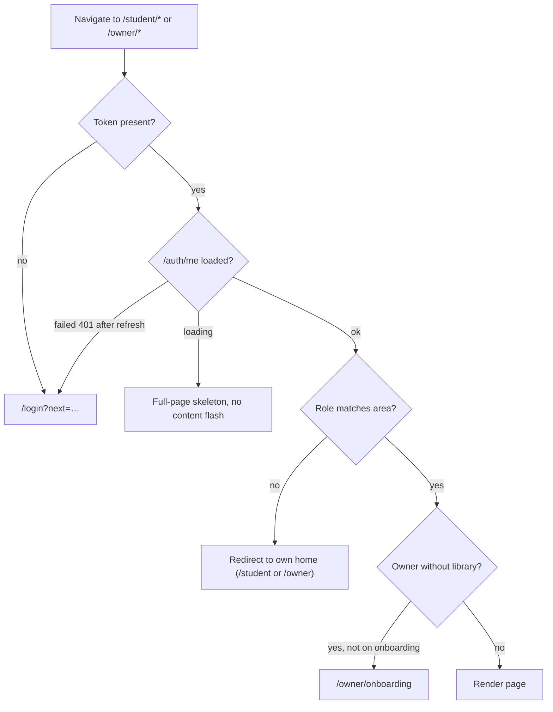

# LibraryHive — UI / Frontend Architecture (Phase 5)

**Version:** 1.0
**Date:** 2026-10-09
**Status:** Draft, awaiting approval
**Builds on:** `ARCHITECTURE.md` §7 (frontend stack, approved), `BACKEND_ARCHITECTURE.md` (API contracts; endpoint numbers like #38 refer to it), `FEATURES.md` v2.2 (feature IDs in brackets), `PROJECT_AUDIT.md` §8 and §22 (existing frontend)

**Goal.** A calm, trustworthy product that a non-technical library owner can use on a phone, and that a student can use to find and pay for a seat in under two minutes. It should look like a small, well-made SaaS product: one brand colour, plenty of white space, clear typography, few animations.

---

## 1. Design principles

| # | Principle | In practice |
|---|---|---|
| 1 | **Real data only** | No hardcoded amenities, shifts, prices or demo credentials (NFR-04). Every number on screen comes from an API response. |
| 2 | **The server decides** | The UI previews (price, valid-until date) but never decides. After every action it shows what the server returned. A 409 is a normal, friendly outcome, not an error page. |
| 3 | **Mobile first** | Most students and many owners will use phones. Design at 375 px, then enhance for desktop. |
| 4 | **One obvious next action** | Each screen has one primary button. Destructive actions are never primary and always ask for confirmation. |
| 5 | **Never colour alone** | Status is shown with colour **and** an icon **and** a text label. |
| 6 | **Plain language** | "Seat taken just now, please pick another" not "Error 409". Error codes from the API map to friendly messages (§10.3). |
| 7 | **Four states, every screen** | Loading, error (with retry), empty (with next step) and loaded (AGENTS §2.3). |
| 8 | **Boring and consistent** | One component for each job (button, table, dialog). No page invents its own look. |

---

## 2. Design system

### 2.1 Foundations (Tailwind theme in `tailwind.config.ts` / CSS variables)

| Token | Value | Use |
|---|---|---|
| Brand | `blue-600` `#2563EB` (hover `blue-700`, tint `blue-50`) | Primary buttons, links, selected seat ring. Kept from the existing app. |
| Neutrals | Tailwind `slate` scale: text `slate-900`, secondary `slate-600`, border `slate-200`, page `slate-50`, card `white` | All text and surfaces |
| Success / Warning / Danger / Info | `green-600`, `amber-600`, `red-600`, `sky-600` with `-50` tints | Status badges, alerts |
| Font | **Inter** through `next/font` (self-hosted, no layout shift), fallback system UI | One family; weights 400, 500, 600, 700 |
| Type scale | 12 / 14 / 16 (body) / 18 / 20 / 24 / 30 px | Body is 16 px on mobile (prevents iOS zoom on inputs) |
| Spacing | 4 px base (Tailwind default) | Page gutter 16 px mobile, 24 px tablet, 32 px desktop |
| Radius | 8 px controls, 12 px cards and dialogs | |
| Elevation | Border first, `shadow-sm` for cards, `shadow-lg` only for popovers and dialogs | No heavy shadows, no gradients in the app UI |
| Icons | `lucide-react` (already installed) | 16/20 px, `aria-hidden` when paired with text |
| Motion | 150 ms colour/opacity transitions; no entrance animations; honours `prefers-reduced-motion` | Skeleton shimmer is the only looping animation |
| Dark mode | **Not in the MVP** (P2) | Tokens are CSS variables, so it can be added later without rewrites |
| Language | English only in the MVP (i18n is P2); copy lives in components, not hardcoded in logic | |

**Formatting helpers** (`lib/format.ts`, the only place that formats):
- Money: `Intl.NumberFormat('en-IN', {style:'currency', currency:'INR'})` → `₹1,200`.
- Dates: `9 Oct 2026`; relative: "in 3 days", "2 days overdue".
- **Times are always shown in Asia/Kolkata**, regardless of the viewer's device timezone, to match the server's business dates.
- Phones are shown as `+91 98765 43210`.

### 2.2 Seat state visuals (the most important visual language)

| Status | Colour | Icon | Label | Selectable by students |
|---|---|---|---|---|
| Empty | green-50 fill, green-600 border | Check | "Available" | Yes |
| Reserved | amber-50 fill, amber-600 border | Clock | "Held" | No |
| Occupied | slate-200 fill, slate-500 border | User | "Taken" | No |
| Disabled | diagonal hatch, slate-400 border | Ban | "Unavailable" | No |
| Selected | blue-600 ring (3 px) + blue-50 fill + check badge | Check | "Your pick" | — |

- Contrast: every state's text/icon meets WCAG AA (4.5:1) against its fill; verified in the component tests (§13).
- A legend sits above every seat map; the same legend component is reused everywhere.
- Owner view adds a small dot for "has an active hold" and shows occupant initials on hover or in the side panel.

### 2.3 Component kit (`components/ui/`, built on Radix primitives + Tailwind)

`Button` (primary, secondary, ghost, danger; loading state), `IconButton`, `Input`, `Textarea`, `Select`, `Checkbox`, `RadioCard`, `DateField`, `PhoneField`, `OtpField`, `FormField` (label + hint + error wiring), `Card`, `Badge`, `StatusBadge`, `Tabs`, `Dialog`, `Sheet` (mobile bottom sheet / desktop side panel), `ConfirmDialog`, `DropdownMenu`, `Tooltip`, `Toast` (via `sonner`), `Skeleton`, `Spinner`, `EmptyState`, `ErrorState`, `Pagination`, `DataTable` (collapses to a card list below 768 px), `FilterBar`, `Stepper`, `ProgressBar`, `Alert`, `Avatar`, `Breadcrumbs`.

**Why Radix primitives (decision U1).** Dialogs, menus, tabs and selects need focus trapping, keyboard handling and ARIA that are easy to get wrong by hand. Radix supplies the behaviour without styling; our Tailwind classes supply the look. This is a small set of packages (`@radix-ui/react-dialog`, `-dropdown-menu`, `-tabs`, `-select`, `-tooltip`, `-checkbox`, `-radio-group`) plus `sonner`, not a full UI framework, consistent with ARCHITECTURE §7.

### 2.4 Domain components (`components/…`)

| Component | Folder | Used by |
|---|---|---|
| `SeatMap` (read-only, selectable and owner modes) + `SeatLegend` + `SeatCell` | `seat-map/` | Library page, owner seats, admission |
| `SeatDetailPanel` (student: seat + plan picker + Continue; owner: occupant/hold actions) | `seat-map/` | Library page, owner seats |
| `PlanPicker`, `PlanCard` | `booking/` | Library page, renewal, admission |
| `HoldCountdown` (server-synced) | `booking/` | Checkout |
| `PaymentSummary`, `RazorpayButton` | `booking/` | Checkout, renewal |
| `LibraryCard`, `LibraryMap` (Leaflet, lazy loaded), `LocationPicker` | `library/` | Discover, onboarding, library page |
| `PhotoGallery` + `Lightbox`, `PhotoUploader`, `PhotoGrid` | `library/` | Library page, owner photos |
| `StatCard`, `OccupancyBar`, `DomainBars` | `charts/` | Dashboards, reports |
| `MemberStatusBadge`, `PaymentStatusBadge`, `ComplaintStatusSteps`, `VisitStatusBadge` | `status/` | Lists and details |
| `AttendanceButton` + `LiveTimer` | `attendance/` | Student dashboard and attendance |
| `NotificationBell` + `NotificationList` | `notifications/` | Both shells |
| `AuthGuard`, `RoleShell` (student/owner navigation shells), `PublicShell` | `layout/` | Layouts |
| `PublishChecklist` | `owner/` | Dashboard, onboarding |
| `IdentityLookupCard` | `owner/` | Admission |

---

## 3. Information architecture and routes

URLs are in English and stable. Route groups `(public)`, `(auth)` do not appear in URLs.

### 3.1 Public and auth (no login needed to view)

| Route | Screen | Features |
|---|---|---|
| `/` | Landing: tagline "Strengthen Your Library & Attract More Students", search box, "Use my location", short how-it-works, "List your library" call to action for owners | DIS-01, AUTH-09 |
| `/discover` | Library discovery: list and map | DIS-01 to DIS-06 |
| `/libraries/[id]` | Library page: gallery, details, plans, seat map, domain mix, visit request, **start booking** | DIS-05, PHO-05, SEAT-05/06, DEMO-01 |
| `/login` | Login (`?next=` honoured) | AUTH-03 |
| `/register` | Register with a Student / Owner switch | AUTH-01/02 |
| `/claim` | "I'm already a member of a library" (claim an offline account) | OFF-04 |
| `/forgot-password` | Request reset code | AUTH-15 |
| `/reset-password` | Enter code and new password | AUTH-15 |

### 3.2 Student (`/student/*`, role `student`)

| Route | Screen | Features |
|---|---|---|
| `/student` | Dashboard | DASH-07 |
| `/student/book/[holdId]` | Checkout: summary, countdown, pay, outcome | BOOK-01/03/04/06, PAY-02 to PAY-05 |
| `/student/memberships` | My memberships (cards) | MEM-03 |
| `/student/memberships/[id]` | Membership detail and payment history | MEM-03, PAY-08 |
| `/student/memberships/[id]/renew` | Renewal checkout | MEM-05 |
| `/student/payments` · `/student/payments/[id]` | History · printable receipt | PAY-08, PAY-12 |
| `/student/attendance` | Check in/out and history | ATT-01/02/04 |
| `/student/complaints` · `/new` · `/[id]` | List · create · detail | CMP-01/02 |
| `/student/visits` | My visit requests | DEMO-04/05 |
| `/student/notifications` | Notification centre | NOT-02 |
| `/student/profile` | Edit name, phone, exam domain | AUTH-06 |

### 3.3 Owner (`/owner/*`, role `owner`)

| Route | Screen | Features |
|---|---|---|
| `/owner/onboarding` | Setup wizard (7 steps) | LIB-01 to LIB-07, PHO-*, SEAT-01 |
| `/owner` | Dashboard | DASH-01/02/03/08, LIB-07 |
| `/owner/seats` | Seat manager (map + actions) | SEAT-01/02/04/07 |
| `/owner/members` · `/[id]` | Directory · member detail | MEM-04/06/08, OFF-03 |
| `/owner/members/new` | Add offline student (admission) | OFF-01/02/05, PAY-07 |
| `/owner/dues` | Due and overdue list | PAY-10/11 |
| `/owner/payments` · `/[id]` | Ledger · receipt | PAY-09 |
| `/owner/attendance` | Present now and history | ATT-03, ATT-06 |
| `/owner/complaints` · `/[id]` | Inbox · detail | CMP-03/04/05 |
| `/owner/visits` | Visit-request inbox | DEMO-02/03 |
| `/owner/library` | Library settings with tabs: **Profile · Plans · Photos** | LIB-02 to LIB-05, PHO-* |
| `/owner/reports` | Tabs: Occupancy · Revenue · Complaints · Domains, plus CSV exports | DASH-02/03/04/06 |
| `/owner/activity` | Activity log (P1) | LOG-07 |
| `/owner/notifications` | Notification centre | NOT-02 |
| `/owner/profile` | Edit name and phone | AUTH-05 |

Utility routes: `not-found.tsx`, `global-error.tsx`, `/health` is backend-only.

### 3.4 Guard rules (`AuthGuard` in the `student/` and `owner/` layouts)



The guard improves experience only. **All real enforcement is on the server** (AGENTS §1.4/1.5).

### 3.5 Old routes removed (no hybrid, no redirects: there are no production users)

| Old | New |
|---|---|
| `/student/discover` | `/discover` |
| `/student/library/[id]` | `/libraries/[id]` |
| `/owner/setup` | `/owner/onboarding` (first time) and `/owner/library` (afterwards) |

---

## 4. Navigation

### 4.1 Public shell
Top bar: logo, "Discover", "List your library", and **Log in / Sign up** (or the user menu when signed in). Footer: short about line, contact email, terms and privacy links (content NOT SPECIFIED, see U8).

### 4.2 Student shell

| Breakpoint | Pattern |
|---|---|
| ≥ 1024 px | Top bar: logo · **Discover · Home · Membership · Attendance · Payments** · bell · profile menu (Complaints, Visits, Profile, Log out) |
| < 1024 px | Top bar: logo, bell, avatar. **Bottom tab bar** (5): Discover · Home · Attendance · Alerts · Profile. Membership, Payments, Complaints and Visits are reached from Home cards and the Profile menu. |

### 4.3 Owner shell

| Breakpoint | Pattern |
|---|---|
| ≥ 1024 px | Left sidebar (collapsible to icons): **Dashboard · Seats · Members · Dues · Payments · Attendance · Complaints · Visits · Library · Reports**; top bar: library name + publish status chip, bell, profile menu. Badges on Dues (overdue count), Complaints (open), Visits (pending). |
| < 1024 px | Top bar with menu button. **Bottom tab bar** (5): Dashboard · Seats · Members · **Inbox** (Complaints + Visits tabs) · More (opens a sheet with the rest). |

Active item uses `aria-current="page"`. Badges update from the dashboard query (refetched every 60 s while visible and on focus).

---

## 5. Key screens

### 5.1 Discovery (`/discover`)

```
┌ Search area or library…  [📍 Use my location]  [Filters ▾]  Sort: Nearest ▾ ┐
│ Domain chips: UPSC SSC NEET JEE …        Amenity chips: AC WiFi …            │
├──────────────────────────────────────┬────────────────────────────────────────┤
│ [cover]  Central Hive Study Hall     │                                        │
│          Connaught Place · 1.2 km    │            Leaflet map                 │
│          ₹1,500/mo · 6 seats free    │       (markers = libraries)            │
│          AC · WiFi · UPSC · CA       │                                        │
│ [cover]  …                           │                                        │
└──────────────────────────────────────┴────────────────────────────────────────┘
  Mobile: [ List | Map ] segmented control; one view at a time; cards full width
```

- **Data:** #14 with filters in the URL query string (shareable, back-button friendly). Debounced search (300 ms).
- **Location:** "Use my location" calls `navigator.geolocation`. If denied, a message explains how to search by area instead. A text search for an area name is **geocoded in the browser** on submit (decision U2), then passes `lat` and `lng` to #14. If geocoding finds nothing, the search falls back to the backend's text match on name, city and area.
- **Card content:** cover thumbnail (or a neutral placeholder), name, area and city, distance, "From ₹X / month", **free seats count with a bar**, up to 3 amenity chips, up to 2 domain chips. All from the API.
- **Pagination:** "Load more" button (page size 12).
- **States:** skeleton cards (6); empty: "No libraries found here yet. Try a larger radius or another area" with a *Clear filters* button; error: message + *Try again*; location denied: inline hint, not an error page.
- **Map:** Leaflet is dynamically imported on the client only. Marker click highlights the card and opens a small popup with a link. Attribution to OpenStreetMap is always visible.

### 5.2 Library page (`/libraries/[id]`)

Sections in order (single column on mobile; two columns on desktop with a sticky booking panel on the right):

1. **Gallery:** cover large plus up to 4 thumbnails; "View all N photos" opens the lightbox (arrow keys, swipe, Esc, focus trapped, captions). No photos: neutral placeholder with the library name.
2. **Header facts:** name, address (with "Open in maps" link), opening hours, contact phone and email, domain chips.
3. **Amenities:** the library's real amenities with icons.
4. **Plans:** cards (name, duration, price, timing note). Selecting one is shared with the booking panel.
5. **Seat map:** legend, counts, "Updated 8 s ago" with a manual refresh; polls every 15 s while the tab is visible (§9.3).
6. **Who studies here:** domain distribution bars (shown only when there is at least one member; otherwise a short "Be among the first members" message).
7. **Location:** small map with one marker.
8. **Book a free visit:** opens a dialog (§5.7).

**Booking panel** (sticky card on desktop; sticky bottom bar on mobile that opens a sheet):

```
 Your pick: Seat A-3                      ← from the seat map
 Plan:  (•) Monthly  ₹1,200 · 30 days
        ( ) Quarterly ₹3,200 · 90 days
 Valid from today until 8 Nov 2026 (preview)
 [ Continue to payment ]                  ← primary
```

- Not logged in: the button reads *Log in to continue* and goes to `/login?next=/libraries/{id}`. The selected seat and plan are kept in `sessionStorage` so the user returns to the same selection. The seat may be gone by then, and that case is handled by the 409 below.
- Logged in as an **owner**: the panel is replaced by a note ("Owners can't book seats").
- **Continue** calls #38 (create hold). On success it navigates to `/student/book/{holdId}`. On `SEAT_UNAVAILABLE` it shows "That seat was just taken. Please choose another", refetches the seat map and clears the selection. `HOLD_EXISTS` links to the existing checkout. `ALREADY_MEMBER` links to the membership.
- Seats of status Reserved, Occupied or Disabled are not selectable. Tapping one shows a short tooltip explaining why.

### 5.3 Checkout (`/student/book/[holdId]`)

```
 Complete your booking                          ⏱ Seat held for 12:41
 ┌ Summary ─────────────────────────────┐
 │ Central Hive Study Hall               │
 │ Seat A-3 · Monthly plan               │
 │ Valid until 8 Nov 2026                │
 │ Total                       ₹1,200    │
 └───────────────────────────────────────┘
 [ Pay ₹1,200 ]     Cancel booking
```

**State machine** (page state, not stored):

| State | Trigger | UI |
|---|---|---|
| `loading` | page open | Skeleton; fetch the hold (#39) |
| `ready` | live hold | Summary and Pay button, countdown |
| `creating_order` | Pay clicked | Button spinner; call #41 |
| `awaiting_payment` | Razorpay modal open | Page dimmed; "Complete payment in the window" |
| `verifying` | modal success callback | "Confirming your payment…" with spinner; call #42 |
| `success` | #42 OK | Success panel: seat, valid until, receipt link, button *Go to my membership* |
| `confirming_slow` | #42 failed with network or 5xx after modal success | "We're confirming your payment. Do not pay again." Polls `GET /student/payments/?order_id=…` every 3 s for up to 90 s; on success goes to `success`, otherwise shows support guidance with the order reference |
| `dismissed` | modal closed with no payment | "Payment not completed". *Try again* if the hold is still live |
| `failed` | modal reports failure, or #41 returns `GATEWAY_ERROR` | Friendly message and *Try again* |
| `seat_lost` | `SEAT_LOST_REFUND_PENDING` | "Your payment was received but the seat was no longer available. The library will refund you." with the receipt number |
| `expired` | countdown reaches 0, or `HOLD_EXPIRED` | "Your hold expired" with *Choose a seat again* (back to the library page) |

- **Countdown (`HoldCountdown`):** computed from `expires_at` minus the **server clock**. The API client reads the `Date` response header to keep a `serverOffset`, so a wrong device clock does not break the timer. It is shown as `mm:ss`, announced to screen readers only at 5 min and 1 min (`aria-live="polite"`), turns amber under 2 minutes and red under 1 minute. Reaching zero does not itself decide anything: the page refetches the hold, and the server's answer wins.
- **While the Razorpay window is open** the countdown pauses visually but the hold keeps running on the server. A payment that completes after expiry is still handled by the server (SPEC §4.3).
- **Razorpay:** `checkout.js` is loaded only on this page and the renewal page. The order's `key_id` comes from the API response (#41), so no public key variable is needed in the frontend. Handler `handler(response)` posts the three values to #42. The `modal.ondismiss` callback leads to `dismissed`.
- **Leaving the page:** a `beforeunload` warning appears in `awaiting_payment` and `verifying`. Returning to the page later re-derives its state from the server (#39, #44).
- **Cancel booking:** confirmation dialog, then #40.

### 5.4 Student dashboard (`/student`)

Order of cards (single column on mobile, two columns on desktop):

1. **Pending hold banner** (only when a live hold exists): "Finish your booking at X, seat A-3, 09:12 left" → *Resume*.
2. **Membership card:** library, seat, plan, status badge, "Due in 5 days" or "2 days overdue", **Renew** button when `renewal_open`. With several memberships, a carousel on mobile.
3. **Attendance card:** large **Check in / Check out** button (full width on mobile), live timer while checked in, today's status.
4. **Recent payments** (last 3), **Complaints** (open count), **Visits** (next or pending).
5. **New-student empty state:** "You don't have a seat yet" → *Find a library*.

### 5.5 Student attendance, payments, complaints, visits, notifications

- **Attendance:** same check-in card, a month picker, a calendar grid of days present (with a text list alternative for screen readers), totals (days, hours), and a history list.
- **Payments:** list cards (method icon, amount, status badge, date, receipt number). The detail page is a clean printable receipt (`@media print` hides navigation; a *Print* button calls `window.print()`).
- **Complaints:** list with a status step indicator (Open → In progress → Resolved), the owner response shown inline. *New complaint* form: library (select from the student's memberships; if only one, preselected and fixed), category (select), description (10–2000, live counter). Success returns to the list with a toast.
- **Visits:** list with status badges; *Cancel* on pending ones (P1).
- **Notifications:** list with unread dot, tap to open the linked item and mark read; *Mark all as read*.

### 5.6 Owner onboarding (`/owner/onboarding`)

A 7-step wizard. The **library is created at step 1** (#17) and every later step saves immediately through its own endpoint, so progress is never lost and the wizard is resumable. Completed steps are derived from server data (`publish_checklist`, plans, seats, photos), so reopening the wizard lands on the first incomplete step.

| Step | Content | API |
|---|---|---|
| 1 Basics | Name, description, address, city, area, contact phone and email, opening and closing time, notes | #17 / #19 |
| 2 Location | **Pin on a map** (drag the marker, "use my location", or search an address), shows latitude/longitude read-only | #19 |
| 3 Exams and amenities | Multi-select chips from the vocabularies (#2, #3) | #19 |
| 4 Plans | Add at least one: name, duration, price, optional timing note. Inline list with edit and deactivate. **No pre-filled default plans.** | #21 to #23 |
| 5 Seats | Grid generator: rows (chips like A, B, C) × seats per row, live preview "24 seats will be created", or add by list. Re-running never resets existing seats. | #31 |
| 6 Photos (optional but encouraged) | Drag-and-drop upload (multi-file, progress per file), choose cover, delete, caption | #26 to #29 |
| 7 Review and go live | `PublishChecklist` (profile ✓, location ✓, active plan ✓, active seat ✓). When all pass, the page shows **"Your library is live"** with a link to its public page and to the dashboard. | #18 |

- Stepper is a vertical list on desktop and a compact "Step 3 of 7" bar on mobile. *Back* and *Continue* never lose typed data; leaving with unsaved changes asks for confirmation.
- Publishing is automatic (D12). The wizard never asks the owner to "submit".

### 5.7 Owner dashboard (`/owner`)

```
 Good morning, Rajesh                  Library status: ● Live
 ┌ Seats ──────────┐ ┌ Members ───────┐ ┌ This month ─────┐ ┌ Needs attention ┐
 │ 18 / 24 taken   │ │ 31 active      │ │ ₹42,600         │ │ 4 overdue →      │
 │ ███████░░ 75%   │ │ 5 due · 4 over │ │ cash 40% · UPI… │ │ 2 complaints →   │
 │ 4 free 1 held   │ │ 6 renewals/7d  │ │                 │ │ 1 visit request →│
 └─────────────────┘ └────────────────┘ └─────────────────┘ └──────────────────┘
 Today: 12 check-ins · 7 present now · 1 new booking
 Domain mix (bars)                       Upcoming renewals (list, next 7 days)
```

- Data: #82. Every card links to the matching filtered list (so counts and lists always agree).
- An unpublished library shows the `PublishChecklist` at the top.
- *Needs attention* is empty-state friendly: "Nothing needs attention 🎉" (no emoji in production copy: plain "All caught up").

### 5.8 Owner seat manager (`/owner/seats`)

- The same `SeatMap` in **owner mode**: every seat shows status; occupied seats show the member's initials; a small marker flags active holds.
- Selecting a seat opens the **side panel** (desktop) or **bottom sheet** (mobile) with actions that depend on status:

| Seat status | Actions |
|---|---|
| Empty | Add offline student here (opens admission with the seat pre-chosen) · Place manual hold (reason) · Rename · Disable (reason) · Remove |
| Reserved (student hold) | See student and countdown · **Release hold** (reason) |
| Reserved (manual hold) | **Release hold** |
| Occupied | View member · Archive member (links to the archive dialog) |
| Disabled | Enable |

- **Add seats** button: dialog with Grid and List modes and a live count preview; the result lists created and skipped labels.
- Destructive actions use `ConfirmDialog` and require a reason where the API does (#33, #34, #36, #37, #52). Outcomes are toasts; `SEAT_IN_USE` is explained inline.
- The map polls every 30 s (owner pages are less time-critical) and refetches after every action.

### 5.9 Owner admission (`/owner/members/new`) [OFF-01/02]

One page with four titled sections and a **sticky summary** (right column on desktop, collapsible bar on mobile):

1. **Student:** phone first. On blur or *Check* the page calls #53:
   - *No match:* the name, email (optional) and exam fields appear. "New student".
   - *Existing:* a card shows "Existing student: **Rahul S.** · +91 98••••10" with *Use this student* (name and contact fields then locked).
   - `IDENTITY_CONFLICT`: a clear message "This phone and email belong to different accounts. Check the details".
2. **Seat:** a compact free-seats map (only Empty seats and the owner's own manual holds are selectable).
3. **Plan and start date:** plan cards; start date (default today, allowed range from the API contract); computed "Next due date" shown as a preview.
4. **Payment received:** method (Cash / UPI / Bank transfer), date, notes. Amount is displayed (the plan price) and not editable.

Submit calls #54. **Success screen:** receipt summary, seat, due date, buttons *Print receipt*, *Add another*, *View member*. If the student is an unclaimed offline user, a secondary action *Generate a claim code* (#55) shows the code **once** with a copy button and the text "Share this with the student. They can use it on the 'I'm already a member' page."

### 5.10 Other owner screens (summary)

| Screen | Content |
|---|---|
| **Members** | `FilterBar` (status tabs: Current · Due · Overdue · Archived; search; domain), table with name, phone, seat, plan, status badge, next due; card list on mobile; offline badge. Row action menu: View, Record renewal, Archive. |
| **Member detail** | Header (status, seat, plan, due), tabs: Payments · Attendance · Complaints. Actions: **Record renewal payment** (dialog: method, plan, date, notes, shows the amount and the resulting new due date after the server responds), **Archive** (dialog with required reason and a plain-language summary: "The seat will become free. Payment and attendance history are kept."). |
| **Dues** | Overdue and Due tabs, aging chips (1–7, 8–15, 15+; P1), amount due, one-tap *Record renewal payment* and *Call* (`tel:` link). |
| **Payments** | Ledger with filters (status, method, channel, date range, search); *Needs refund* rows highlighted with an explanation; receipt detail. |
| **Attendance** | *Present now* list with entry times (auto-refresh 60 s) and *History* with date filters; manual check-in/out and corrections (P1). |
| **Complaints** | Status tabs with counts; list with category, student, age; detail drawer: description, response textarea, status control (*Mark in progress* / *Resolve* requires a response). |
| **Visits** | Pending first; each card shows student, date, slot, note, **Accept** and **Reject** with optional note. |
| **Library settings** | Tabs **Profile · Plans · Photos** reuse the onboarding step components (same forms, same validation) so there is one implementation of each. |
| **Reports** | Tabs with simple bar/progress visuals (no chart library) and **Export CSV** buttons (members, payments, attendance) with a date range. |
| **Activity log (P1)** | Table: when, who, what, details (changes shown as "price: ₹1,200 → ₹1,400"). |

---

## 6. Auth screens

| Screen | Details |
|---|---|
| **Login** | Email, password (show/hide), *Log in*, links to Forgot password and Register. Generic error "Email or password is incorrect". Honours `?next=` (only same-origin relative paths are accepted). On success redirects to `next`, or `/owner` / `/student` by role. |
| **Register** | A Student / Owner segmented switch at the top. Fields: name, email, phone (Indian mobile, +91 prefix shown), password (strength hint and the validator rules), and for students an optional exam domain select. On `CLAIM_REQUIRED` the page switches to the **claim panel**: "A library already added you as a member. Verify it's you to link your account." with the available channels (email code if `masked_email` is present, otherwise owner code). |
| **Claim (`/claim`)** | Step 1: phone, choose *Email me a code* or *I have a code from my library*. Step 2: 6-digit `OtpField`, new password, email (required if the record had none). Neutral wording so the page never confirms whether a record exists. After success the user is signed in and lands on the membership page. |
| **Forgot password** | Email only. After submit, always shows "If an account exists, we've sent a code" and a *Enter code* link. Resend is disabled for 60 s (client hint; the server throttles for real). |
| **Reset password** | Email (prefilled), 6-digit code, new password and confirmation. Success → "Password changed. Please log in" (the server has signed out every device). `RESET_INVALID` and `CLAIM_LOCKED` have friendly messages. |

---

## 7. Forms and validation

- **Library:** `react-hook-form` + `zod`; one zod schema per form in `lib/schemas/`, mirroring the backend rules in BACKEND_ARCHITECTURE §7 (lengths, ranges, enums, phone, price > 0, duration 1–366, etc.).
- **When errors appear:** on blur for the field, and on submit for the whole form; the first invalid field is focused and an error summary is announced to screen readers (`role="alert"`).
- **Server errors:** `details` (field errors) are mapped to fields with `setError`. Non-field errors appear in an `Alert` above the submit button, using the friendly message table (§10.3). Client validation is a convenience only; the server always revalidates.
- **Submitting:** the submit button shows a spinner and is disabled while pending, preventing double submits. Mutations that must be idempotent (payment verify) are safe to repeat anyway.
- **Inputs:** numeric inputs use `inputMode="numeric"`, phone uses `type="tel"` with autocomplete hints, the OTP field uses `autocomplete="one-time-code"`, dates use native pickers with min/max from business rules.
- **Phone:** typed freely, formatted on blur; the value sent is what the user typed (the server normalises). Only Indian numbers are accepted in the MVP.
- **Uploads:** client pre-checks size (5 MB) and type for fast feedback; the server result is authoritative. Per-file progress and individual retry.
- **Unsaved changes:** forms with more than one step or long forms warn before navigating away.

---

## 8. Responsive behaviour

| Width | Layout |
|---|---|
| 360–639 px (phone) | Single column; bottom tab bar; sheets for secondary panels; tables become card lists; sticky bottom action bars; minimum touch target 44 × 44 px |
| 640–1023 px (tablet) | Two-column grids for cards; bottom tab bar kept; dialogs centred |
| ≥ 1024 px (desktop) | Sidebar (owner) or top nav (student); two- and three-column dashboards; side panels instead of sheets |
| ≥ 1536 px | Content max width 1280 px, centred |

Specifics:
- **Seat map:** cells are 44 px on phones and 40 px on desktop. Rows are labelled with a sticky row label; a row wider than the screen scrolls horizontally inside its container (the page itself never scrolls sideways). Pinch-zoom is not disabled.
- **Tables:** `DataTable` renders `<table>` from 768 px up and a stacked card list below, using the same column definitions (primary column as the card title, up to 3 secondary values, row actions in a menu).
- **No horizontal page scroll** at 360 px; verified in the visual checks (§13).
- **Verified viewports** (matches the Definition of Done): 375, 414, 430, 768, 1366 and 1920 px.

---

## 9. Data, state and API access

### 9.1 Structure

```
frontend/
├── app/
│   ├── layout.tsx                    root: font, providers (Query, Auth, Toaster)
│   ├── global-error.tsx, not-found.tsx
│   ├── (public)/  page.tsx (landing) · discover/ · libraries/[id]/        + layout (PublicShell)
│   ├── (auth)/    login/ · register/ · claim/ · forgot-password/ · reset-password/
│   ├── student/   layout.tsx (AuthGuard + StudentShell, error.tsx) · page.tsx · book/[holdId]/ · memberships/ · payments/ · attendance/ · complaints/ · visits/ · notifications/ · profile/
│   └── owner/     layout.tsx (AuthGuard + OwnerShell, error.tsx) · page.tsx · onboarding/ · seats/ · members/ · dues/ · payments/ · attendance/ · complaints/ · visits/ · library/ · reports/ · activity/ · notifications/ · profile/
├── components/    ui/ · layout/ · seat-map/ · booking/ · library/ · charts/ · status/ · attendance/ · notifications/ · owner/
├── lib/
│   ├── api-client.ts                 fetch wrapper (§9.2)
│   ├── api/                          one typed module per backend app: auth.ts, libraries.ts, seats.ts, memberships.ts, payments.ts, …
│   ├── auth.ts, auth-context.tsx     token storage + AuthProvider / useAuth
│   ├── query-keys.ts                 key factory
│   ├── errors.ts                     error_code → friendly message and action (§10.3)
│   ├── schemas/                      zod schemas per form
│   ├── format.ts                     money, dates, phones
│   ├── geocode.ts                    Nominatim wrapper
│   ├── razorpay.ts                   script loader + typed checkout options
│   └── types.ts                      domain types (built on generated API types)
└── tests/                            component and e2e tests
```

### 9.2 `api-client.ts`

- Base URL from `NEXT_PUBLIC_API_URL` (must end in `/api/v1`; the example file is corrected).
- Attaches `Authorization: Bearer` with the in-memory access token. Calls to `/auth/*` go to the frontend origin (`/api/v1/auth/…`, proxied by a Next.js rewrite to the backend) so the refresh cookie is first-party; all other calls go to `NEXT_PUBLIC_API_URL`. On **401**, performs **one** token refresh (a single in-flight refresh shared by concurrent requests), retries the request once, and on failure clears the session and redirects to login with `next`.
- Unwraps the envelope. Throws `ApiError {status, code, message, details, requestId}`. CSV downloads use a separate `download()` helper.
- Reads the `Date` response header and keeps `serverOffsetMs` for countdowns.
- Never uses `any`. Request and response types come from `lib/types.ts`, which is derived from the OpenAPI schema (generated with `openapi-typescript` into `lib/api-types.gen.ts`, regenerated when the backend contract changes; a CI step fails if the generated file is stale).
- Components never call `fetch` directly (AGENTS §2.3). The only exceptions are the geocoder (§9.5) and the Razorpay script loader, both isolated in `lib/`.

### 9.3 Server state (TanStack Query)

| Data | Strategy |
|---|---|
| Public library list and detail | `staleTime` 60 s |
| **Seat map** | `refetchInterval` 15 s (owner: 30 s), paused when the tab is hidden, refetch on focus, refetch after any booking or seat action |
| Hold | `staleTime` 0; refetch on mount and focus |
| Notifications unread count | 60 s interval, on focus |
| Dashboards | 60 s interval while visible |
| Lists (members, payments, …) | `placeholderData: keepPreviousData` for smooth paging; filters live in the URL |

Mutations invalidate exact key groups (e.g. a successful payment invalidates holds, memberships, payments, dashboard, notifications and the seat map). **No optimistic updates for money or seat state**: the UI waits for the server.

### 9.4 Auth state

`AuthProvider` restores the session on page load by calling `POST /auth/refresh/` (the `HttpOnly` refresh cookie is sent automatically through the same-site `/api/v1/auth/*` rewrite), keeps the returned **access token in memory only** (SEC-1, `SECURITY.md` §4.2), then loads `/auth/me` and exposes `{user, status, login, logout}`. Nothing auth-related is stored in `localStorage`. Logout calls #9 (which clears the cookie), then clears the in-memory token and the query cache. A `storage` event listener signs out other tabs. No token is ever written to logs, URLs or analytics.

### 9.5 Third-party browser calls (isolated)

| Service | Where | Notes |
|---|---|---|
| OpenStreetMap tiles | Leaflet | Visible attribution. Tile usage limits are re-checked in Phase 10 (a hosted tile plan may be needed at scale). |
| Nominatim geocoding (**U2**) | `lib/geocode.ts` | Called only on explicit search submit (never while typing), India-biased, max one request per second, results cached in memory. The text a user types is sent to that third party; this is documented in the privacy text and re-reviewed in Phase 6. |
| Razorpay Checkout | `lib/razorpay.ts` | Script loaded on demand with a retry; shown only on payment pages. The Content-Security-Policy (Phase 6) allows this domain and the OSM and storage domains only. |

---

## 10. UI states

### 10.1 The four-state pattern

Every data-driven region is rendered by a shared pattern: `isLoading` → `Skeleton` shaped like the final content (no spinners for page-level loads); `isError` → `ErrorState` (icon, friendly message, **Try again** button, and the `request_id` in small text for support); empty → `EmptyState` (illustration-free icon, one sentence, one action); success → content. Background refetches never replace content with a skeleton; they show a subtle "Updating…" indicator.

### 10.2 Empty states (examples)

| Screen | Message | Action |
|---|---|---|
| Discover | "No libraries found in this area yet." | Clear filters / widen radius |
| Library photos (public) | Neutral placeholder tile | — |
| Student home, no membership | "You don't have a seat yet." | Find a library |
| Student payments | "No payments yet." | — |
| Complaints (student) | "You haven't raised any complaints." | New complaint |
| Owner seats | "Add your first seats to open your library for booking." | Add seats |
| Owner members | "No members yet. Add students who already study here, or share your library page." | Add offline student |
| Owner dues | "All caught up. No dues right now." | — |
| Owner complaints / visits | "No complaints right now." / "No visit requests yet." | — |
| Notifications | "You're all caught up." | — |

### 10.3 Error mapping (`lib/errors.ts`)

A table maps each `error_code` from BACKEND_ARCHITECTURE §6.1 to `{message, action?}` so wording is consistent. Examples:

| Code | Shown to the user | Action |
|---|---|---|
| `SEAT_UNAVAILABLE` | "That seat was just taken. Please pick another." | Refresh seat map |
| `HOLD_EXPIRED` | "Your seat hold expired." | Choose a seat again |
| `ALREADY_MEMBER` | "You already have a seat at this library." | View membership |
| `INVALID_SIGNATURE` | "We couldn't verify this payment. If money was deducted it will be sorted out automatically; check My payments in a few minutes." | View payments |
| `SEAT_LOST_REFUND_PENDING` | See §5.3 | — |
| `RATE_LIMITED` / `CLAIM_LOCKED` | "Too many attempts. Please wait a few minutes and try again." | — |
| `LIBRARY_REQUIRED` | "Finish setting up your library first." | Go to onboarding |
| `SEAT_IN_USE` | "This seat has an active member or hold. Archive or release it first." | — |
| `GATEWAY_ERROR` | "Payments are temporarily unavailable. Please try again shortly." | Retry |
| unknown / `SERVER_ERROR` | "Something went wrong on our side. Reference: {request_id}" | Try again |

Network failure: a top banner "You're offline. We'll reconnect automatically." (`navigator.onLine` + failed fetch detection). 401 after refresh: redirect to login with a toast "Please log in again".

### 10.4 Feedback patterns

- **Toasts** (`sonner`, bottom-centre on mobile, bottom-right on desktop) for low-stakes confirmations: "Photo deleted", "Plan updated".
- **Inline success panels / pages** for high-stakes outcomes: payment, admission, archival.
- **`ConfirmDialog`** for destructive actions, with the consequence in plain words and the danger-styled confirm button on the right.

---

## 11. Accessibility (WCAG 2.1 AA target)

| Area | Requirement |
|---|---|
| Semantics | Landmarks (`header`, `nav`, `main`), one `h1` per page, ordered headings, a **skip to content** link |
| Keyboard | Everything operable by keyboard; visible focus ring (`focus-visible:ring-2 ring-blue-600 ring-offset-2`); no keyboard traps except in dialogs (focus trapped, `Esc` closes, focus returns to the trigger) |
| Seat map | `role="grid"` with arrow-key navigation (roving `tabindex`); each seat is a button with `aria-label="Seat A-3, available"` (or "held", "taken", "unavailable") and `aria-pressed` for the selected seat; unavailable seats use `aria-disabled` (still focusable so their status is announced); a text-based seat **list view toggle** is offered as an alternative to the grid |
| Colour | AA contrast; status never colour-only (§2.2); focus and error states are not colour-only |
| Forms | Every input has a visible label; errors are linked with `aria-describedby`; required fields marked in text; an error summary on submit |
| Live regions | Toasts use `role="status"`; blocking errors use `role="alert"`; the hold countdown announces only at key thresholds |
| Motion | `prefers-reduced-motion` disables transitions and skeleton shimmer |
| Media | Library photos have `alt` text from the caption, or "Photo of {library name}" |
| Zoom | Layout works at 200% zoom and 320 px reflow; no fixed-pixel containers that clip text |
| Language | `<html lang="en">`; page `<title>` set per route (via `generateMetadata` in server layouts or `document.title` on client pages) |

**Verification:** `eslint-plugin-jsx-a11y` in CI, `axe` checks inside the component tests for the key components, and a manual keyboard and screen-reader pass of the booking flow before release (Phase 9).

---

## 12. Mobile usability

- Primary actions sit in the thumb zone (bottom bars and sheets); the primary button is full width on phones.
- Inputs are 16 px text to avoid iOS auto-zoom; correct `inputMode` and `autocomplete`.
- The payment flow works with UPI apps: the Razorpay modal handles app intents; the page tolerates the browser being backgrounded (state is re-derived from the server on return).
- Large lists use pagination or "Load more" rather than infinite scroll, so footers and bottom bars stay reachable.
- Images use the server-made thumbnails (480 px) in lists and the 1920 px version only in the lightbox; plain `` with a fixed aspect ratio so nothing shifts. (`next/image` optimisation is not used so image hosting stays on object storage with no extra paid service.)
- Initial JS stays small: Leaflet, the lightbox and Razorpay are loaded only on the screens that need them. Target on a mid-range phone over 4G: discover page interactive in about 3 s (checked in Phase 9, not guaranteed here).

---

## 13. Frontend quality gates

| Gate | Tool | Enforced where |
|---|---|---|
| Type safety | `tsconfig` with `"strict": true`, no `any` (ESLint `no-explicit-any` as error) | CI |
| Lint | ESLint (`next/core-web-vitals`, `@typescript-eslint`, `jsx-a11y`) | CI |
| Build | `next build` | CI |
| Component tests | Vitest + React Testing Library (+ `axe`): `SeatMap` (states, keyboard, selection), forms (validation and server error mapping), `api-client` (refresh once, envelope, error mapping), `HoldCountdown` (server offset), `AuthGuard` | CI |
| End-to-end | Playwright against a local backend on PostgreSQL: register → discover → select seat → create hold; owner onboarding → add seats; owner admission; claim flow; role guards. Payment completion is verified manually in Razorpay **test mode** on staging (the browser cannot be scripted against the real gateway reliably). | CI (smoke) + staging |
| Visual check | Manual pass at the six viewports (§8) per release; screenshots attached to the PR for UI changes | PR template |
| Generated types fresh | `openapi-typescript` output diff | CI |

---

## 14. Feature coverage

Every UI-facing P0/P1 feature in `FEATURES.md` has a screen above. Features with no UI by design: LOG-01 to LOG-05, LOG-08 to LOG-10 (backend only), NOT-01/06/07 (backend job), PAY-04 (webhook), AUTH-07/08/11/12 (enforced server-side). Items with a UI that are easy to miss: **DEMO-01 dialog** (library page), **DEMO-05 cancel** (visits), **OFF-04 claim page**, **AUTH-15 pages**, **PAY-12 receipt** (print view), **SEAT-07 owner release/hold** (seat manager side panel), **PHO-06 caption and order** (owner photos), **LIB-07 publish checklist** (dashboard and wizard).

---

## 15. Migration of the existing frontend (no hybrid)

| Existing file | Fate |
|---|---|
| `app/layout.tsx` (inline-styled header, emoji links, hardcoded nav) | Replaced by providers-only root layout; three shells (`PublicShell`, `StudentShell`, `OwnerShell`) |
| `app/globals.css` (CSS variables) | Replaced by Tailwind theme and tokens |
| `app/page.tsx` (redirect) | Becomes the landing page |
| `app/student/discover/page.tsx` (702 lines) | Rebuilt as `(public)/discover` using `LibraryCard`, `LibraryMap`, filters. **Removed:** city presets, hardcoded facility badges. Search and sorting logic reused where sound. |
| `app/student/library/[id]/page.tsx` (600 lines) | Rebuilt as `(public)/libraries/[id]`. **Removed:** hardcoded amenities, `alert()` booking, fake shift display. |
| `app/owner/setup/page.tsx` (1,341 lines) | Split into the onboarding wizard and `/owner/library` tabs sharing step components. **Removed:** inline login with prefilled credentials, client-side seat status cycling, destructive "save everything" submit, default plans. |
| `components/seat-map/SeatGrid.tsx` | Replaced by `SeatMap`. **Removed:** shift selector and hardcoded shift hours, label-regex row parsing (rows come from `row_label`), client-side summary duplication. |
| `components/charts/DomainChart.tsx` | Kept in spirit as `DomainBars`, restyled; takes the API's domain list; no fake zero bars. |
| `lib/api-client.ts`, `lib/auth.ts`, `lib/types.ts` | Rewritten as described (§9) |
| `tsconfig.json` `"strict": false`, `declarations.d.ts`, tracked `tsconfig.tsbuildinfo` | Strict on; unneeded declaration removed; build artifacts git-ignored and untracked |
| `package.json` | Adds: `tailwindcss` (+ `postcss`, `autoprefixer`), `@tanstack/react-query`, `react-hook-form`, `zod`, `@hookform/resolvers`, `leaflet`, `react-leaflet`, `sonner`, Radix primitives (§2.3), dev: `eslint` + plugins, `vitest`, `@testing-library/*`, `jest-axe`, `playwright`, `openapi-typescript`. Adds scripts `lint`, `typecheck`, `test`, `e2e`. |
| `.env.example` | `NEXT_PUBLIC_API_URL=http://127.0.0.1:8000/api/v1`. `NEXT_PUBLIC_RAZORPAY_KEY_ID` is **not needed** (the key arrives with each order) and is removed from `AGENTS.md` §11.2. |

---

## 16. Decisions (recommended defaults applied, as in earlier phases)

| ID | Decision | Default applied |
|---|---|---|
| U1 | UI primitives | Radix primitives wrapped in our own Tailwind kit (not a full UI framework) + `sonner` for toasts |
| U2 | "Searched area" geocoding (FR-03) needs a geocoder; none exists in the API | Nominatim (OpenStreetMap) called from the browser, on submit only, with a text-search fallback. Re-evaluated in Phase 6 (privacy) and Phase 10 (limits, possible paid provider). |
| U3 | Landing page at `/` | Minimal landing replaces the redirect |
| U4 | Dark mode | Not in the MVP (P2) |
| U5 | Language | English only (P2: Hindi) |
| U6 | Old URLs | Removed, with no redirects (no production users) |
| U7 | Change password while logged in | Not in the MVP (P2); the Forgot password flow covers it |
| U8 | Terms, Privacy and contact content | **NOT SPECIFIED, REQUIRES DECISION:** legal text must be supplied by the team before launch. The UI carries placeholders for links; they must not go live empty. |
| U9 | Public library pages and SEO | Client-rendered in the MVP (ARCHITECTURE §7); server-rendered metadata and social previews are P2 |

**Contract amendment made in this phase:** BACKEND_ARCHITECTURE #44 gains an optional `order_id` query parameter (used by checkout to confirm a payment after a dropped connection). Forgot-password endpoints 13a and 13b were added at your request.
